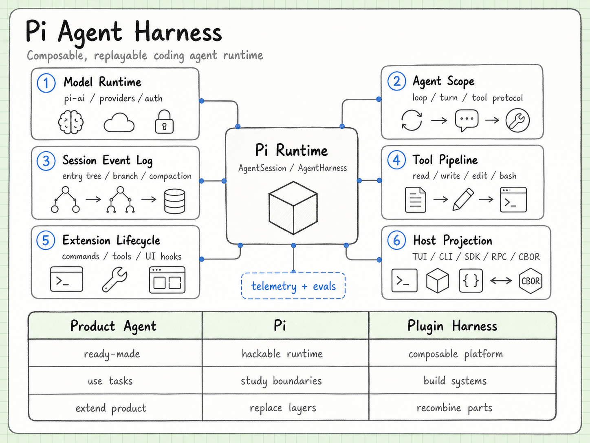

# pi-runbook documentation index

Language: [中文](README.md) | English

This is the documentation map for `pi-runbook`. The repository README explains what this project is; this page explains how to read the notes.

> If you want to understand Pi systematically, which pages should you read first, and what question does each page answer?

Most long-form notes are currently Chinese-first. This index gives English readers a stable map while the detailed pages continue to evolve.

## Recommended reading paths

### 1. Build the system-level mental model

For a first pass through the project:

1. [Visual architecture map](visual-map.md)
2. [Core ideas](pi-overview.md)
3. [Architecture](architecture.md)

After this path, you should understand whether Pi is a product, a framework, or an agent harness, and where `pi-ai`, `pi-agent-core`, `pi-tui`, and `pi-coding-agent` fit.

### 2. Study the runtime boundaries

For understanding how the agent actually runs:

1. [Agent Core](agent-core.md)
2. [AI Package](ai-package.md)
3. [Coding Agent](coding-agent.md)
4. [Tool Execution / Safety](tool-execution-safety.md)
5. [Extension System](extensions.md)

After this path, you should understand how model output becomes tool execution, how results return to context, and where core runtime, product policy, and extensions are separated.

### 3. Study state, memory, and observability

For long-running tasks, branching, compaction, evals, and telemetry:

1. [Session / Storage](session-storage.md)
2. [SQLite Session Backend](session-backend.md)
3. [Compaction](compaction.md)
4. [Telemetry](telemetry.md)
5. [Evals](evals.md)

After this path, you should understand how Pi stores history, how it keeps working after context grows too large, and how runtime behavior can be observed and regression-tested.

### 4. Embed Pi into another system

For IDEs, web UIs, remote agent services, or custom products:

1. [RPC / SDK](rpc-sdk.md)
2. [Inter-process protocols](protocol-transport.md)
3. [TUI Engine](tui-engine.md)
4. [Model Runtime / Auth](model-runtime-auth.md)

After this path, you should understand how humans use Pi, how programs drive Pi, and when to choose SDK, local JSONL RPC, remote CBOR protocol, or the TUI layer.

### 5. Prepare for upstream participation

For issues, PRs, and maintenance norms:

1. [Engineering governance](engineering.md)
2. [Contribution playbook](contribution-playbook.md)
3. [Bilingual docs strategy](bilingual-docs.md)

After this path, you should understand why Pi uses `lgtmi` / `lgtm` gates, what makes an issue useful to maintainers, and how this runbook can become a public learning lab.

## Visual atlas

| Visual | Page | Question |
| --- | --- | --- |
| `pi-visual-map.png` | [Visual architecture map](visual-map.md) | What is the overall mental model of Pi? |
| `pi-core-architecture.png` | [Core ideas](pi-overview.md) | How do the four major layers fit together? |
| `pi-monorepo-map.png` | [Architecture](architecture.md) | How are monorepo packages separated? |
| `agent-core-loop-map.png` | [Agent Core](agent-core.md) | How does the agent loop continue, stop, and emit events? |
| `ai-provider-layer-map.png` | [AI Package](ai-package.md) | How do many providers become one LLM interface? |
| `coding-agent-facade-map.png` | [Coding Agent](coding-agent.md) | How does the product layer assemble tools, sessions, TUI, and extensions? |
| `tui-engine-map.png` | [TUI Engine](tui-engine.md) | Why can the terminal UI engine stay independent of agents? |
| `extension-system-map.png` | [Extension System](extensions.md) | How do extensions attach commands, tools, hooks, and UI? |
| `tool-execution-boundary-map.png` | [Tool Execution / Safety](tool-execution-safety.md) | What sits between model tool calls and real-world execution? |
| `session-abstraction-map.png` | [Session / Storage](session-storage.md) | How does the session abstraction support replaceable backends? |
| `session-backend-map.png` | [SQLite Session Backend](session-backend.md) | How does the SQLite backend separate repository and search? |
| `compaction-checkpoints-map.png` | [Compaction](compaction.md) | Why is compaction a checkpoint rather than deletion? |
| `model-runtime-map.png` | [Model Runtime / Auth](model-runtime-auth.md) | How do provider catalogs, models, and credentials meet? |
| `sdk-rpc-surfaces-map.png` | [RPC / SDK](rpc-sdk.md) | How do SDK, JSONL RPC, and CBOR remote protocol coexist? |
| `protocol-transports-map.png` | [Inter-process protocols](protocol-transport.md) | What constraints are JSONL and CBOR each solving? |
| `telemetry-map.png` | [Telemetry](telemetry.md) | Why is observability a contract before it is an exporter? |
| `evals-map.png` | [Evals](evals.md) | How do evals protect real LLM behavior? |
| `engineering-governance-map.png` | [Engineering governance](engineering.md) | How do CI, release, supply-chain, and contribution gates protect maintainer attention? |
| `contribution-trust-path-map.png` | [Contribution playbook](contribution-playbook.md) | What kind of trust path do `lgtmi` and `lgtm` represent? |
| `bilingual-strategy-map.png` | [Bilingual docs strategy](bilingual-docs.md) | How do Chinese exploration and English publication share work? |

## Topic index

### Core architecture

- [Visual architecture map](visual-map.md)
- [Core ideas](pi-overview.md)
- [Architecture](architecture.md)
- [Agent Core](agent-core.md)
- [AI Package](ai-package.md)
- [Coding Agent](coding-agent.md)
- [TUI Engine](tui-engine.md)

### Runtime boundaries

- [Extension System](extensions.md)
- [Tool Execution / Safety](tool-execution-safety.md)
- [Session / Storage](session-storage.md)
- [SQLite Session Backend](session-backend.md)
- [Compaction](compaction.md)
- [Model Runtime / Auth](model-runtime-auth.md)
- [Telemetry](telemetry.md)

### External interfaces

- [RPC / SDK](rpc-sdk.md)
- [Inter-process protocols](protocol-transport.md)

### Engineering and collaboration

- [Engineering governance](engineering.md)
- [Evals](evals.md)
- [Contribution playbook](contribution-playbook.md)
- [Bilingual docs strategy](bilingual-docs.md)

## Reading principles

- Look at the visual first, then read the prose.
- Understand boundaries before implementation details.
- Separate source observations from current interpretation.
- When a claim can be tested, turn it into a small experiment.
- Before sending anything upstream, compress it into a short, concrete, reproducible issue or PR description.

