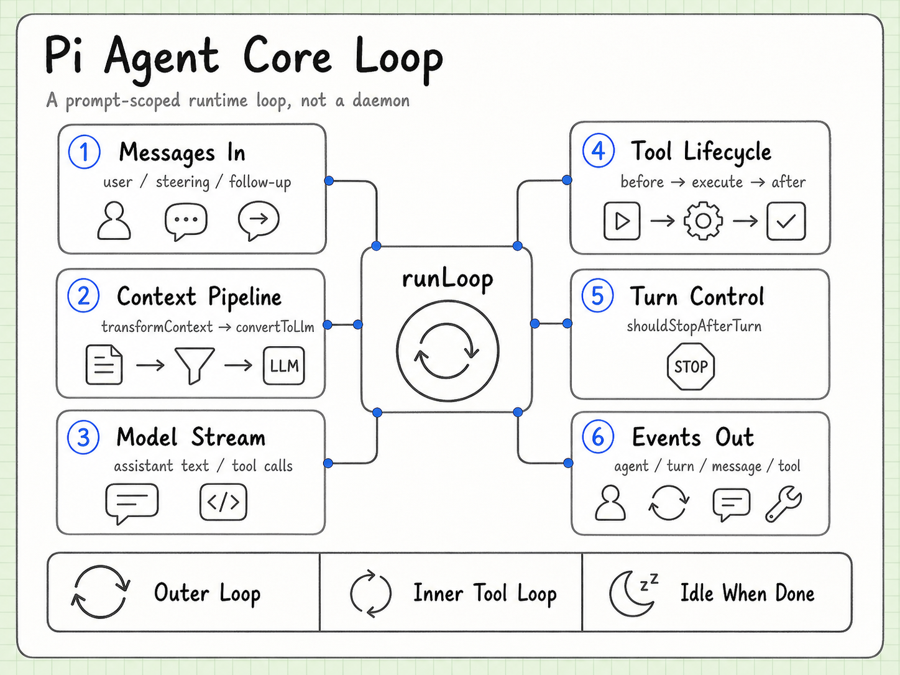

# Agent Core

Language: [中文](agent-core.md) | English

Agent Core is the runtime loop underneath the coding-agent product. It knows how to turn a context into model events, handle tool calls, feed results back, and decide when a turn or follow-up is complete.



## What it does not own

Agent Core does not need to know:

- which vendor serves the model;
- how a terminal component is drawn;
- which coding tools the product chooses to expose;
- how a session is persisted by a particular backend.

Those concerns are supplied through interfaces and surrounding packages.

## The loop

```text
context
  -> model stream
  -> text / thinking / tool call events
  -> tool execution when needed
  -> tool result appended to context
  -> another model stream or completion
```

There are two useful levels of iteration:

- an outer follow-up loop for additional user or steering input;
- an inner tool loop for the model to call tools and receive their results.

The runtime emits structured events while this happens. Consumers can render them, record them, or use them to drive another protocol.

## Tool calls are a boundary

The model produces an intent, not a filesystem mutation. The runtime hands the call to the tool layer, waits for a result, and turns that result back into a message. This keeps model protocol and execution policy separate.

The same shape works for a local `read` tool, a remote service call, or a dynamic extension tool. The execution layer remains responsible for validation, errors, cancellation, and result size.

## Stop paths

A loop can end because:

- the model returns a normal stop;
- the model has no further tool call;
- the user or controller aborts;
- a tool or provider returns an error;
- the response reaches a length or context boundary.

“Multi-turn” therefore does not mean “daemon forever”. It means that one task can contain a controlled sequence of model and tool events.

## Why events matter

The event protocol is more stable than a particular UI. A TUI can show incremental text, an RPC client can forward JSONL events, and telemetry can record spans without changing the Agent loop itself.

## Continue reading

- [Tool Execution / Safety](tool-execution-safety.md)
- [Session / Storage](session-storage.md)
- [Compaction](compaction.md)
- [AI Package](ai-package.md)
- [Source and version index](source-index.en.md)
