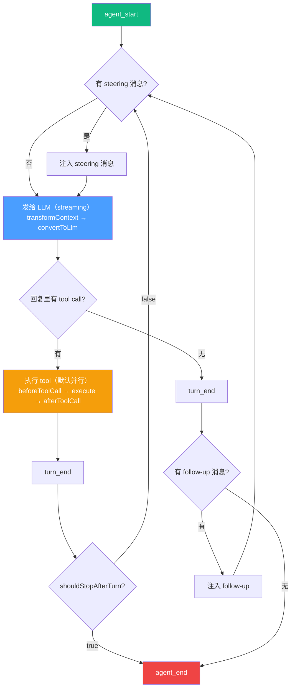
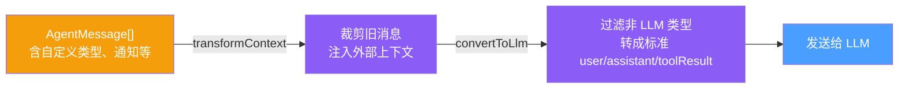

# Agent Core

> 状态：第一轮理解完成

pi-agent-core 是 agent 的运行时，整个项目的大脑。管对话状态、编排 tool call、处理多轮循环。

## 它不管什么

agent-core 不知道文件系统是什么，不知道 bash 是什么，不知道代码是什么。它只知道：消息进来 → 发给 LLM → 有 tool 就执行 → 结果再发给 LLM → 循环。所有具体的"做什么事"是上层通过 tools 和 system prompt 注入的。

## Agent Loop 核心逻辑

核心函数 `runLoop`（agent-loop.ts，约 800 行）是一个双层 while 循环：


上图先把 `agent-core` 理解成一次 `prompt()` 内部的运行时循环：消息进入 context pipeline，模型流式返回文本或 tool call，tool lifecycle 负责执行边界，turn control 决定是否继续。下面的 Mermaid 版本保留为可维护文本版。



### 外层循环：follow-up

agent 本来该停了，但用户排了新的指令进来（"顺便也帮我总结一下"），那就继续跑。

### 内层循环：tool call + steering

LLM 每次回复如果带了 tool call，执行完 tool 后继续问 LLM。同时检查用户有没有中途打断（steering："停！别这样改，用另一种方式"）。

### 三条退出路径

1. LLM 不再调 tool、steering 和 follow-up 队列都空 → 自然 break
2. shouldStopAfterTurn 钩子返回 true（如 context compaction）→ 提前退出
3. stopReason 是 error 或 aborted（网络挂了、Ctrl+C）→ 直接 return

不是 daemon。一次 `agent.prompt()` 调用跑完循环就结束，返回 idle 状态等下一条消息。

## 消息管道

每轮 LLM 调用前，消息经过两步转换：



这个两段式设计让 pi 可以在同一份对话记录里混入 UI 专用的消息类型，不干扰 LLM 上下文。

## Tool 执行模型

- 默认并行（executeToolCallsParallel），除非某个 tool 标了 sequential
- 如果 LLM 回复被 token 限制截断（stopReason: "length"），不执行残缺 tool call，直接返回错误让 LLM 重发（failToolCallsFromTruncatedMessage）
- beforeToolCall / afterToolCall hook 可拦截或修改 tool 结果

## 核心类型

AgentTool 接口（types.ts）：

```typescript
interface AgentTool<TParameters, TDetails> extends Tool<TParameters> {
  label: string;           // UI 显示名
  parameters: TParameters; // typebox schema
  execute: (               // 执行函数
    toolCallId, args, signal?, onUpdate?
  ) => Promise<AgentToolResult<TDetails>>;
  executionMode?: "parallel" | "sequential";  // 可选覆盖
}
```

AgentMessage = LLM Message（user/assistant/toolResult）+ 自定义消息类型（通过 declaration merging 扩展）。

AgentEvent = agent_start/end + turn_start/end + message_start/update/end + tool_execution_start/update/end。
