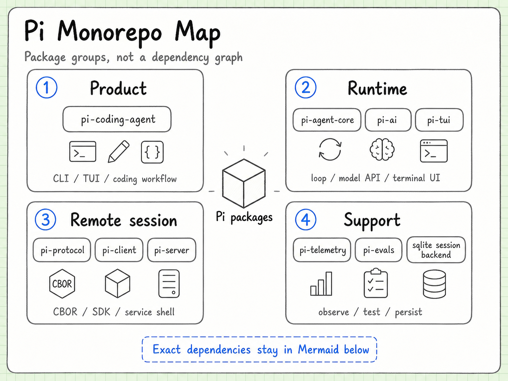

# Architecture

Language: [中文](architecture.md) | English

Pi is organized as a monorepo, but the important fact is not the directory count. The useful question is which package owns a decision and which package is deliberately kept unaware of it.



## Read the repository as layers

```text
shared protocol and model types
  -> Agent runtime
  -> coding-agent product layer
  -> TUI, CLI, RPC, server, and extensions
```

The current source tree contains separate packages for the Agent runtime, model integrations, coding-agent composition, terminal UI, evaluation, storage, and server-side transport. Package boundaries may evolve, so the [source index](source-index.en.md) is the versioned reference for the paths discussed here.

## Dependency direction

The intended direction is from generic runtime pieces toward product-specific composition:

- `pi-ai` owns provider and model protocol concerns;
- `pi-agent-core` owns turns, tool calls, and lifecycle events;
- `pi-coding-agent` owns coding tools, sessions, extensions, configuration, and modes;
- `pi-tui` owns terminal rendering primitives;
- storage, evals, and server packages provide replaceable surrounding capabilities.

The exact package graph is less important than the information flow. A low-level package should not need to import product policy merely to do its job.

## Who should not know what

| Boundary | It should know | It should not own |
| --- | --- | --- |
| AI adapter | Provider request/response formats and compatibility | Coding workflow or terminal layout |
| Agent Core | Turns, context, tool calls, and events | A specific vendor or UI |
| Coding Agent | Coding tools, sessions, trust, extensions, and modes | Every provider protocol detail |
| TUI | Components, input, layout, and rendering | Whether a task is semantically complete |
| Storage backend | Persistence and search mechanics | How the model reasons about a task |
| Evals | Harness setup and behavioral assertions | Product presentation |

These negative boundaries are where much of the maintainability comes from.

## Local and remote entry points

The same runtime can be reached through different surfaces:

```text
interactive user -> TUI / CLI
same-process code -> SDK
local external process -> JSONL RPC
remote process -> server / IPC protocol
```

Each surface changes transport and presentation, not the core meaning of a tool call or a session entry.

## How to use this map

When reading an unfamiliar change, ask:

1. Which layer owns the behavior?
2. Is the change a new capability or a new translation?
3. Does it change an internal contract or only one adapter?
4. Which event, session, or eval observes the change?

Those questions are usually more useful than starting from a file name.

## Continue reading

- [Agent Core](agent-core.en.md)
- [AI Package](ai-package.md)
- [Coding Agent](coding-agent.md)
- [RPC / SDK](rpc-sdk.md)
- [Source and version index](source-index.en.md)
