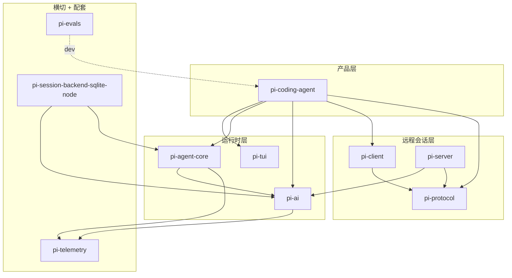
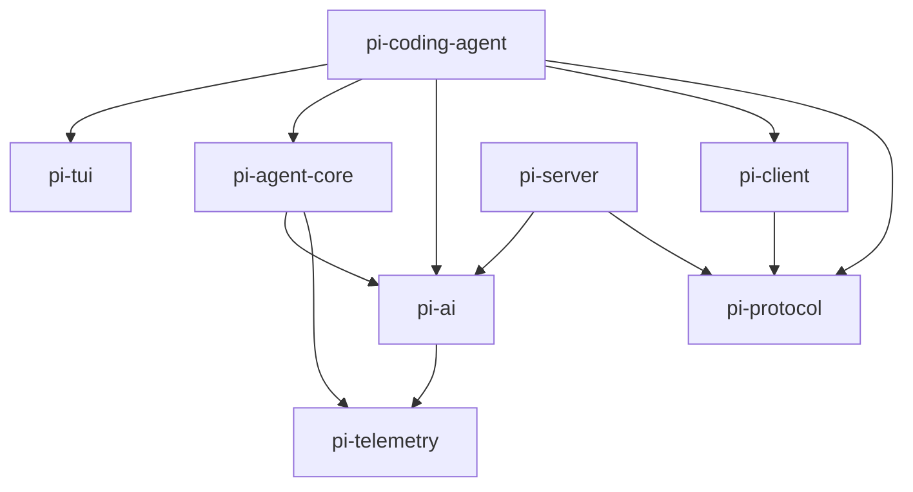
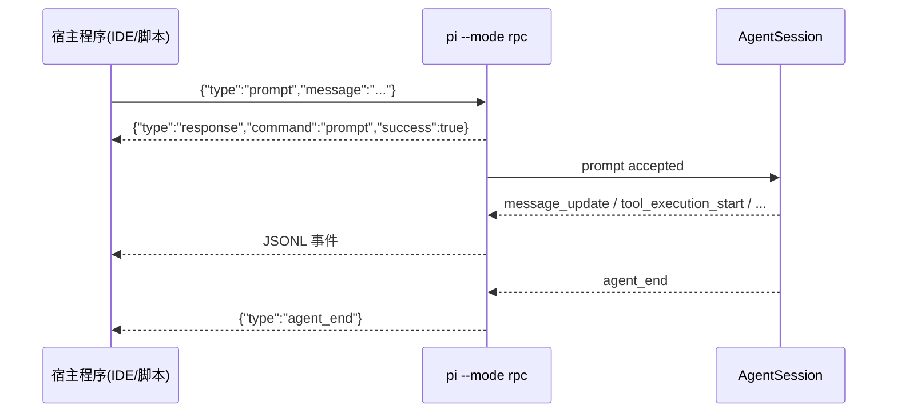
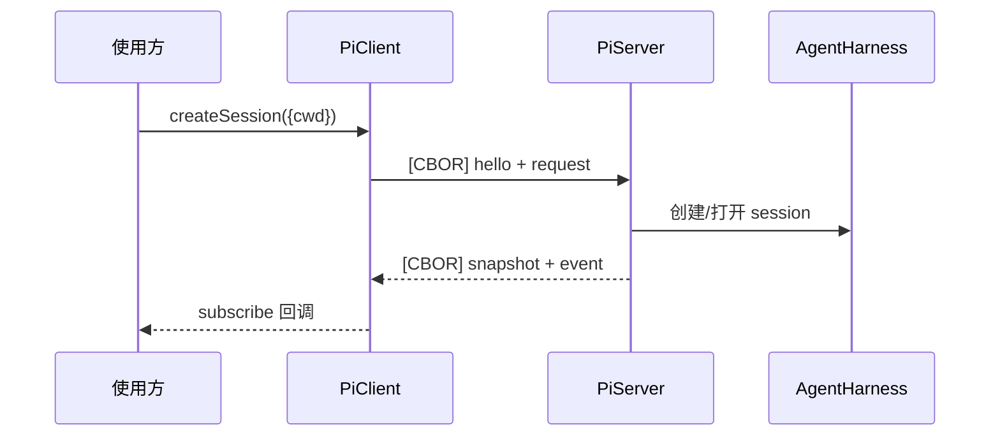

# 架构总览

> 状态：已对齐 main（revision `9d2ec7ff`，2026-08-13）
> 本文回答：pi 这个 monorepo 里有哪些包、谁依赖谁、模块边界画在哪里、数据怎么流动。

pi 是一个 npm workspaces monorepo，当前是 **10 个顶层包 + 1 个 session backend**。这篇是"结构地图"：先看包与依赖，再看模块边界和数据流。至于**为什么**要这么拆（变化频率隔离、各层独立复用），见 [核心思想概览](pi-overview.md)。

> 历史注记：本页早前记录的是"四个核心包"（tui / ai / agent-core / coding-agent）。经核对源码，`telemetry`、`protocol`、`client`、`server`、`session-backends`、`evals` 在 7/21~8/05 就已加入 main，是当时遗漏而非后来新增。详见文末"与旧四包认知的差异"。

## 十一个包

| 目录 | npm 包 | 定位 | 内部依赖 | 外部依赖数 |
|---|---|---|---|---|
| `packages/tui` | `pi-tui` | 终端 UI 库（差分渲染） | 无 | 2 |
| `packages/telemetry` | `pi-telemetry` | 遥测契约 + schema 工具 | 无 | 0 |
| `packages/protocol` | `pi-protocol` | CBOR 传输协议（experimental） | 无 | 1 |
| `packages/ai` | `pi-ai` | LLM 统一抽象 | telemetry | 10 |
| `packages/agent` | `pi-agent-core` | agent runtime | ai, telemetry | 4 |
| `packages/client` | `pi-client` | 远程 session 客户端 | protocol | 0 |
| `packages/server` | `pi-server` | 远程 session 服务端（experimental） | ai, protocol | 0 |
| `packages/coding-agent` | `pi-coding-agent` | coding agent CLI / 产品层 | agent-core, ai, client, protocol, tui | 16 |
| `packages/evals` | `pi-evals` | 行为评测 | 无（dev: ai, coding-agent） | 0 |
| `packages/session-backends/sqlite-node` | `pi-session-backend-sqlite-node` | SQLite session backend | ai, agent-core | 0 |

两个命名细节：

1. **目录名去掉了 `pi-` 前缀**（`packages/agent`），但 **npm 包名带 scope**（`@earendil-works/pi-agent-core`）。这是为什么 runbook 里 `pi-` 前缀的包名仍能对上、目录结构却变了。
2. **"外部依赖数"只统计 `dependencies` 字段的直接外部依赖**，不含 devDependencies。`pi-evals` 的 `dependencies` 为空，但它以 devDependencies 形式依赖 `pi-ai` 和 `pi-coding-agent`（`^0.84.1`）——它是个评测工具，不供别人运行时依赖。

## 分层：四个梯队

和旧"四包"认知最大的不同：**远程会话层（protocol/client/server）是独立的一层**，插在产品层和运行时层之间。旧的 runbook 把 RPC 当成"coding-agent 的一个 mode"（`pi --mode rpc`），但源码里它已经演变成一组独立包。

## 依赖方向

真实依赖关系（箭头 = 依赖）：

三个关键结论：

1. **三个叶子**：`pi-tui`、`pi-telemetry`、`pi-protocol` 不依赖任何内部包，也不被（除 protocol 外）运行时层依赖。
2. **`pi-telemetry` 被 `pi-ai` 和 `pi-agent-core` 同时依赖**——遥测已经下沉到 core 层，值得单独作为 runtime 边界阅读。
3. **`pi-coding-agent` 直接依赖 5 个内部包**（`agent-core` / `ai` / `client` / `protocol` / `tui`），不是旧的"tui + agent-core"。其中 `client` + `protocol` 是远程会话能力。

依赖仍然是**单向、无环**的，只是规模从 4 个包长到了 11 个。

## 模块边界：谁不知道什么

架构的价值不在"各包有什么"，而在"各包**不**知道什么"：

| 包 | 知道什么 | 刻意不知道什么 |
|---|---|---|
| `pi-tui` | 字符、行、键盘输入、组件渲染 | LLM、agent、文件系统、网络 |
| `pi-protocol` | CBOR 编码、消息 schema、分帧 | transport 本身（transport 由消费方提供）、agent 业务 |
| `pi-telemetry` | 遥测契约、schema 工具 | 具体 provider、agent loop |
| `pi-ai` | provider、model、streaming、auth | agent loop、工具、"对话"业务概念 |
| `pi-agent-core` | 消息、事件流、tool 协议、循环控制 | "文件""bash""代码"具体语义、具体 transport |
| `pi-client` | 连上 server、发命令、订阅 snapshot | session 怎么存、模型怎么调 |
| `pi-server` | 接 connection、暴露 service | 具体 session/model 实现（由 `PiServerService` 注入） |
| `pi-coding-agent` | 文件、shell、session、TUI、扩展 | ——（具体化层，把通用协议落到编程场景） |

新增包延续了同一条原则：**core 保持通用，具体能力从边界注入**。`pi-server` 最典型——它只给骨架，`listSessions` / `createSession` 等要应用自己实现 `PiServerService`。

## 每个包内部的关键模块

按源码里确认过的结构（revision `9d2ec7ff`）：

### `pi-agent-core`（`packages/agent`）

- `agent-loop.ts`——双层 while 循环：外层 follow-up，内层 tool call + steering。
- `agent.ts`——`Agent` 入口（`new Agent({...})` + `subscribe` + `prompt`）。
- `harness/`——`AgentHarness` 更底层的执行抽象。
- `types.ts`——`AgentTool` / `AgentMessage` / `AgentEvent` 核心类型。
- `proxy.ts`、`search/`、`node.ts`——transport / 搜索 / Node 运行时相关（**待深读**，见文末）。

> `pi-agent-core` 的 package description 现在写着 "transport abstraction + attachment support"，这两个维度 runbook 尚未覆盖，先标记待深读。

### `pi-coding-agent`（`packages/coding-agent`）

- `agent-session.ts`——`AgentSession` 中枢（compaction、自动重试、持久化、模型切换、扩展编排）。
- `system-prompt.ts`——`buildSystemPrompt`。
- `core/tools/`——内置工具 `read` / `write` / `edit` / `bash` / `grep` / `find` / `ls`。
- `modes/`——运行模式：`interactive/`、`rpc/`（JSONL）、`print-mode.ts`、`json-event.ts`。
- `client/`——`remote-session.ts`，用 `PiClient` 连远程 server（**新增**）。
- `server/`——`create-harness.ts`，把 coding-agent harness 暴露成 server（**新增**）。
- `rpc-entry.ts`——`pi-rpc` 二进制的入口（`main(["--mode","rpc",...])`）。

### `pi-protocol`（`packages/protocol`）

- `schemas.ts`——消息 schema（`SessionPhase`、`ModelRef`、content 四类、`Usage`、`ServerEvent` 等）。
- `framing.ts`——`[uint32-be CBOR 长度][CBOR payload]` 分帧。
- `cbor/`、`codec.ts`——严格 CBOR 子集的编解码。
- `PROTOCOL_VERSION = 1`。

### `pi-client` / `pi-server`

- `pi-client`：`client.ts`（`PiClient`）、`connection.ts`、`session-handle.ts`（`SessionLease`）、`transport.ts`（`ByteTransport`）、`unix.ts`（Unix socket transport，独立子路径）。
- `pi-server`：`server.ts`（`PiServer`）、`listener.ts`、`snapshots.ts`、`transports/`、`protocol.ts`（`pi-ai` ↔ `pi-protocol` 的 bridge）。

### `pi-ai` / `pi-tui` / `pi-telemetry`

- `pi-ai`：`providers/`（几十个 provider）、10 种底层 API 适配类型（见 [ai-package.md](ai-package.md)）。
- `pi-tui`：差分渲染（三策略 + CSI 2026）、组件系统、Overlay 系统（见 [tui-engine.md](tui-engine.md)）。
- `pi-telemetry`：厂商中立的遥测契约与 schema 工具（见 [telemetry.md](telemetry.md)）。

## 数据流：本地 vs 远程

现在有**两条**数据流，别混。

### 本地嵌入（JSONL RPC）

载体是 stdin/stdout，一行一个 JSON 对象。详见 [rpc-sdk.md](rpc-sdk.md)。

### 远程会话（CBOR 协议）

载体是 `[uint32-be CBOR 长度][CBOR payload]`，走 Unix socket / WebSocket。详见 [rpc-sdk.md](rpc-sdk.md) 的"远程会话"一节。

两条数据流的共同点：**事件是跨包语言**。`AgentEvent` 从 core 流出，本地模式变成 JSONL，远程模式变成 CBOR，但事件本身的语义是同一套。

## 关键设计决策

每层抽象为什么画在这里：

1. **TUI 独立成包**——渲染变化频率极低、与 agent 零耦合，可被任何终端应用复用。
2. **ai 独立成包**——provider 生态变化最快，纯适配层，10 个 provider SDK 的更新不波及渲染和 runtime。
3. **agent-core 只依赖 ai + telemetry，不依赖 TUI / 具体工具**——UI 和业务工具外部注入，core 能服务后台 agent 和自定义 agent。
4. **telemetry 下沉到 core 层**——被 ai 和 agent-core 共同依赖，说明可观测性被当成 runtime 的一等公民，而不是产品层后加的功能。详见 [telemetry.md](telemetry.md)。
5. **protocol / client / server 拆成三个包**——协议（怎么说话）、客户端（谁要连）、服务端（谁被连）三个角色独立演化。理由有四：依赖隔离（client 零外部依赖，不背 server 的 pi-ai）；transport-neutral（各端接自己的传输）；形态不同（client 是开箱 SDK，server 是留钩子的框架）；协议单独成包防两端 schema 失联。详见 [rpc-sdk.md](rpc-sdk.md)。
6. **session-backends 拆成独立包**——把 SQLite backend 和 `node:sqlite` 适配器挪出去，**让 core 不默认拉入原生 SQLite 依赖**；backend 接受 runtime-specific SQLite factory，未来其他 backend 各自成包。详见 [session-backend.md](session-backend.md)。

一句话：**变化频率不同、复用场景不同、运行环境不同的东西必须隔离；依赖只允许单向向下。**

## 与旧四包认知的差异

| 旧认知（runbook 早期） | 当前源码（`9d2ec7ff`） | 性质 |
|---|---|---|
| 4 个核心包 | 10 顶层包 + 1 session backend | 遗漏 |
| agent-core 只依赖 ai | 依赖 ai + **telemetry** | 修正 |
| coding-agent 依赖 tui + agent-core（间接 ai） | **直接**依赖 5 个包，含 client + protocol | 修正 |
| RPC = coding-agent 的一个 mode | JSONL mode 仍在 + 独立 CBOR client/server 包 | 并存，遗漏后者 |
| SQLite backend 是"未来的 backend" | 已抽成独立包 `pi-session-backend-sqlite-node`（原名 storage，8/05 改名） | 遗漏 |
| 无 telemetry | `pi-telemetry` 存在，且被 core 依赖 | 遗漏 |

## 阅读地图

- 想理解"为什么拆"和整体哲学 → [pi-overview.md](pi-overview.md)
- 想深入某个包 → 见上面"每个包内部的关键模块"对应的专题文档
- 想理解边界如何被外部扩展 → [extensions.md](extensions.md)
- 想理解本地 RPC 与远程协议的细节 → [rpc-sdk.md](rpc-sdk.md)
- 想理解 runtime 如何描述自己的运行过程 → [telemetry.md](telemetry.md)
- 想理解 SQLite session backend 为什么独立成包 → [session-backend.md](session-backend.md)

## 待深挖 / 待补充

这版架构篇钉死了包结构和依赖，但还有几个点没展开：

1. **`pi-agent-core` 的 "transport abstraction" 和 "attachment support"**——description 里出现的新维度，`harness/`、`proxy.ts`、`search/` 目录的具体职责尚未读。
2. **`pi-server` 的生命周期**——它是 experimental，README 明说 "no compatibility guarantees"，其 API 边界仍在演进。
3. **`pi-evals` 与 `vitest-evals` 的绑定**——devDep 里的 `vitest-evals@0.15.0` 是外部评测框架，见 [evals.md](evals.md) 的既有记录，但需核对版本。
4. **依赖数的统计口径**——上表"外部依赖数"是 `dependencies` 字段的直接依赖，与 pi-overview 里"2/11/4/18"的历史口径可能不同（可能含 devDeps 或传递依赖），需统一。
