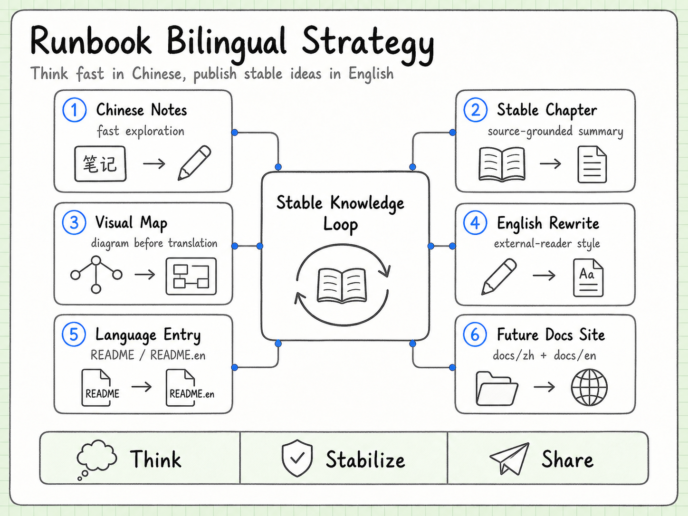
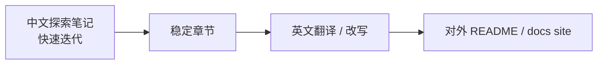

# pi-runbook 双语文档策略：先保留思考速度，再逐步国际化

这一章不是拆 pi 源码，而是给这个 runbook 自己定一套双语维护方式。

我们想要的不是“机器翻译一大堆没人维护的页面”，而是一套能长期演进的结构：

> 中文负责快速思考和沉淀，英文负责稳定表达和对外沟通。

## 1. 为什么不要一开始就全量双语

这个项目现在还是学习实验室，不是成熟官网。

如果一开始就把所有文档拆成中英两套，会很容易出现三个问题：

- 中文笔记还在频繁改，英文很快过期；
- 每次改文档都要同步两份，维护负担变大；
- 早期很多判断还在验证，英文版本会显得过度正式。

所以当前策略是：



上图先把双语策略理解成一个稳定知识循环：中文保留探索速度，稳定章节先用图表沉淀结构，再把成熟内容改写成面向外部读者的英文版本。下面的 Mermaid 版本保留为可维护文本版。



先把理解做扎实，再把稳定内容翻译出去。

## 2. 当前阶段：轻量语言切换

现在先做最小可用双语结构：

```text
README.md        中文入口
README.en.md     英文入口
docs/*.md        中文主文档
docs/bilingual-docs.md  双语维护规则
```

这样做有几个好处：

- 访问仓库时已经有语言切换入口；
- 不打断当前中文学习节奏；
- 英文读者至少能知道项目目的、结构和后续计划；
- 等文档稳定后，可以逐篇翻译。

## 3. 中英内容的角色分工

| 类型 | 中文 | 英文 |
| --- | --- | --- |
| journal | 主语言，保留思考过程 | 通常不翻译，除非有代表性总结 |
| docs | 主语言，快速迭代 | 稳定后翻译 |
| experiments | 代码优先，注释可中英混合 | README 可补英文 |
| contribution notes | 中文先梳理参与路线 | 成熟后翻成英文，方便对外沟通 |
| public summary | 中文和英文都要有 | 英文更适合对外展示 |

中文版本可以更像“我怎么理解这个系统”；英文版本应该更像“这个系统是什么、为什么这么设计、怎么验证”。

## 4. 推荐的最终目录结构

等内容稳定后，可以迁移成：

```text
README.md
README.en.md
docs/
  zh/
    pi-overview.md
    extensions.md
    session-storage.md
    ...
  en/
    pi-overview.md
    extensions.md
    session-storage.md
    ...
  assets/
```

也可以在每篇文档顶部加语言切换：

```markdown
Language: 中文 | [English](../en/pi-overview.md)
```

英文页对应：

```markdown
Language: [中文](../zh/pi-overview.md) | English
```

现在还不急着做这个迁移，因为当前 `docs/` 仍在快速增长。等核心章节稳定到 8-10 篇后再搬，会更省力。

## 5. 翻译不是直译，而是二次写作

这个项目的英文文档不应该只是中文逐句翻译。

推荐规则：

- 保留技术判断和结构；
- 减少中文聊天式表达；
- 增加上下文解释；
- 示例路径和命令保持一致；
- 不确定判断要标明 “my current interpretation”；
- 涉及上游协作规则时，尽量引用源码或官方文档；
- 每篇英文文档都要注明对应中文源文档。

比如中文可以写：

> 这里的味道很 Linux 派，少做花活，把边界讲清楚。

英文更适合写：

> The design favors a small core with explicit boundaries, leaving policy and environment-specific behavior to extensions or operating-system-level isolation.

意思一样，但面向不同读者。

## 6. 每篇文档建议加 metadata

后续如果要做 docs site，可以在每篇文档顶部加简单 frontmatter：

```yaml
---
lang: zh
title: "pi Tool Execution / Safety"
status: draft
translation:
  en: ../en/tool-execution-safety.md
source:
  repo: earendil-works/pi
  revision: "<commit-or-tag>"
---
```

状态可以用：

- `draft`：还在探索；
- `reviewed`：结构基本稳定；
- `translated`：已有另一语言版本；
- `stale`：需要重新对齐上游。

这会让后续自动检查和发布更方便。

## 7. 什么时候翻译

建议满足三个条件再翻译：

1. 这章已经至少读过一轮源码；
2. 这章已经有图或表，把结构讲清楚；
3. 这章短期内不会大改。

当前最适合优先翻译的顺序：

1. `pi-overview.md`
2. `extensions.md`
3. `tool-execution-safety.md`
4. `rpc-sdk.md`
5. `contribution-playbook.md`

原因是这几篇最能体现项目价值，也最适合 build in public。

## 8. 如果以后做站点

等内容成熟后，可以考虑把 runbook 发布成一个小型 docs site。

最轻量的路线：

- VitePress / Docusaurus / Astro Starlight 任选一个；
- `docs/zh` 和 `docs/en` 做语言目录；
- 首页保留中英切换；
- 每篇文档顶部有 source / last reviewed；
- 实验代码仍留在 `experiments/`；
- journal 可以只发布精选总结，不一定全量暴露。

不要太早做站点。先把内容写扎实，站点只是包装。

## 9. 当前行动约定

现在开始采用这些规则：

- 新增核心中文文档仍放在 `docs/`；
- 每个稳定主题可以补一个英文摘要或英文版；
- README 保持中英入口互链；
- 等核心文档稳定后，再统一迁移到 `docs/zh` / `docs/en`；
- 翻译前先检查上游源码是否已经变化；
- 英文文档优先翻“结论、结构、实验路线”，不翻所有思考碎片。

这个策略比较适合我们现在的阶段：既能 build in public，又不牺牲学习速度。
