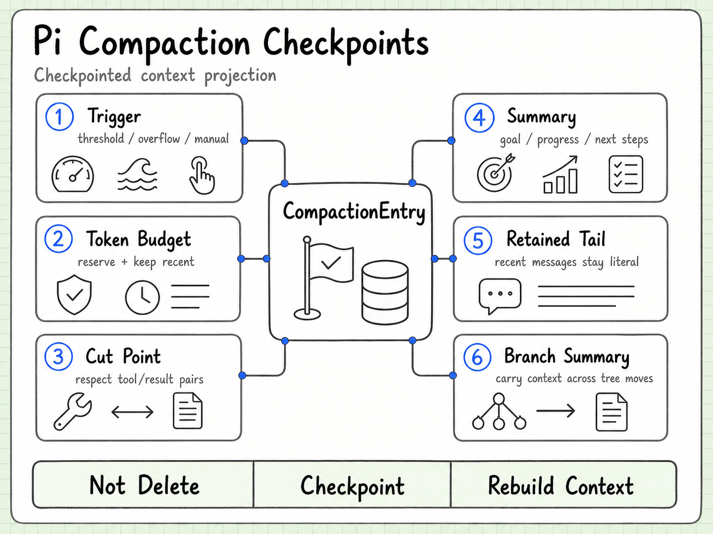
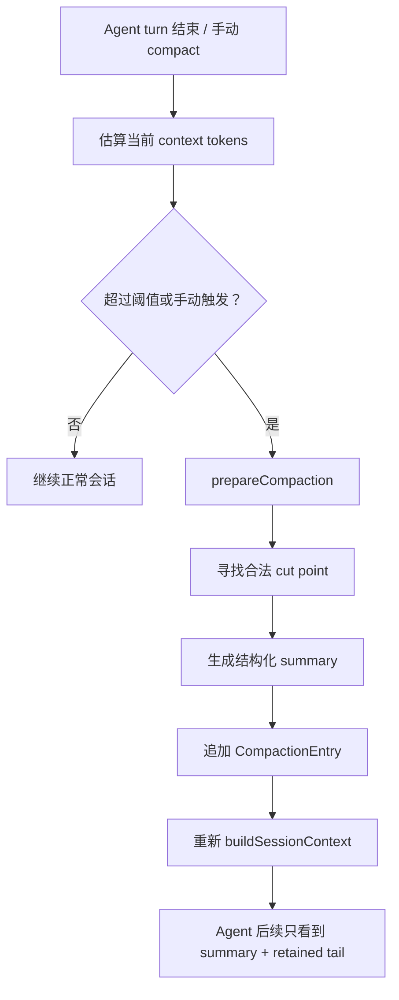
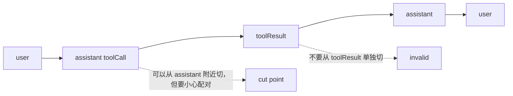
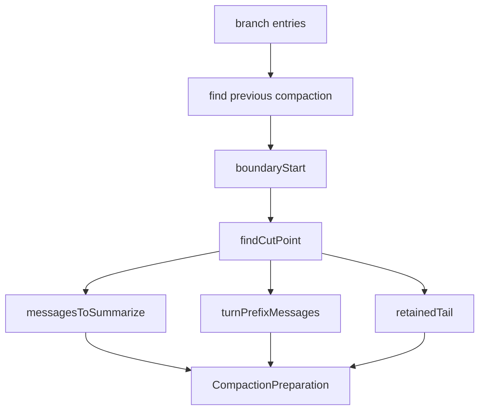
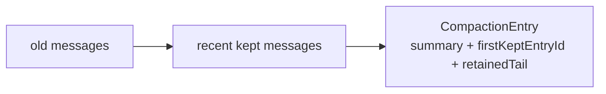
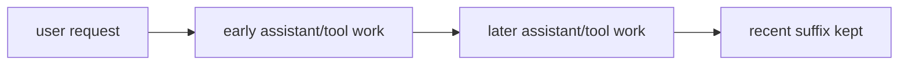
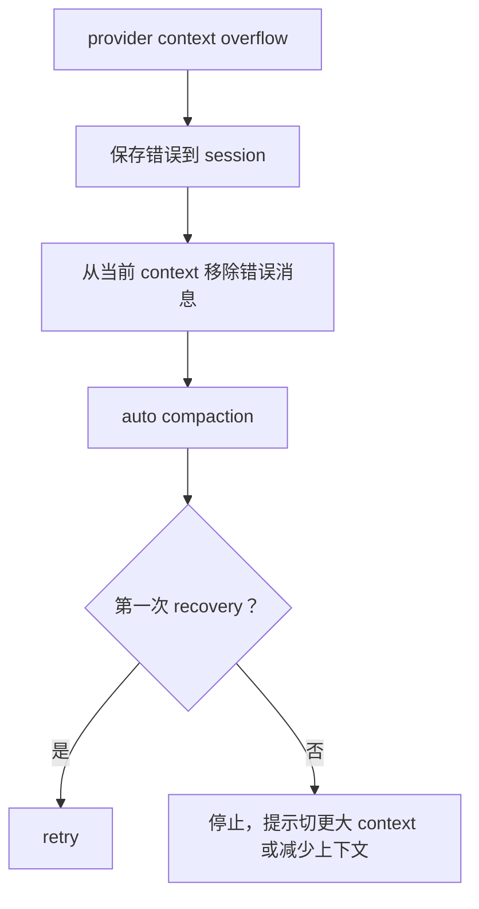
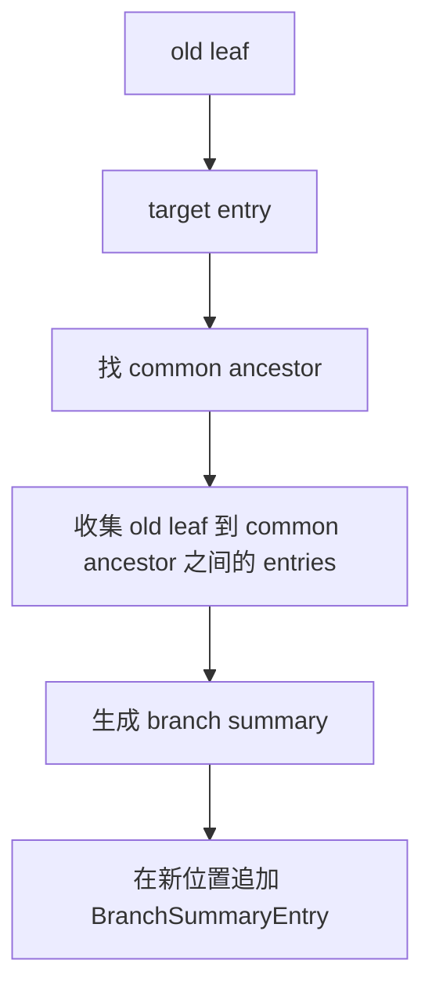

# pi Compaction：上下文压缩不是删历史，而是写 checkpoint

这一章看 pi 的 compaction 和 branch summarization。

LLM 的 context window 是有限的。一个 coding agent 跑久了以后，历史消息、工具调用、文件读取结果、错误日志会越来越多。如果只是不断把所有历史塞给模型，迟早会撞上下文上限。

pi 的做法不是简单丢掉旧消息，而是：

> 把旧上下文总结成结构化 checkpoint，写回 session tree；之后模型看到的是 summary + 最近保留的消息。

所以 compaction 不是“删除历史”，而是“改变 session 到 LLM context 的投影方式”。

## 1. 两种总结机制

pi 里有两种相关但不同的总结：

| 机制 | 触发方式 | 解决什么问题 |
|---|---|---|
| Compaction | 自动阈值、context overflow、手动 `/compact` | 当前 branch 太长，需要压缩旧上下文 |
| Branch summarization | `/tree` 切换分支时 | 离开一条探索路径时，把那条分支的关键上下文带到新位置 |

一个是“长了要压”，一个是“换路要带摘要”。

它们都服务同一个目标：让 agent 能持续工作，而不是上下文一满就失忆或崩掉。

## 2. Compaction 的整体流程



上图先把 compaction 理解成 checkpoint 机制：它不是删除 session 历史，而是选择合法 cut point，把旧上下文总结成 `CompactionEntry`，再用 summary + retained tail 重建后续 LLM context。下面的 Mermaid 版本保留为可维护文本版。



触发条件可以简化成：

```text
contextTokens > contextWindow - reserveTokens
```

默认配置里：

- `reserveTokens`: 16384
- `keepRecentTokens`: 20000
- `enabled`: true

`reserveTokens` 是给模型接下来输出预留空间；`keepRecentTokens` 是压缩后尽量保留的最近上下文。

## 3. 为什么不能随便切

最天真的压缩方式是“保留最近 N 条消息”。但 coding agent 里有工具调用，所以不能随便切。

比如 assistant 发起 tool call，后面必须有对应 tool result。如果从 tool result 中间切掉，就会破坏 provider 的消息配对规则。

pi 的 cut point 规则里，合法切点主要是：

- user message
- assistant message
- bash execution message
- custom message
- branch summary

不会从普通 tool result 处切。

简化理解：



这说明 pi 的 compaction 不是文本摘要功能，而是理解 agent 消息结构后的上下文重写。

## 4. `prepareCompaction()` 做了什么

`prepareCompaction()` 是 compaction 的准备阶段。

它大概做这些事：

1. 如果当前 branch 为空，或者最后一个 entry 已经是 compaction，就不再压缩；
2. 找到最近一次 compaction；
3. 如果之前压缩过，拿 previous summary 作为迭代更新基础；
4. 计算当前 context token；
5. 从后往前累计 token，找到尽量保留 `keepRecentTokens` 的 cut point；
6. 区分普通 cut 和 split turn；
7. 生成：
   - `messagesToSummarize`
   - `turnPrefixMessages`
   - `retainedTail`
   - `firstKeptEntryId`
   - `tokensBefore`
   - `fileOps`
   - `previousSummary`

结构上可以这么看：



这个函数真正厉害的地方是：它把“哪些东西要总结、哪些东西要保留、从哪里恢复”都算清楚了。

## 5. 普通 compaction：summary + retained tail

普通情况下，压缩前是一条长 branch：


压缩后追加一个 `CompactionEntry`：



之后 build context 时，模型看到：

```text
compactionSummary
+ retainedTail / firstKeptEntryId 之后的近期消息
+ compaction 之后的新消息
```

所以历史没有从 session 文件里消失，只是不再完整进入模型窗口。

## 6. Split turn：单个 turn 太大怎么办

有一种麻烦情况：某个 turn 自己就特别长，比如一次读了很多文件、跑了很多命令、工具结果巨大。

这时如果严格按 turn 边界切，可能怎么切都超过 `keepRecentTokens`。

pi 会进入 split turn：



它会把同一个 turn 分成：

- `turnPrefixMessages`：这个 turn 前半段，被单独总结；
- `retainedTail`：这个 turn 后半段，直接保留；
- summary 里会多出一段 `Turn Context (split turn)`。

这点很工程化。因为长工具链场景里，最容易爆的不是多轮聊天，而是单轮里 agent 做了太多事。

## 7. Summary 不是随便写的

默认 summary 使用固定结构：

```markdown
## Goal

## Constraints & Preferences

## Progress
### Done
### In Progress
### Blocked

## Key Decisions

## Next Steps

## Critical Context
```

这个格式不是为了好看，而是为了下一轮 LLM 能稳定接手。

它强制保留：

- 用户目标；
- 约束和偏好；
- 已完成/进行中/卡住的事；
- 关键决策；
- 下一步；
- 文件路径、函数名、错误信息等关键上下文。

这其实就是我们现在做 runbook 的同一种思路：不只是记录“发生过什么”，而是记录“后续工作需要知道什么”。

## 8. 文件操作追踪

Compaction 还会追踪文件操作。

它从 assistant 的 tool call 里抽取：

- `read` 过的文件；
- `write` 过的文件；
- `edit` 过的文件。

最后追加到 summary 末尾：

```xml
<read-files>
path/to/file.ts
</read-files>

<modified-files>
path/to/changed.ts
</modified-files>
```

这个设计非常实用。因为 coding agent 在长任务里最怕忘记“我动过哪些文件、读过哪些文件”。

而且它是累计的：如果之前的 compaction/branch summary 里已经有 file details，后续 summary 会继续继承。

## 9. `compact()` 真正生成什么

`compact()` 接收 `CompactionPreparation`，然后调用模型生成 summary。

关键点：

- summarization 是一次独立模型请求；
- 它会使用新的 routing session id；
- 会禁用 prompt-cache 写入，因为这种一次性 summary prompt 很难复用；
- 支持 retry；
- 支持 abort signal；
- 支持 thinking level；
- summary 的 token/cost usage 会保存进 session；
- 最终返回 `CompactionResult`。

`CompactionResult` 大概包含：

| 字段 | 作用 |
|---|---|
| `summary` | 压缩后的结构化摘要 |
| `firstKeptEntryId` | 从哪个 entry 开始保留近期历史 |
| `tokensBefore` | 压缩前上下文 token |
| `usage` | 生成 summary 的模型消耗 |
| `retainedTail` | 新 harness 里保留的近期消息 |
| `details` | 默认保存 read/modified files |

这个结果会被写成 `CompactionEntry`。

## 10. 自动 compaction 的两种场景

`AgentSession` 里自动 compaction 主要处理两种情况。

### threshold

模型正常回答了，但 context 已经超过阈值。

这时 pi 会自动压缩，但不会自动重试当前请求，因为当前请求已经成功了。

### overflow

模型返回 context overflow 错误。

这时 pi 会：

1. 保存错误消息作为历史；
2. 从 agent state 里移除这个错误 assistant message；
3. 做 compaction；
4. 尝试自动 retry；
5. 只做一次 overflow recovery，避免无限重试。



这就是“自动救场”，但不会无止境自救。

## 11. Branch summarization：切分支时带走上下文

`/tree` 切换分支时，pi 可以总结你离开的那条 branch。

核心流程：



这解决的是另一个问题：

假设你在方案 A 里探索了很多东西，现在跳回去试方案 B。你不一定想把 A 的全部历史塞进 B，但 A 里的某些发现可能对 B 有用。

Branch summary 就是“把离开的那条路上的关键经验打包带走”。

这很像：

- Git 分支切换时留下实验记录；
- 游戏存档里的路线说明；
- 研究笔记里的“这条路径探索到哪里”。

## 12. Extension 怎么接管 compaction

扩展系统能监听：

- `session_before_compact`
- `session_compact`
- `session_before_tree`
- `session_tree`

其中 `session_before_compact` 可以：

- 取消 compaction；
- 替换默认 summary；
- 用另一个模型做 summary；
- 保存自定义 `details`；
- 根据 manual / threshold / overflow 做不同策略。

官方例子 `custom-compaction.ts` 就展示了一个思路：

- 主对话用一个模型；
- compaction summary 用更便宜/更快的 Gemini Flash；
- 如果找不到模型或 auth，就 fallback 到默认 compaction。

这很重要，因为 compaction 本质上也是一类 Agent 行为：

> 不同团队可能会有不同的记忆压缩策略。

有的团队想保守，多保留细节；有的团队想极简；有的团队想额外保留 ticket、文件、测试结果；这些都不应该写死在 core 里。

## 13. 这个设计的核心思想

我会这样总结 pi 的 compaction：

第一，它是 checkpoint，不是删除。

Session 原始历史还在，context 投影发生变化。

第二，它尊重 agent 消息结构。

不会粗暴切断 tool call / tool result 的关系。

第三，它保留近期工作。

旧历史变 summary，近期消息直接保留，减少“刚做完什么就忘了”的问题。

第四，它是可扩展策略。

默认策略足够通用，但 extension 可以替换摘要模型和摘要格式。

第五，它把压缩本身也记账。

summary 的 usage、read files、modified files 都会写回 session。

## 14. 我们怎么实验

这块适合做三个小实验：

1. 人工制造长 session，执行 `/compact`，观察 JSONL 里的 `compaction` entry；
2. 写一个 extension 监听 `session_before_compact`，只加一段自定义 summary，验证是否进入后续 context；
3. 用 `/tree` 切换分支，生成 branch summary，观察 `branch_summary` entry。

未来贡献点：

- Windows / PowerShell 下 compaction 文档补充；
- split turn 的测试和解释；
- extension custom compaction 示例增强；
- branch summary 与 label、custom entry 混合场景测试；
- session-format 中 `retainedTail` / `firstKeptEntryId` 迁移说明；
- overflow recovery 的用户提示优化。

如果 Session / Storage 解决的是“历史怎么保存”，那么 Compaction 解决的是“历史太长时，怎么继续工作而不失控”。
