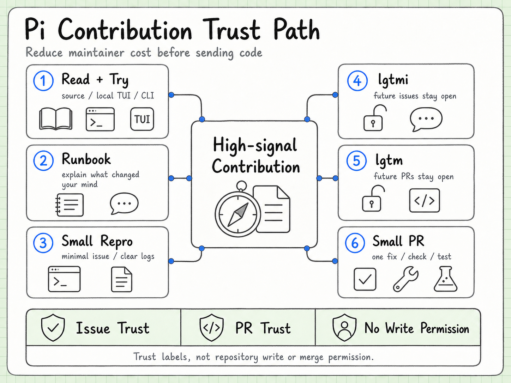
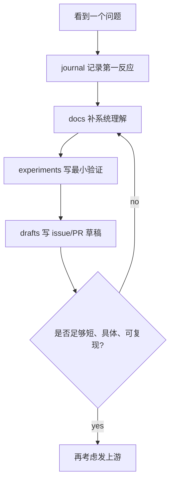

# pi 参与手册

> 状态：初版
> 用途：把 pi 的公开贡献规则、维护者偏好和我们的练习路线整理成可执行手册。

## 一句话结论

参与 pi 的关键不是先写代码，而是先证明自己能降低维护者成本。

对新 contributor 来说，最稳的路线是：



上图先把参与路线理解成信任路径：先用源码阅读、本地试用和 runbook 复盘降低沟通噪音，再用小而具体的 issue 争取 `lgtmi`，最后在足够理解边界后进入 `lgtm` 和小 PR 阶段。下面的 Mermaid 版本保留为可维护文本版。


这不是刷权限路线，而是建立信任路线。

## 上游的硬规则

pi 的 `CONTRIBUTING.md` 可以压缩成几条：

- core minimal。能放 extension 的东西，不要塞进 core。
- 可以用 AI 写代码，但提交者必须理解代码。
- 新 contributor 的 issue 和 PR 默认会被 auto-close。
- maintainer 会日常复查 auto-closed issue，值得看的会 reopen。
- `lgtmi` 只让 future issues 不再自动关闭。
- `lgtm` 才让 future issues 和 PRs 都不再自动关闭。
- 没有 `lgtm` 不要开 PR。
- PR 前必须跑 `npm run check` 和 `./test.sh`。
- 不要编辑 `CHANGELOG.md`，changelog 由维护者处理。
- 低信号、批量、AI slop 式 issue/PR 可能导致永久 block。

## 权限不是核心维护权

`lgtmi` 和 `lgtm` 不是仓库写权限。

| 标记 | 真实含义 | 能做什么 | 不能做什么 |
| --- | --- | --- | --- |
| `lgtmi` | issue-level trust | 之后开的 issue 不被自动关 | 不能开不被自动关的 PR |
| `lgtm` | PR-level trust | 之后开的 issue 和 PR 不被自动关 | 不等于 merge/write 权限 |
| `write/maintain/admin` | 仓库协作者权限 | 能触发 approval workflow、参与维护操作 | 需要项目方授予 |

所以我们的阶段目标不是“拿核心权限”，而是：

- 第一阶段：让维护者愿意读你的 issue。
- 第二阶段：让维护者相信你能开小 PR。
- 第三阶段：长期稳定贡献后，才可能进入更深的信任圈。

## 什么是高信号 issue

高信号 issue 有一个特点：维护者读完后，下一步很明确。

### Bug issue 应该包含

- 现象：发生了什么。
- 期望：你认为应该发生什么。
- 环境：OS、terminal、Node/Bun/npm、pi version。
- 复现：最短命令或最少步骤。
- 范围：是否只在某平台、某模型、某 provider、某交互模式出现。
- 日志：只贴相关片段。
- 你已排除的可能性：例如换 shell、换模型、禁 extension 后是否仍存在。

### Feature issue 应该包含

- 真实场景：你为什么需要它。
- 当前绕法：现在怎么解决，哪里不舒服。
- 归属判断：它像 core、coding-agent、provider、TUI，还是 extension。
- 最小能力：最小可接受改动是什么。
- 维护风险：可能引入什么复杂度。

## issue 模板

可以先在 `drafts/` 里写成这种形式，不急着发上游：

```markdown
## Problem

Short description in one or two sentences.

## Reproduction

Environment:
- OS:
- Shell/terminal:
- Node:
- pi:
- Model/provider:

Steps:
1. Run `...`
2. ...

Expected:
...

Actual:
...

## Notes

I checked:
- ...

I think this may belong in `packages/...` because ...
```

注意：上游要求 issue 简短，最好一屏能读完。runbook 草稿可以长，上游 issue 要收敛。

## PR 前置条件

没有 `lgtm` 前，不开 PR。

拿到 `lgtm` 后，PR 也应该从小范围开始：

- 一次只修一个问题。
- 不做顺手重构。
- 不改无关格式。
- 不碰 CHANGELOG。
- 不新增 dependency，除非 issue 已经讨论过。
- 不把 extension 能做的东西塞进 core。
- 先写清楚为什么这个改动属于这个包。

## PR 描述模板

```markdown
## What

Short description of the change.

## Why

This fixes ...

## Where

This is in `packages/...` because ...

## Verification

- `npm run check`
- `./test.sh`

## Risk

The main risk is ...
```

这份描述的目的不是显得正式，而是让 reviewer 立刻看出你理解了边界、验证和风险。

## Review 怎么回

pi 这种维护风格下，review 回复比代码本身更能体现你是否读懂了。

差的回复：

```text
AI suggested this.
```

好的回复：

```text
I agree this should stay out of agent-core.
The behavior depends on workspace trust and CLI session state, so I moved it to coding-agent.
agent-core only sees message/tool/model abstractions and should not know about local project policy.
```

有几个固定原则：

- 先明确同意或不同意。
- 用代码边界解释，而不是用偏好解释。
- 如果改了，说明改在哪里。
- 如果没改，说明为什么保留。
- 不把“AI 生成”当理由。

## 我们自己的练习流程

在真正碰上游前，先在 `pi-runbook` 里做四步。



### journal 记录什么

- 我一开始怎么理解。
- 哪里看不懂。
- 哪个文件改变了我的判断。
- AI 给了什么建议，我采纳或否决了什么。

### docs 沉淀什么

- 稳定结论。
- 架构边界。
- 术语解释。
- 图表和调用链。

### experiments 验证什么

- 一个 tool 怎么注册。
- 一个 extension 怎么接入。
- 一个 provider 行为怎么被抽象。
- 一个 TUI 事件如何流动。
- 一个 issue 能不能最小复现。

### drafts 准备什么

- 准备发给上游的 issue。
- 准备发给上游的 PR 描述。
- review 回复草稿。
- Discord 提问草稿。

## 适合新手的切入点

更适合现在碰：

- 文档和示例中可验证的不一致。
- Windows/PowerShell 相关复现，因为我们本地就是这个环境。
- CLI 参数、错误信息、help 文案这类低风险改进。
- provider metadata 或模型列表的小问题，但要非常谨慎验证。
- extension examples 的可读性和可运行性问题。
- 小型 regression test，尤其能绑定具体 issue。

先不要碰：

- agent loop 核心策略重写。
- 大范围 TUI 架构调整。
- 新增大型内置功能。
- 引入新依赖。
- provider 协议大改。
- release 流程改动。
- 未讨论的 breaking change。

## AI 使用边界

可以让 AI 做：

- 读代码并画调用链。
- 生成复现脚本草稿。
- 对比 issue 和源码。
- 提出几种修复方案。
- 写测试初稿。
- 检查 PR 描述是否清楚。

不能让 AI 替你做：

- 决定改动是否属于 core。
- 在你不理解时直接提交代码。
- 编造复现、日志或测试结果。
- 生成一大段看起来礼貌但没有事实的信息。
- 用“我让 AI 看了”替代技术解释。

一句话：AI 可以当加速器，不能当责任主体。

## lgtmi/lgtm 的现实路线

### 争取 lgtmi

靠高质量 issue。

你要证明：

- 你读过规则。
- 你能短而具体地描述问题。
- 你不是批量丢问题。
- 你的 issue 让维护者更快定位。

### 争取 lgtm

靠持续的技术判断。

你要证明：

- 你知道代码应该改在哪一层。
- 你能解释测试选择。
- 你能接受 maintainer 的边界判断。
- 你不会把维护成本转嫁给他们。

`lgtm` 通常不是请求一次就该得到的东西，更像维护者在多次互动后自然给出的信任标记。

## 我们的判断标准

每次准备发上游前，用这张表自查：

| 问题 | 合格标准 |
| --- | --- |
| 是否一屏能读完？ | 是 |
| 是否有复现或明确场景？ | 是 |
| 是否说明为什么重要？ | 是 |
| 是否区分事实和推测？ | 是 |
| 是否知道涉及哪个包？ | 大致知道 |
| 是否尊重 core minimal？ | 是 |
| 是否需要新依赖？ | 最好不需要 |
| 是否由我们理解后提交？ | 是 |

如果这张表有三项以上不确定，就先放在 runbook 里继续拆，不急着发。

## 最后记一句

pi 的贡献门槛看起来硬，但它真正奖励的是一种能力：把模糊问题压缩成可维护、可验证、低噪音的工程交流。

这正好也是我们做 `pi-runbook` 的训练目标。
