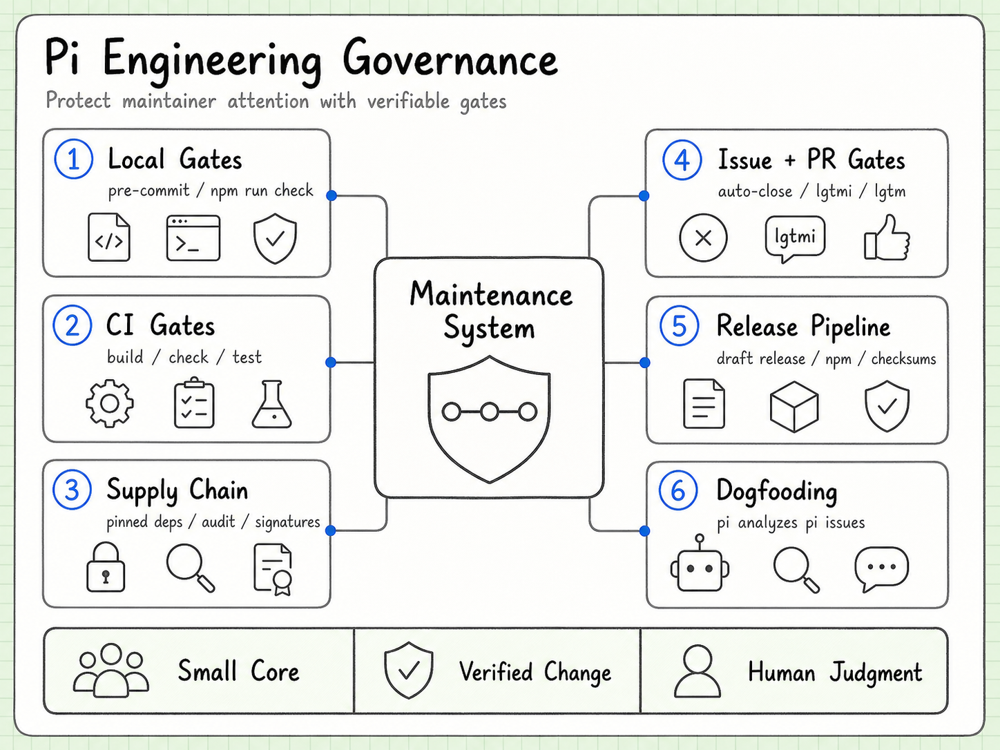
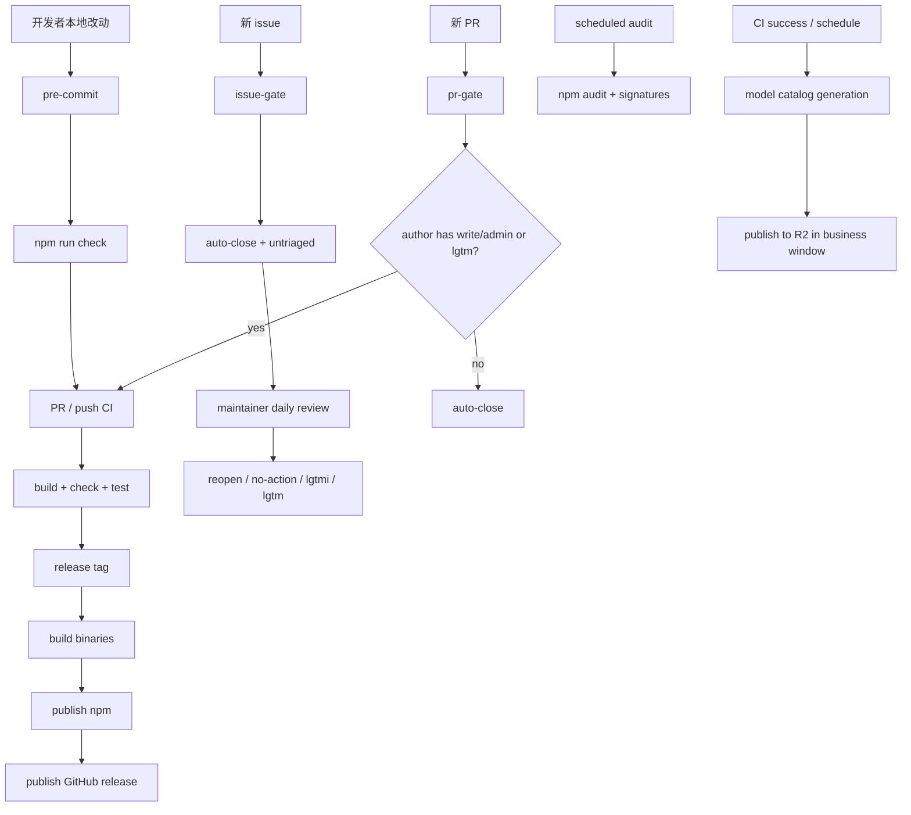
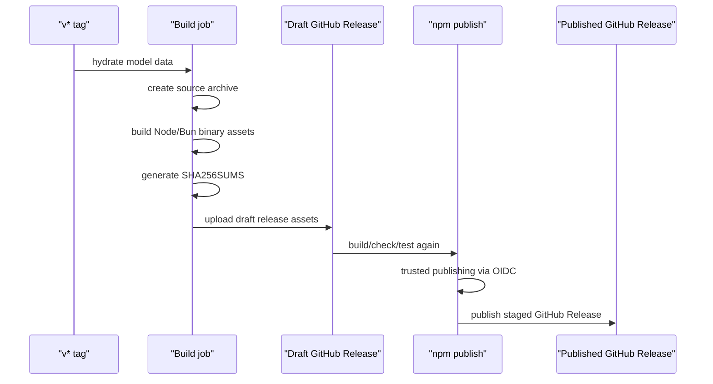
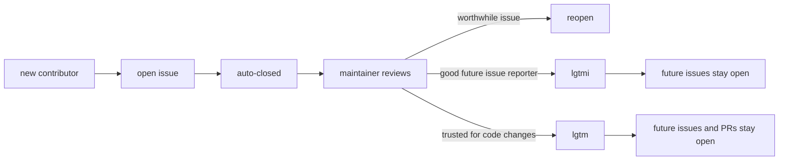

# pi 工程实践与协作治理

> 状态：初版
> 目标：理解 pi 不是只靠代码设计保持小而稳，而是把本地规则、CI、发布流程、issue/PR 门禁一起做成维护系统。

## 一句话结论

pi 的工程实践核心不是“流程很多”，而是“把维护者注意力花在高质量问题和可验证改动上”。

它的策略很清楚：

- core 要小，扩展能力走 extension。
- 新贡献者默认先进入 issue 过滤区。
- 代码改动必须能被本地 check、测试、CI、发布脚本重复验证。
- AI 可以写代码，但提交者必须理解代码。
- 自动化可以辅助 triage，但最终维护判断仍由有权限的人类做。

这套风格很像成熟开源项目的维护者视角：宁可入口严格，也不要让低质量 issue、AI 生成噪音、依赖供应链风险和发布事故把核心维护者拖垮。

## 总体结构



上图先把 pi 的工程实践理解成一套维护系统：本地 gate、CI、供应链检查、issue/PR 门禁、发布流水线和 dogfooding 都在保护维护者注意力，让改动保持可验证、可解释。下面的 Mermaid 版本保留为可维护文本版。



## 本地质量门

pi 在本地就先挡掉一批风险。

`.npmrc` 里有两条很有代表性的规则：

```ini
save-exact=true
min-release-age=2
```

含义是：

- 直接依赖必须锁精确版本，不接受隐式升级带来的不可复现。
- 新发布的 npm 包至少等 2 天再安装，降低刚发布恶意包或事故包被立刻吃进去的概率。

`.husky/pre-commit` 做三件事：

- 先检查 lockfile 是否允许提交。
- 运行 `npm run check`。
- 如果改动影响 `packages/ai`、web UI 或 lockfile，再跑 browser smoke check。

这说明 pi 对依赖和模型/provider 相关改动特别敏感。它不是“写完跑测试就行”，而是先假设供应链和 provider 兼容性都是事故高发区。

## CI 质量门

核心 CI 在 `.github/workflows/ci.yml`：

- 触发：push 到 `main`，以及 PR 到 `main`。
- 安装：`npm ci --ignore-scripts`。
- 验证：`npm run build`、`npm run check`、`npm test`。

这里有两个细节值得记：

- CI 安装依赖时禁用 lifecycle scripts，减少依赖包安装阶段执行任意脚本的风险。
- 本地 `AGENTS.md` 说普通代码改动只需要 `npm run check`，不要随便跑全量 vitest；CI 才负责完整 build/check/test。

这是一种分层验证：本地偏快、偏确定；CI 偏完整、偏正式。

## 依赖与供应链安全

pi 还有单独的 `.github/workflows/npm-audit.yml`：

- 每天定时跑。
- `npm ci --ignore-scripts --no-audit --no-fund` 安装。
- `npm audit --omit=dev --audit-level=moderate` 查生产依赖漏洞。
- `npm audit signatures --omit=dev` 验证 registry 签名。

再结合这些脚本：

- `check:pinned-deps`
- `check:shrinkwrap`
- `check:install-lock:coding-agent`
- `generate-coding-agent-shrinkwrap.mjs`
- `generate-coding-agent-install-lock.mjs`

可以看出 pi 对“可复现安装”和“发布物安装安全”非常重视。尤其 `coding-agent` 是用户真正安装运行的入口，所以它有额外 shrinkwrap/install-lock 机制。

## 发布流水线

`.github/workflows/build-binaries.yml` 是正式发布管线。

它做的事情不只是打包：



几个维护者味道很重的点：

- GitHub Release 先创建 draft，npm 发布成功后才公开 release。
- 如果发布失败，会清理 draft release，避免半成品公开。
- 发布 npm 用 trusted publishing/OIDC，不依赖本地 token、OTP 或个人机器。
- 发布前再次 build/check/test，不复用之前的主线 CI 结果。
- release asset 生成 SHA256SUMS，方便用户和包维护者校验。

这是一种“宁可慢一点，也不要发布状态不可解释”的设计。

## 模型目录发布

`.github/workflows/publish-model-catalog.yml` 负责生成和发布 model catalog。

触发来源包括：

- CI 完成后。
- 相关文件的 PR。
- 工作日定时任务。
- 手动触发。

发布到 R2 时还有 business-hours window：按 Europe/Vienna 时间限制在工作日白天窗口内发布。这个设计挺现实：模型目录来自外部 provider 生态，变化频繁，如果自动发布在没人看的时间出问题，维护成本会变高。

它反映了 pi 的一个现实假设：provider/model metadata 是活数据，不是静态代码。

## issue/PR 门禁

pi 的贡献入口非常明确：新贡献者的 issue 和 PR 默认自动关闭。

规则来自 `CONTRIBUTING.md` 和 workflows：

- `issue-gate.yml`：新 contributor 开 issue 会被 auto-close，并打 `untriaged`。
- `pr-gate.yml`：没有 `lgtm` 或仓库写权限的人开 PR，会被 auto-close。
- `approve-contributor.yml`：有 `write/maintain/admin` 权限的人在 issue 评论里写 `lgtmi` 或 `lgtm`，workflow 会更新 `.github/APPROVED_CONTRIBUTORS`。

权限语义：

| 标记 | 能力 | 结果 |
| --- | --- | --- |
| `lgtmi` | issue | 之后开的 issue 不再自动关闭 |
| `lgtm` | pr | 之后开的 issue 和 PR 都不再自动关闭 |

`lgtmi` 不等于 PR 权限。它更像“这个人提问题的质量可以信任”。`lgtm` 才是“这个人可以进入代码贡献通道”。



这里最值得学习的是：它把“提好问题”和“交好代码”拆成两个信任等级。很多项目把这两件事混在一起，pi 拆开后，维护者可以更细地分配信任。

## issue triage 自动化

`.github/workflows/issue-triage-labels.yml` 让维护者可以用标签批量推进 triage：

- issue 被 reopened 时，移除 `untriaged` 和 `no-action`。
- 加 `no-action` 时，移除 `untriaged`。
- 加 `last-read` 时，把上一个 `last-read` 到当前 issue 之间还没处理的 `untriaged` issue 标成 `no-action` 并关闭。
- 如果 issue 有 `to-discuss`，则不会被批量标 `no-action`。

这套东西背后的思路是：维护者每天扫一段 issue 流，用标签标记读到哪里了。没被挑出来的低优先级 issue 会被自动收束，不让 tracker 无限堆积。

`.github/workflows/remove-inprogress-on-close.yml` 则负责关闭 issue 时清掉 `inprogress` 标签，避免状态残留。

## dogfooding: 用 pi 分析 pi 的 issue

`.github/workflows/issue-analysis.yml` 是最能体现项目性格的一条 workflow。

它会在两种情况下运行：

- issue 被加 `pi-analyze` label。
- staff 成员评论 `@issuron analyze`。

然后 CI 会：

- 验证触发者是 `earendil-works/staff` active member。
- 验证触发者有仓库 `write/admin` 权限。
- checkout 代码。
- 安装依赖并 build。
- 写入专用 `PI_AUTH_JSON`。
- 运行 pi 自己的 `/is <issue-url>` prompt。
- 导出 session jsonl/html 到 gist。
- 把分析结果和可导入 session 链接评论回 issue。

这就是 eat your own dog food：用 pi 的 coding agent 去分析 pi 的 issue。

但它没有把 AI 变成最终裁判。`CONTRIBUTING.md` 明确说 AI 可以辅助归类、总结、发现缺失信息，但最终维护判断仍由人类完成。

## 维护团队：是不是只有一个人？

公开证据不能证明“只有一个维护者”，因为 GitHub 不公开仓库 collaborator 权限列表。

能看到的是：

- 仓库 owner 是组织 `earendil-works`。
- GitHub API 公开组织成员里能看到 `colindaymond`、`mitsuhiko`、`vegarsti`。
- 贡献者列表里 `badlogic` 贡献数最高，明显是主作者和核心推动者。
- 本地 `git shortlog` 也显示 Mario Zechner 是绝对主要提交者，但还有 Armin Ronacher、Christian Klotz、David Brailovsky、Cristina Poncela、Vegard Stikbakke 等多人有可见贡献。
- `issue-analysis.yml` 还引用了 `earendil-works/staff` team，说明内部至少有 staff/team 概念。

所以更准确的判断是：

> pi 不是只有一个人参与，但公开证据显示维护权和设计方向高度集中，核心风格主要由 Mario/badlogic 主导。

这对学习者反而是好事。它不像大公司项目那样被流程和兼容包袱盖住，也不像玩具项目那样没有工程纪律。它更像一个强维护者主导的、快速演进但边界很硬的开源系统。

## 对我们的参与策略

现阶段不要急着 PR。

更合理的路线是：

- 先在 `pi-runbook` 里拆架构、拆设计思想、拆工程实践。
- 本地试用 pi，尤其是 TUI、模型配置、tool、extension、session。
- 从 issue 里找能复现、能解释、范围小的问题。
- 先提交短、具体、有复现价值的 issue，争取 `lgtmi`。
- 等理解了代码边界和维护风格，再请求或等待 `lgtm`，进入 PR 通道。

这条路线的核心不是“刷权限”，而是让维护者相信两件事：

- 你提的问题会节省他们时间。
- 你交的代码不会制造额外维护债。

## 可借鉴到自己的项目

pi 的协作治理可以拆成几条可复用原则：

- 把核心做小，把扩展留给插件层。
- 把新贡献者入口设计成低成本筛选，而不是无限人工回复。
- 把 issue 权限和 PR 权限分层。
- 让 CI 保护维护者，不只是保护代码。
- 供应链默认不可信：锁版本、延迟新包、禁 install scripts、审计签名。
- 发布必须可回滚、可验证、可解释。
- AI 是维护辅助，不是维护责任的替代品。

这也是我们建 `pi-runbook` 的意义：不只是记笔记，而是把这些机制拆成可以迁移、可以实验、可以回溯的工程方法。
