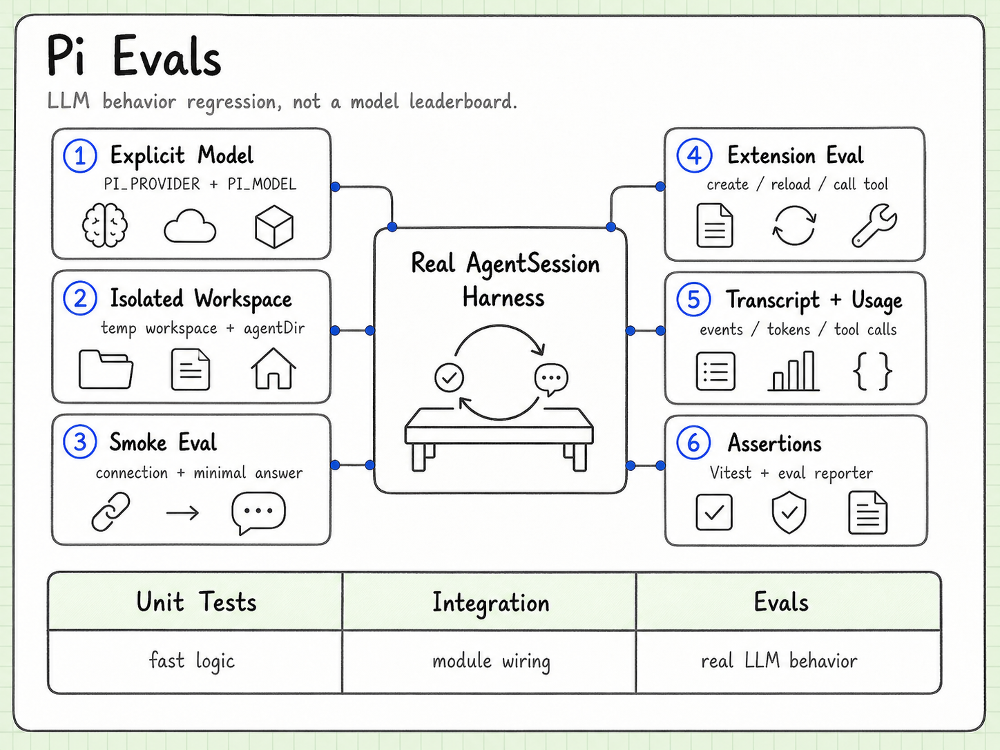

# Evals

Language: [中文](evals.md) | English

Pi's evals are designed to catch regressions in Agent behavior, not only regressions in pure functions. The important unit is a realistic AgentSession run with a model, tools, events, and assertions about the resulting behavior.



## A layered test strategy

```text
unit tests
  -> package integration tests
  -> smoke evals
  -> extension evals
  -> broader behavior checks
```

Lower layers are fast and deterministic. Evals cover the seams where a small runtime change can alter tool selection, event order, session behavior, or extension loading.

## What a smoke eval proves

A smoke eval checks that the basic path is connected:

```text
create session
  -> send prompt
  -> receive model response
  -> execute or observe tool behavior
  -> assert a usable result
```

It is not intended to prove every product feature. Its value is detecting broken wiring, invalid provider assumptions, or a runtime that no longer completes a minimal task.

## What an extension eval proves

An extension eval exercises the real connection between:

- extension discovery;
- registration;
- Agent lifecycle;
- tool or command invocation;
- result propagation.

This is stronger than testing the extension function in isolation because it verifies the host contract as well.

## Why not use only mocks?

Mocks are useful for deterministic package tests, but an Agent is a protocol and behavior system. A mocked stream can miss:

- event ordering mistakes;
- malformed tool-call handling;
- context growth and compaction interactions;
- provider-specific message conversion;
- an extension that registers correctly but is never reachable.

The right balance is not “no mocks”. It is fast lower-level tests plus a small number of realistic evals at the boundaries that matter.

## What evals can catch

Behavioral regressions can include:

- a tool call no longer reaches the executor;
- an error loop is no longer terminated;
- an extension is discovered but not loaded;
- a session does not preserve the expected state;
- a refactor changes the event sequence consumed by a client;
- a provider change silently removes a capability.

## What evals cannot guarantee

Evals do not make model behavior deterministic or prove that every prompt will work. They are regression instruments: focused scenarios that make important runtime contracts observable.

## A useful contribution habit

When changing Agent behavior, ask:

1. Is a unit test enough?
2. Does the change cross a provider, tool, session, or extension boundary?
3. Which smallest realistic eval would fail before the fix and pass after it?

That question keeps evals small while still connecting them to real behavior.

## Continue reading

- [Agent Core](agent-core.en.md)
- [Extension System](extensions.en.md)
- [Engineering governance](engineering.md)
- [Source and version index](source-index.en.md)
