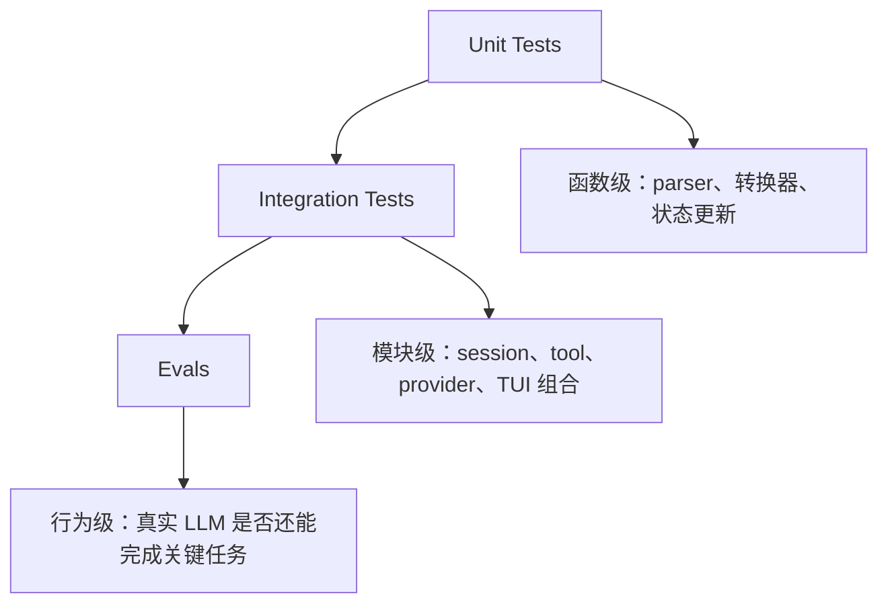
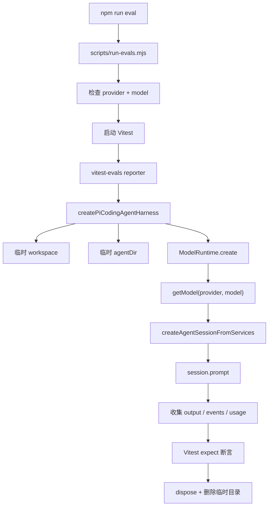
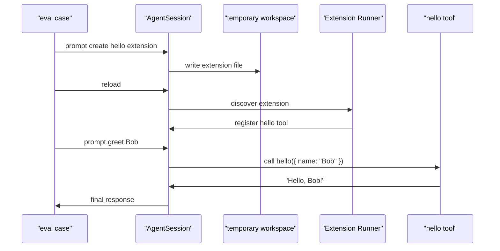

# pi 行为评测

> 状态：初版
> 目标：理解 pi 为什么需要 evals，以及它如何把 LLM 参与后的 agent 行为纳入工程回归。

## 一句话结论

pi 的 evals 不是为了全面评价模型聪不聪明，而是给 agent 系统做关键行为回归。

普通测试能证明“确定性代码没坏”。但 pi 是 agent 产品，里面有真实 LLM、tool call、session、extension、provider 转换和模型选择。代码检查全绿，不代表真实 agent 还会做对事。

evals 补的就是这块空缺：

> 真实模型 + 真实 AgentSession + 真实工具链，在关键场景下是否还保持预期行为。

## 测试分层



三层问的问题不一样：

| 层级 | 问题 | 特点 |
| --- | --- | --- |
| Unit test | 这段确定性逻辑对不对？ | 快、稳定、便宜 |
| Integration test | 这些模块接起来对不对？ | 中等成本，能抓组合问题 |
| Eval | 真实 agent 还会不会做对事？ | 慢、贵、可能波动，但最贴近产品行为 |

所以 evals 不替代普通测试。它只守住 LLM 参与后最重要的几条生命线。

## pi 现在的 evals 结构

源码在 `packages/evals`：

```text
packages/evals/
  README.md
  package.json
  vitest.config.ts
  scripts/run-evals.mjs
  src/pi-harness.ts
  src/smoke.eval.ts
  src/extensions.eval.ts
```

运行入口是根目录脚本：

```bash
npm run eval -- --provider openai-codex --model gpt-5.4
```

如果从 pi 自己的 Bash tool 里跑，可以继承当前 session 的：

```text
PI_PROVIDER
PI_MODEL
```

这里有个重要设计：runner 要求 provider 和 model 都必须明确存在，不会静默 fallback 到别的模型。否则 eval 结果会失真，比如你以为测的是 A 模型，实际跑的是 B 模型。

## 执行链路



`pi-harness.ts` 是关键适配层。它把 pi 的真实 `AgentSession` 包成 `vitest-evals` 能运行的 harness。

它做了几件事：

- 每次 eval 创建临时 workspace。
- 每次 eval 创建临时 agentDir。
- 使用 `SettingsManager.inMemory()`。
- 使用 `SessionManager.inMemory(cwd)`。
- 创建真实 `ModelRuntime`。
- 按 `PI_PROVIDER` / `PI_MODEL` 找真实 model。
- 创建真实 `AgentSession`。
- 调用 `session.prompt(...)`。
- 把消息转换成 transcript events。
- 统计 provider、model、tokens、toolCalls。
- 最后 dispose session，并删除临时目录。

这意味着 eval 不会污染用户项目，也不会依赖本地历史 session。

## smoke eval：测联通

`src/smoke.eval.ts` 是最小生命体征测试。

它禁用工具：

```ts
const piCodingAgentHarness = createPiCodingAgentHarness({ noTools: "all" });
```

然后问：

```text
What's the capital of France? Respond with only the city name.
```

断言：

- 输出是 `Paris`。
- 没有 errors。
- provider 等于 `PI_PROVIDER`。
- model 等于 `PI_MODEL`。
- token usage 大于 0。

这个测试不是为了测模型知识。法国首都只是一个稳定短答案，用来验证整条链路还活着：

```text
provider/model 选择
-> 模型认证
-> AgentSession 创建
-> prompt 调用
-> response 返回
-> usage 记录
```

可以粗略记成：

> smoke eval = 这个 agent 还能连通并完成最小对话吗？

## extension eval：测自扩展能力

`src/extensions.eval.ts` 更接近 pi 的核心价值。

它跑三步：

```text
1. 让 agent 创建一个 hello extension。
2. reload session。
3. 让 agent 用 hello tool 问候 Bob。
```

然后断言：

- 最终 response 是 `Hello, Bob!`。
- session 里出现了一个 extension path。
- tool definitions 里有 `hello`。
- transcript 中确实出现过 `hello` tool call。
- tool call 参数是 `{ name: "Bob" }`。
- tool call 状态是 `ok`。
- tool result 是 `Hello, Bob!`。

这个 eval 守的是一条完整行为链：



可以粗略记成：

> extension eval = 这个 agent 还能长出新工具并使用它吗？

它不是只测插件文件能不能加载，而是测“agent 自己创造能力 -> reload -> 注册能力 -> 调用能力”的完整闭环。

## 为什么不用纯 mock

mock 很适合确定性逻辑，但不适合证明真实模型行为。

如果只 mock assistant output，我们只能证明：

- tool runner 能处理某个写死的 tool call。
- session 能记录某个写死的消息。
- extension loader 能加载某个写死文件。

但证明不了：

- 真实 prompt 下模型是否还会生成正确 tool call。
- tool schema 改了以后模型是否还理解。
- message history 转换是否影响模型行为。
- provider payload 改动是否改变工具调用。
- session reload 之后模型是否能看到新工具。

所以 pi 的选择是：

- 大量普通测试覆盖确定性逻辑。
- 少量 eval 覆盖真实 agent 行为。

这个组合比较健康。

## 为什么不大量写 eval

eval 有天然成本：

- 会消耗真实 token。
- 会受模型版本和 provider 状态影响。
- 会比 unit test 慢。
- 偶尔会因为模型波动失败。
- 失败时定位成本比普通 test 高。

所以 pi 没有把 eval 当成全覆盖工具，而是用它守几个关键行为。

这也很符合 pi 的整体风格：少而硬。不是铺满测试矩阵，而是挑最能代表产品生命体征的路径。

## 它能抓什么退化

pi evals 能抓到这类问题：

- provider/model 选择没有生效。
- auth 或 model runtime 断了。
- AgentSession 不能正常 prompt。
- 输出格式不再 obey instruction。
- usage 统计消失。
- tool call 没产生。
- tool call 参数变形。
- extension 创建失败。
- reload 后 extension 没注册。
- tool result 没正确回到最终回答。

它抓不到或不适合抓：

- 所有模型质量差异。
- 所有边缘 prompt。
- UI 渲染细节。
- provider 协议的每个 payload 字段。
- 完全确定的函数级逻辑。

这些仍然应该交给 unit/integration tests。

## 对我们有什么启发

如果我们以后做自己的 agent 应用，可以照着这个思路设计 eval：

- 先选 1 个 smoke eval：证明最小模型调用链路。
- 再选 1 个核心能力 eval：证明产品独有能力。
- 每个 eval 都用隔离目录，避免污染真实环境。
- 明确 provider/model，不允许隐式 fallback。
- 尽量断言结构性事实，而不是只看自然语言是否“差不多”。
- 保留 transcript 和 usage，方便失败后回放。

比如一个 coding agent，核心 eval 可能是：

- 能否读文件并回答文件内容。
- 能否修改一个小 bug 并跑测试。
- 能否创建 extension/tool 并调用。

一个企业 agent，核心 eval 可能是：

- 能否按权限读取一条记录。
- 能否生成但不发送审批。
- 能否在缺字段时追问而不是乱填。

重点不是 eval 数量，而是每个 eval 都守住一个产品承诺。

## 和参与上游的关系

evals 也能帮助我们更好地参与 pi：

- 如果 issue 涉及 agent 行为退化，可以先问“这个能不能写成 eval？”
- 如果 PR 改了 prompt、tool schema、provider message conversion、extension loading，要特别关注是否影响 eval。
- 如果一个问题用 unit test 很难表达，但能用真实 agent 行为表达，eval 可能是更好的回归形式。

但 eval 不是第一选择。只有当问题本身依赖真实模型行为时，才值得走 eval。

## 最后记一句

pi 的 evals 体现的是一种务实态度：承认 LLM 行为不能完全锁死，但仍然用工程手段守住关键行为不退化。

这也是 agent 项目和普通软件项目最大的差异之一。
