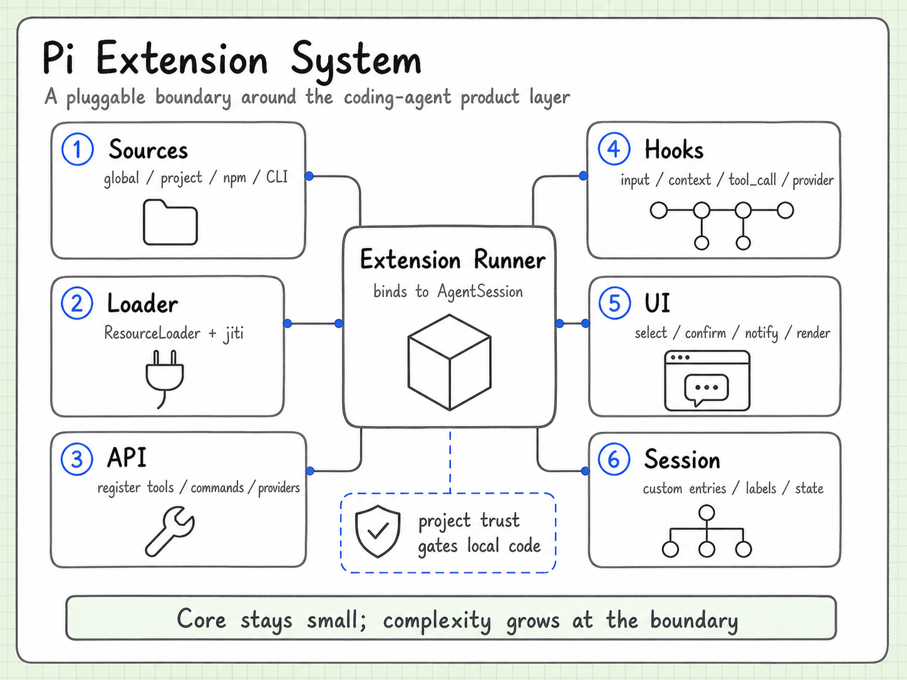

# Extension System

Language: [中文](extensions.md) | English

Pi extensions are a way to add behavior around the Agent runtime without turning the core loop into a registry of every possible feature. An extension can contribute commands, tools, hooks, providers, or UI behavior.



## The extension boundary

```text
extension module
  -> loader
  -> trust / project policy
  -> runner
  -> registered commands, tools, hooks, providers, or UI
```

The loader discovers and imports an extension. Trust and project policy decide whether it may run. The runner supplies the lifecycle and registration surface.

## What extensions can add

Typical extension surfaces include:

- commands that users can invoke;
- tools that the Agent can call;
- event hooks for lifecycle or input changes;
- providers or dynamic model capabilities;
- UI components and notifications;
- custom messages or rendering behavior.

The important distinction is between adding a capability and changing the runtime contract. An extension should normally use the contract exposed by the host instead of reaching into private state.

## Trust is part of loading

An extension is code, not a passive configuration file. That is why discovery and execution are separate steps. Project trust, user choice, and extension policy form a boundary before arbitrary code becomes active.

This also explains why the extension system is not merely “a folder of plugins”. The host needs to control when code is loaded, what it can register, and how failures are reported.

## Dynamic tools

Extensions can add tools after the initial session setup. The Agent still sees a normal tool definition and receives a normal tool result; the extension owns how the capability is implemented.

That gives Pi a useful split:

```text
Agent Core: stable tool-call lifecycle
Extension: capability-specific implementation
Coding Agent: product policy and safety decisions
```

## How to evaluate an extension

When reading or writing one, check:

1. What is the smallest host contract it depends on?
2. At what lifecycle point is it loaded?
3. What state does it own?
4. How can it fail or be disabled?
5. Which eval proves that registration and execution still work?

The last question matters because extension bugs often appear only after the real loader, session, and Agent are connected.

## Continue reading

- [Tool Execution / Safety](tool-execution-safety.md)
- [Evals](evals.en.md)
- [Coding Agent](coding-agent.md)
- [Source and version index](source-index.en.md)
