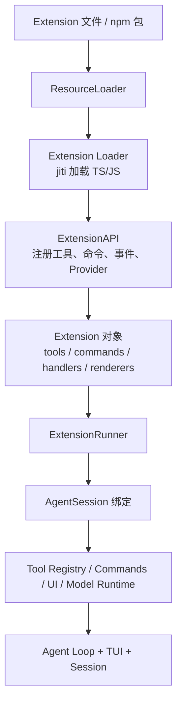
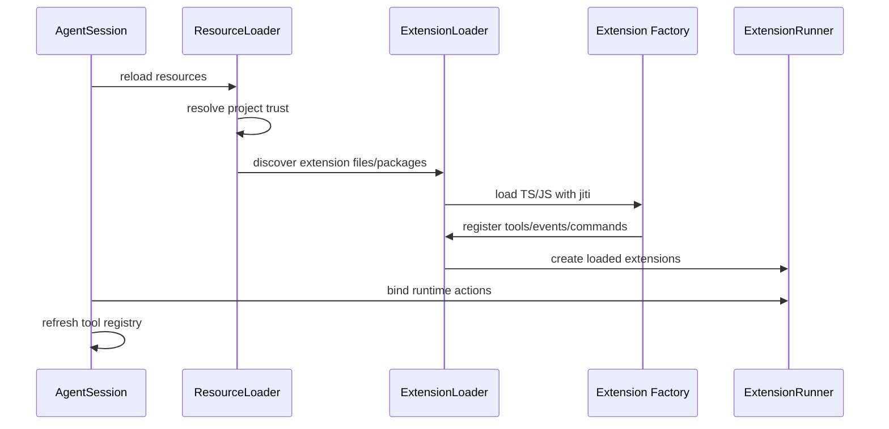
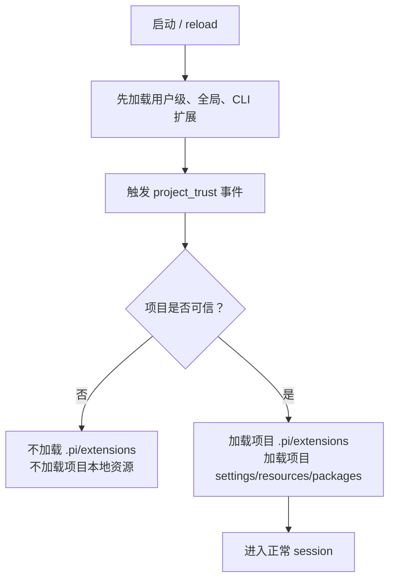
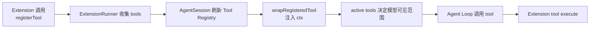
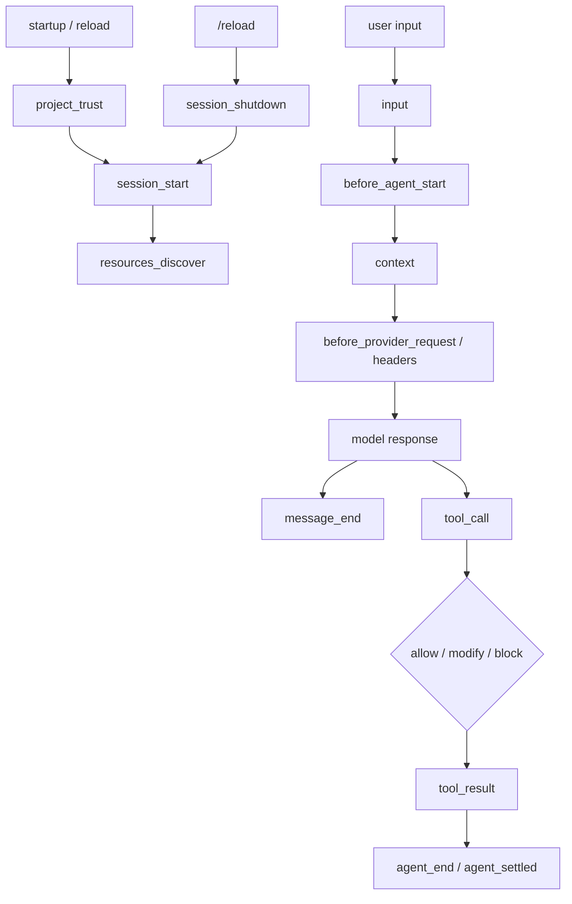
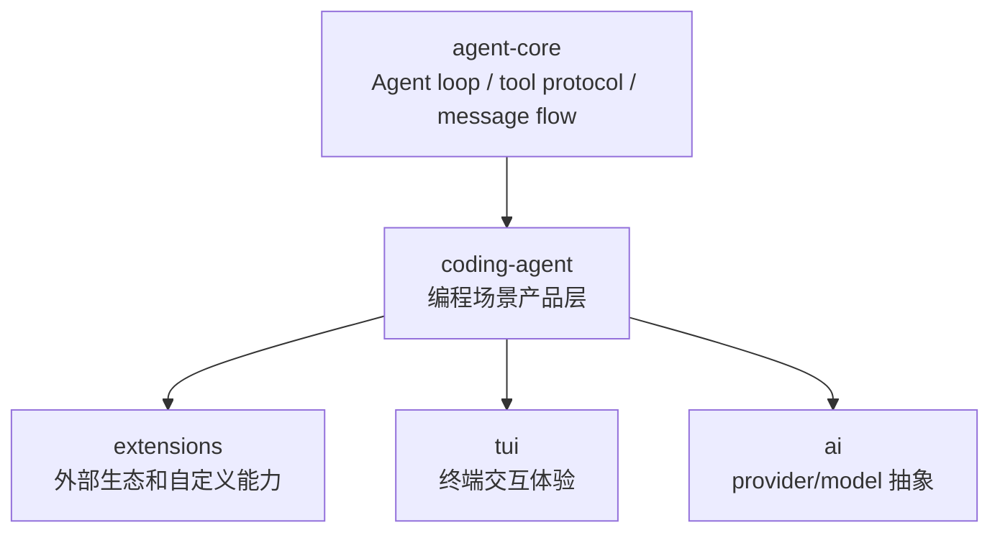

# pi 扩展系统：插件生态的边界

这一章专门看 pi 的 Extension System。

如果前面说 `pi-agent-core` 是“Agent 怎么思考和执行”的内核，`pi-coding-agent` 是“把 Agent 放进编程场景”的产品层，那么扩展系统就是 pi 对外开放生态的接口层：你不需要改 pi 源码，也可以往里面加工具、命令、事件拦截、模型供应商、UI 交互、上下文改写和会话记录。

一句话理解：

> Extension 是 pi 给外部开发者留下的“可插拔改造层”。它让 pi 保持核心简洁，同时允许用户和生态在外面长出自己的工作流。

## 1. 它解决的不是“多一个工具”，而是“怎么让工具长进系统”

一个 coding agent 如果只内置 `read`、`bash`、`edit`、`write`，它能工作，但很难变成生态。因为真实开发环境里会出现很多长尾需求：

- 我想加一个公司内部代码搜索工具。
- 我想在执行危险命令前弹确认。
- 我想把某个 SaaS、数据库、CI、日志平台接进来。
- 我想修改 prompt/context/compaction 策略。
- 我想加自定义 slash command。
- 我想在 TUI 里渲染自己的结果。
- 我想接一个 pi 原本没内置的模型 provider。

如果这些都必须 upstream 改源码，维护成本会爆炸。

pi 的做法是：核心层不急着包办所有场景，而是暴露一套 Extension API，让外部 TypeScript 模块注册能力。

这就有点像：

- VSCode / JetBrains 的插件生态；
- Java 里的 SPI / JDBC 那种“统一接口 + 外部实现”；
- 但又比 JDBC 更高层，因为它不只是替换 driver，还能介入 Agent 生命周期、事件、UI 和工具系统。

## 2. 整体结构图

这张图的重点是：Extension 并不直接塞进 `agent-core`，而是主要挂在 `coding-agent` 这一层。

原因也很清楚：扩展系统包含项目路径、用户配置、TUI、命令、provider、session、权限提示这些“产品层复杂度”。如果全部塞进 core，core 会很快膨胀。

## 3. Extension 怎么被加载

pi 支持几类扩展来源：

- 用户全局扩展：`~/.pi/agent/extensions/*.ts`
- 用户全局扩展目录：`~/.pi/agent/extensions/*/index.ts`
- 项目本地扩展：`.pi/extensions/*.ts`
- 项目本地扩展目录：`.pi/extensions/*/index.ts`
- settings 里配置的额外 extension path
- npm package 形式的扩展
- CLI 参数临时传入的扩展，比如调试时用 `-e ./some-extension.ts`

加载流程大概是这样：

这里有个很妙的设计：扩展文件被加载时，主要做“注册”；真正可以影响会话的操作，要等 `AgentSession` 把 runtime actions 绑定进去之后才执行。

换句话说：

- 加载期：扩展告诉 pi“我有什么能力”；
- 运行期：pi 把真实会话、工具、UI、模型 runtime 接给扩展；
- reload 时：旧上下文失效，重新加载，避免扩展拿着旧 session 继续乱跑。

## 4. Project trust 是安全边界

扩展是代码，不是普通配置。它有完整系统权限。

所以 pi 对项目本地扩展做了 trust gate：

这里的安全边界非常关键：

- 项目本地 `.pi/extensions` 不会在 trust 之前执行；
- 可以参与 trust 判断的是用户已经信任的全局/CLI 扩展；
- 如果没有 UI，危险场景应该 fail closed；
- 官方文档明确提醒：扩展拥有完整系统权限，只安装可信来源。

这也是为什么扩展系统一边很强，一边必须很小心。它像插件，也像本地脚本自动化，一旦信错了项目，后果不是“配置错了”，而是“代码执行了”。

## 5. Extension 能注册什么能力

| 能力 | API / 机制 | 用途 |
|---|---|---|
| 自定义工具 | `pi.registerTool()` | 给模型增加新的 callable tool |
| 事件处理 | `pi.on(event, handler)` | 拦截或改写 tool call、tool result、context、provider request 等 |
| Slash command | `pi.registerCommand()` | 增加 `/xxx` 命令 |
| 快捷键 | `pi.registerShortcut()` | 给 TUI 增加快捷操作 |
| Flags | `pi.registerFlag()` | 给会话增加可切换开关 |
| UI 交互 | `ctx.ui.select/confirm/input/notify/custom` | 在 TUI 场景里向用户询问或渲染内容 |
| 自定义渲染 | message/entry renderer | 控制工具调用、结果、消息、entry 如何展示 |
| Session 记录 | `pi.appendEntry()` | 往会话历史里写自定义 entry |
| Provider | `pi.registerProvider()` | 接入自定义模型供应商 |
| Resource discovery | `resources_discover` 事件 | 扩展技能、prompt、theme 等资源 |
| Prompt/context hook | `input`、`context`、`before_agent_start` | 改写输入、上下文、系统提示词 |

所以 Extension 不只是“注册一个函数给模型调用”。

它真正开放的是一整圈产品能力：输入、上下文、模型请求、工具执行、UI、会话状态和输出渲染。

## 6. Tool 是怎么进入 Agent 的

自定义 tool 的路径可以简化成这样：

有几个值得注意的细节：

第一，Extension tool 会被包装成 `agent-core` 能理解的 `AgentTool`。所以 core 不需要知道“这是扩展来的工具”，只要按统一 tool 协议执行。

第二，工具是否暴露给模型，还要看 active tools。也就是说，注册了不代表永远可见，pi 可以动态控制“这轮模型能看到哪些工具”。

第三，扩展 tool 可以覆盖内置 tool 名称。这个能力很强，也很危险，所以适合高级场景，比如公司内部想替换默认 `bash` 策略、加审计或审批。

第四，pi 支持动态工具：扩展可以在运行中注册新工具，甚至一个 tool 执行完以后让新 tool 进入 active set。源码里会检测执行前后的 active tools 变化，并把新增工具名带回去。

这解释了为什么它不只是静态插件系统，而是可以支持“Agent 用着用着长出新能力”的系统。

## 7. 事件系统是扩展的第二条主线

Extension 的另一条主线是事件。

可以把事件理解成 Agent 生命周期里的挂钩点：

事件系统让扩展可以做很多“横切逻辑”：

- 在工具执行前做权限判断；
- 在 provider request 前加 header 或改 payload；
- 在 model response 后做记录；
- 在 context 进入模型前补充信息；
- 在 compaction 时定制摘要策略；
- 在 session 开始/结束时启动或释放资源。

这也是它像框架的地方：核心流程本身不必知道所有业务逻辑，只要暴露正确的生命周期钩子。

## 8. 三个代表性例子

### hello extension

最小例子就是注册一个 `hello` tool。

它说明的不是“hello 有多有用”，而是 extension 的最短路径：

1. 写一个 TypeScript 文件；
2. 导出默认 factory；
3. 在 factory 里 `pi.registerTool(...)`；
4. reload；
5. 模型就能调用这个 tool。

这就是 evals 里会测的核心能力：pi 能不能创建扩展、reload、发现工具、调用工具、拿到结果。

### permission gate

这个例子监听 `tool_call`。

如果模型要执行疑似危险命令，比如 `rm -rf`、`sudo`、`chmod 777`，扩展可以：

- 在有 UI 时弹出选择，让用户确认；
- 在无 UI 时直接阻止；
- 返回 block reason，让 agent 知道为什么被拦。

这类扩展非常适合企业、团队和个人安全策略。

它也说明：pi 的安全能力不一定都写死在 core 里，很多策略可以通过 extension 外挂。

### dynamic tools

这个例子展示运行时注册工具。

比如通过一个 slash command 动态创建 `echo_xxx` tool，然后让 agent 后续可以调用。

这很有意思，因为它说明 pi 的工具系统不是完全静态的。模型可见工具集可以随着 session 状态变化。

从生态角度看，这意味着扩展可以做“工具市场”“项目能力发现”“按需激活工具”等高级玩法。

## 9. 为什么要这样拆

我觉得这里能看出 pi 的一个设计品味：

> 核心不追求大而全，而是把扩展点设计清楚，让复杂性长在边界上。

如果把所有 provider、命令、UI、权限策略、项目资源、prompt hack 都塞进 core，短期会显得功能多，长期会很难维护。

pi 现在的拆法大概是：

所以 Extension System 的意义不是“我可以写插件”这么简单。

它真正承担的是：

- 让 pi 可以被用户改造；
- 让团队可以加内部能力；
- 让生态可以试错；
- 让 core 保持小；
- 让新想法先在外部实验，成熟后再考虑 upstream。

这对我们做 `pi-runbook` 也很关键：runbook 不只是笔记，还可以成为扩展实验室。

## 10. 和 evals 的关系

`packages/evals` 里有一个 extension eval，专门测“扩展创建与使用”的链路。

它大概做了这几件事：

1. 让 agent 创建一个 hello extension；
2. reload session；
3. 检查 extension 文件是否存在；
4. 检查 `hello` tool 是否被注册；
5. 让 agent 调用 `hello` tool；
6. 检查最终结果里有 `Hello, Bob!`。

这不是随便测一个小功能，而是在测 pi 的生态边界是否可用。

因为如果 extension 不能稳定创建、加载、reload、调用，那 pi 作为“可扩展 agent 底座”的价值会少一大截。

## 11. 我们怎么实践

对我们自己的路线来说，Extension System 是很适合做第一批实验的。

建议按这个顺序：

1. 先复刻 `hello` extension，理解最小注册路径；
2. 再做一个只读工具，比如读取当前 git branch、列出 TODO、查 package scripts；
3. 再做一个 permission gate，练习 `tool_call` 拦截；
4. 再做一个 command，比如 `/branch-summary`；
5. 最后做一个带 UI 的工具，比如让用户选择某个 script 再执行；
6. 如果还想深入，再看 custom provider / compaction / input transform。

这样走的好处是：不用先改 pi 核心，也能快速建立“我真的理解这套机制”的体感。

## 12. 适合未来贡献的切入点

Extension System 相关的贡献点，可能比直接改 agent loop 更适合作为入门：

- 改进扩展文档和示例；
- 给 Windows 环境补充扩展加载、路径、reload 的说明；
- 给 extension eval 增加更多边界测试；
- 梳理动态工具 active tools 的行为；
- 验证 project trust 在不同模式下是否 fail closed；
- 整理扩展开发最佳实践；
- 做一个实际有用的小扩展，然后写成案例。

这类贡献相对安全，又能展示你真的理解 pi 的设计思想。

对维护者来说，这种贡献也更容易判断质量：不是“我改了一堆核心逻辑”，而是“我读懂了边界，并把边界讲清楚/测清楚/用清楚了”。
