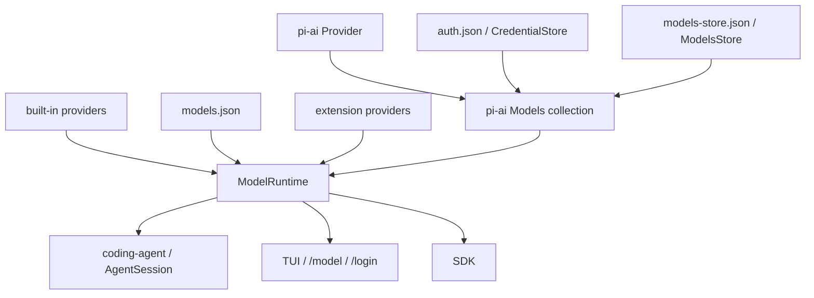
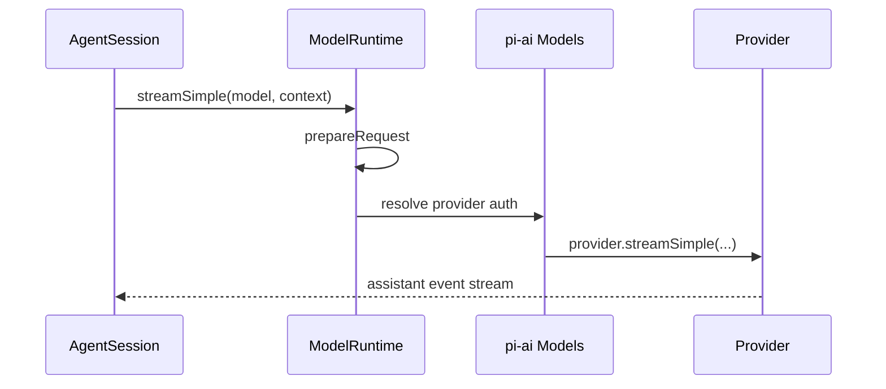
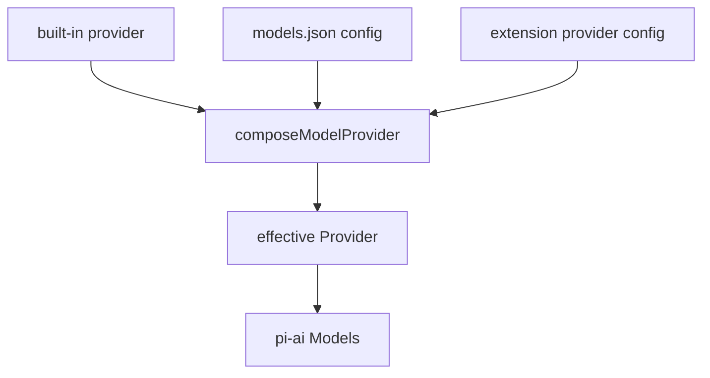
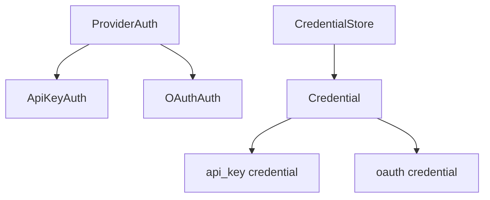
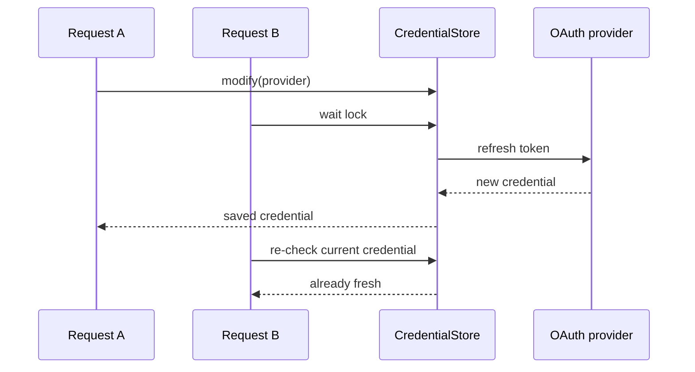
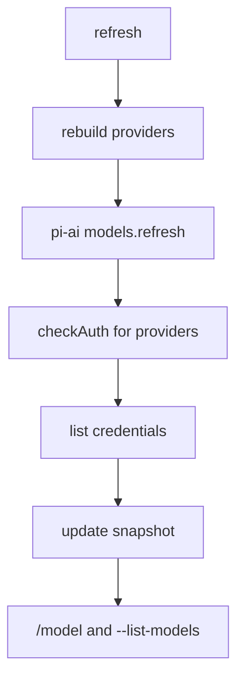
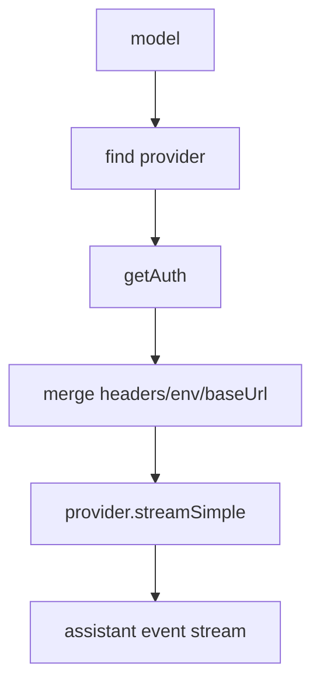

# pi Model Runtime / Auth：把模型供应商变成可组合运行时

这一章看 pi 的模型与认证系统。

如果 `pi-ai` 是“模型供应商抽象层”，那么 `coding-agent` 里的 `ModelRuntime` 就是“面向实际产品运行的模型/auth facade”。

它解决的问题不是“怎么调用 OpenAI/Anthropic”，而是：

> 在一个长期运行的 Agent 里，如何统一管理内置 provider、自定义 models.json、扩展 provider、API key、OAuth、动态模型列表、可用性检查和真实请求认证。

## 1. 为什么需要 ModelRuntime

一个简单模型调用库可能只需要：

```typescript
callModel({ apiKey, model, messages })
```

但 pi 面对的是更复杂的场景：

- 内置很多 provider；
- provider 的 auth 方式不一样：API key、OAuth、AWS ambient credential、Google ADC、本地 keyless server；
- 用户可以用 `/login` 存凭证；
- 用户可以用环境变量；
- 用户可以写 `models.json` 加 Ollama、vLLM、LM Studio、自定义 proxy；
- extension 可以运行时注册 provider；
- provider 可能动态刷新模型列表；
- session 恢复时要找回之前的 provider/model；
- TUI 需要知道哪些模型“可用”；
- OAuth token 可能过期，需要自动 refresh；
- SDK 用户可能想临时注入 API key，但不落盘。

这些逻辑如果散在各处，系统会很快失控。

所以 pi 把它们集中到 `ModelRuntime`。

## 2. 分层图



这里有两层需要区分：

- `pi-ai Models`：更底层的 provider collection，负责 provider、auth resolution、stream delegation；
- `coding-agent ModelRuntime`：更产品化的 facade，负责加载配置、组合 provider、维护可用模型快照、接扩展和 UI。

## 3. Provider 是运行时单位

在 pi-ai 里，provider 是真正的运行时单位。

一个 provider 拥有：

- `id`
- `name`
- `auth`
- `getModels()`
- 可选 `refreshModels()`
- 可选 `filterModels()`
- `stream()`
- `streamSimple()`

模型本身不是孤立存在的。每个 model 都属于某个 provider：

```text
provider: anthropic
model: claude-opus-4-5
api: anthropic-messages
```

当请求发生时：



也就是说，pi 不是让上层到处判断“这个模型该怎么调”，而是让 provider 自己拥有调用逻辑。

## 4. Provider 组合：built-in + models.json + extension

`ModelRuntime` 会把 provider 来源组合起来。



组合顺序可以这样理解：

1. built-in provider 提供默认行为和模型 catalog；
2. `models.json` 可以新增 provider、覆盖 baseUrl、headers、compat、models、modelOverrides；
3. extension 可以注册 provider config 或完整 native Provider；
4. 最后得到一个 effective Provider，交给 `pi-ai Models`。

这就是它像 SPI/JDBC 的地方：核心定义 provider 协议，不同来源都能被合成为统一实现。

## 5. `models.json` 是用户配置层

`models.json` 主要解决自定义模型和兼容性覆盖。

比如本地 Ollama：

```json
{
  "providers": {
    "ollama": {
      "baseUrl": "http://localhost:11434/v1",
      "api": "openai-completions",
      "apiKey": "ollama",
      "models": [
        { "id": "qwen2.5-coder:7b" }
      ]
    }
  }
}
```

这里的 `apiKey` 对 Ollama 可能只是占位，因为 Ollama 不看它，但 pi 仍然用“auth configured”来决定模型是否出现在可用列表里。

`models.json` 可以配置：

- provider `baseUrl`
- provider `api`
- provider `apiKey`
- provider `headers`
- `authHeader`
- `models`
- `modelOverrides`
- `compat`
- Radius OAuth gateway

这让 pi 可以接：

- Ollama
- LM Studio
- vLLM
- SGLang
- 公司内部 proxy
- OpenAI-compatible endpoint
- Anthropic-compatible endpoint
- Google Generative AI endpoint

## 6. Auth 的核心原则

pi-ai 的 auth 抽象很明确：



一个 provider 至少要有一种 auth 语义。

哪怕是 keyless 本地服务器，也要有一个“resolve 为已配置”的 auth，这样整个系统可以统一判断 provider 是否可用。

CredentialStore 的原则：

- 按 provider id 存；
- 一个 provider 一个 credential；
- credential 带类型：`api_key` 或 `oauth`；
- `modify()` 是唯一写路径；
- `modify()` 是 serialized read-modify-write；
- `list()` 只能列非秘密 metadata，不能解析 secret；
- OAuth refresh 在 `modify()` 锁内执行，避免并发重复刷新。

最重要的一条：

> stored credential owns the provider。

也就是说，如果 `auth.json` 里已经存了某个 provider 的 credential，就不会在它坏掉时偷偷 fallback 到环境变量。

这能减少非常多“我以为用的是 A key，实际用了 B key”的混乱。

## 7. 认证优先级

从用户视角看，认证优先级大概是：

1. CLI / SDK 的运行时 API key override；
2. `auth.json` 存储的 API key 或 OAuth token；
3. 环境变量；
4. `models.json` 里的 custom provider key / fallback config。

官方 providers 文档写的是：

```text
CLI --api-key
auth.json
environment variable
models.json
```

SDK 文档写的是：

```text
runtime override
auth.json
environment variable
fallback resolver
```

这两种说法不冲突。CLI 的 `--api-key` 本质上就是一次运行时 override / request override。

## 8. `auth.json` 做什么

默认凭证文件在：

```text
~/.pi/agent/auth.json
```

API key 示例：

```json
{
  "anthropic": { "type": "api_key", "key": "sk-ant-..." },
  "openai": { "type": "api_key", "key": "sk-..." }
}
```

OAuth login 后也会存在这里。

文件存储实现里有几个工程点：

- 自动创建父目录；
- 文件权限 `0600`；
- 用 lockfile 做同步/异步锁；
- `modify()` 时读当前内容、写回新内容；
- 解析失败时保留最后一次有效内存快照；
- `read()` 时才解析配置值，比如 `$ENV_VAR` 或 `!command`。

`key` 支持：

- literal；
- `$ENV_VAR` / `${ENV_VAR}`；
- `!command`；
- 转义 `$$` 和 `$!`。

这很方便，但也意味着：配置命令本身的缓存、失败恢复、速率限制，需要用户自己负责。

## 9. OAuth 为什么要放在 provider 里

OAuth 流程差异很大。

比如：

- OpenAI Codex / ChatGPT subscription；
- Anthropic Claude Pro/Max；
- GitHub Copilot；
- xAI subscription；
- OpenRouter PKCE；
- Radius gateway。

所以 pi 没有做一个“大一统 OAuth 流程”，而是让 provider 自己实现：

- `login(interaction)`
- `refresh(credential)`
- `toAuth(credential)`

`Models.getAuth()` 或真实请求路径会在 token 快过期时自动 refresh。

关键点是 refresh 在 CredentialStore 的锁里执行：



这避免并发请求同时刷新同一个 token。

## 10. 可用模型快照

`ModelRuntime` 维护一个 snapshot：

- all models；
- available models；
- configured providers；
- stored providers；
- auth check map。

TUI 和 CLI 不需要每次都完整解析所有东西。



`getModels()` 是“所有已知模型”，不代表可用。

`getAvailable()` 是“provider auth 已配置的模型”。

这点很重要：模型存在和模型能用，是两件事。

## 11. 动态模型列表与 `models-store.json`

有些 provider 的模型 catalog 不是静态的，比如 Radius、某些 gateway、本地 server。

pi-ai provider 可以实现 `refreshModels(context)`。

refresh context 里会有：

- effective credential；
- provider-scoped store；
- allowNetwork；
- force；
- abort signal。

动态模型会缓存到：

```text
~/.pi/agent/models-store.json
```

这样离线启动时也能恢复上次 catalog。

这也是 ModelRuntime 创建时为什么有 `allowModelNetwork` 和 `PI_OFFLINE` 这类控制：启动时不一定应该联网。

## 12. Extension 怎么接模型系统

Extension 可以注册 provider。

两种方式：

### config 形式

扩展给出 provider config：

- baseUrl
- api
- apiKey
- headers
- models
- oauth
- refreshModels
- streamSimple

`ModelRuntime.registerProvider(name, config)` 会把它作为 extension layer 参与 compose。

### native Provider 形式

扩展直接给出完整 pi-ai `Provider`。

这适合需要完整自定义：

- auth；
- getModels；
- refreshModels；
- filterModels；
- stream；
- streamSimple。

这就是为什么 Extension System 不只是加 tool，它也能加模型 provider。

## 13. 请求时发生什么

真实请求前，`ModelRuntime.prepareRequest()` 会做：

1. 找到 provider；
2. resolve auth；
3. 合并 provider auth headers；
4. 合并 model headers；
5. 合并显式 request headers；
6. 执行 `transformHeaders`；
7. 合并 provider-scoped env；
8. 如果 auth 提供 baseUrl，覆盖 request model 的 baseUrl；
9. 调 provider 的 stream/streamSimple。

简化图：



这让上层 Agent 不用关心每个供应商的凭证和 header 细节。

## 14. 这个设计的核心思想

我会把 Model Runtime / Auth 总结成四点：

第一，provider 是运行时单位。

模型属于 provider，请求由 provider 负责执行。

第二，auth 是 provider-owned。

不同 provider 可以有完全不同的 API key / OAuth / ambient credential 规则。

第三，配置是分层组合。

built-in、models.json、extension provider 叠加成 effective provider。

第四，模型存在不等于模型可用。

`getModels()` 是 catalog，`getAvailable()` 是带 auth 状态的可用集合。

## 15. 我们怎么实验

这块可以做几个低风险实验：

1. 看本地 `~/.pi/agent/auth.json` 的结构，不提交；
2. 用 `/login` 存一个测试 provider 的 API key；
3. 用 `pi --list-models` 看 available models；
4. 写一个最小 `models.json` 接本地 Ollama 或 mock provider；
5. 做一个 extension 注册 toy provider；
6. 测试 `setRuntimeApiKey()` 这种不落盘的 SDK 用法；
7. 对照 `/model` 看 model 是否存在、是否 available。

潜在贡献点：

- `providers.md`、`models.md`、`sdk.md` 之间认证优先级表述统一；
- Windows 下 `auth.json` 权限、lockfile、`!command` 示例；
- `models-store.json` 的文档补充；
- extension provider 示例补充；
- OAuth refresh 错误提示；
- custom provider 的 compat 设置文档。

如果 Extension System 是“生态怎么扩”，Session / Storage 是“状态怎么存”，Compaction 是“长任务怎么不断线”，那 ModelRuntime / Auth 就是“这个 Agent 怎么稳定接入真实模型世界”。

