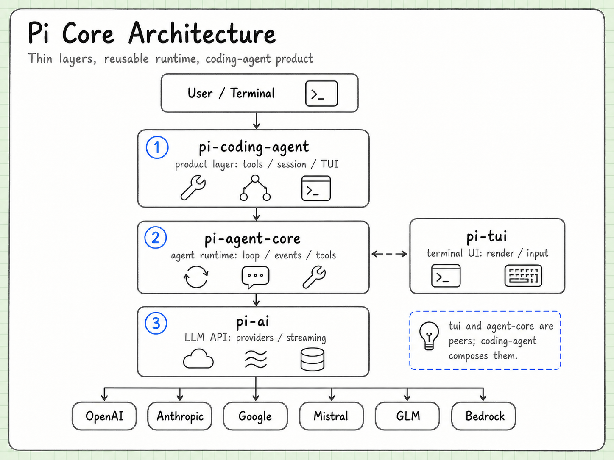

# Pi core ideas

Language: [中文](pi-overview.md) | English

This page gives a system-level model of Pi before the reader dives into individual packages. Pi is best understood as a small, composable coding-agent harness: a runtime that connects model providers, an Agent loop, tools, sessions, extensions, and user-facing transports.



## One-line definition

Pi is not a model and not only a terminal application. It is a set of boundaries that let a coding Agent run, persist state, execute tools, and expose the same runtime through different clients.

## Four useful layers

| Layer | Responsibility |
| --- | --- |
| `pi-ai` | Normalizes model messages, streaming, tool calls, usage, auth, and provider-specific compatibility. |
| `pi-agent-core` | Runs the model/tool feedback loop and emits lifecycle events. |
| `pi-coding-agent` | Adds coding tools, sessions, extensions, prompts, configuration, and product modes. |
| `pi-tui` | Renders terminal components and handles interactive input without owning Agent policy. |

The layers are related, but they should not become one large abstraction. A provider adapter should not know how the terminal is rendered; the TUI should not decide when a model needs another tool call.

## One task through the runtime

```text
user input
  -> coding-agent session
  -> Agent Core turn
  -> pi-ai provider stream
  -> text or tool call
  -> tool execution
  -> result appended to context
  -> next model call or stop
```

The outer unit is a user task. Inside it, the runtime may perform several model calls and tool executions. The loop stops when the model finishes, the user interrupts, a tool or runtime fails, or a resource boundary is reached.

## The message pipeline

Pi keeps the model-facing protocol separate from the user-facing presentation. The Agent receives structured events; the TUI, RPC mode, or another client decides how to display or transport them.

That separation is what allows the same runtime to support an interactive terminal, a print mode, an SDK integration, or a remote server.

## Why the split matters

The design keeps four changes independent:

- adding a provider does not require rewriting the Agent loop;
- adding a coding tool does not require changing the model protocol;
- replacing the TUI does not change session semantics;
- embedding the runtime does not require pretending that a remote client is a terminal.

This is a capability boundary, not a promise that every provider supports every feature. Shared semantics are normalized; provider-specific options and compatibility flags remain below the common interface.

## Engineering implications

The most useful way to study Pi is boundary-first:

1. identify the internal contract;
2. find the adapter or product layer that implements it;
3. observe the event and state transitions;
4. verify one design claim with a small experiment.

## Continue reading

- [Architecture](architecture.en.md)
- [Agent Core](agent-core.en.md)
- [AI Package](ai-package.md)
- [Extension System](extensions.en.md)
- [Source and version index](source-index.en.md)
