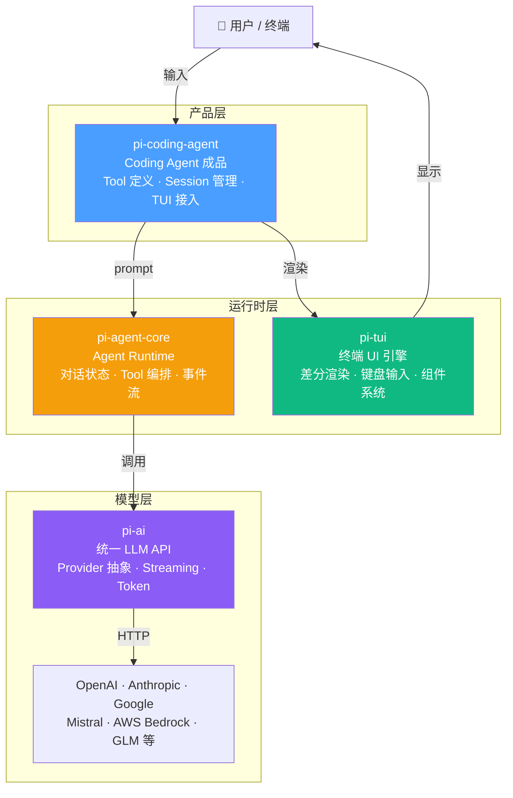
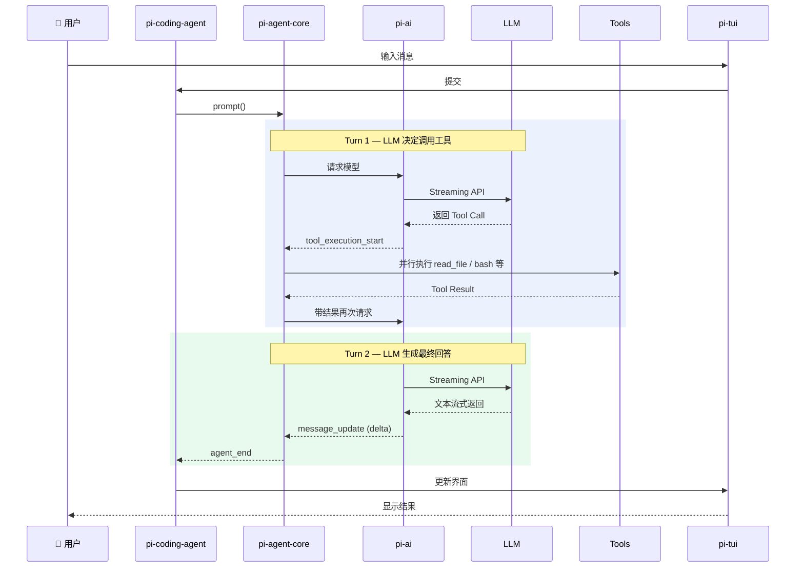
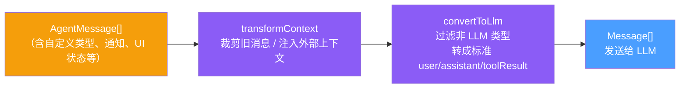
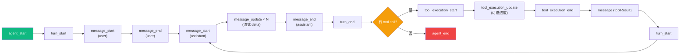
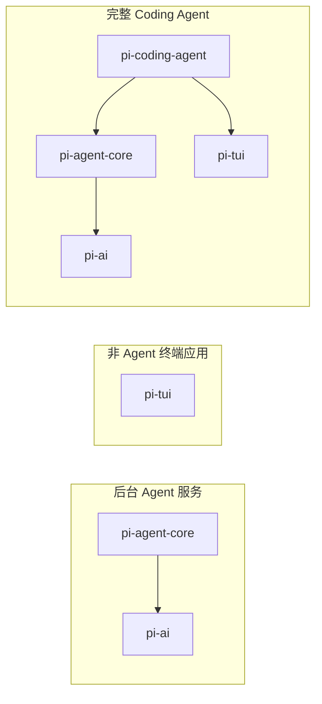

# Pi 核心思想概览

## 一句话定义

pi 是一个开源的 agent 框架，外加一个基于这个框架的 coding agent 实现。不绑定任何模型厂商，用 TypeScript 写，MIT 协议。

## 作者

Mario Zechner（badlogic），奥地利工程师，libGDX 创造者。做了十五年跨平台游戏框架，风格是"最小抽象、强个人主导、工程纪律严格"。pi 的设计哲学跟 libGDX 一脉相承——薄抽象、分层清晰、每一层独立可用。

## 四层架构

关键点：tui 和 agent-core 是平级的，互不依赖。coding-agent 同时依赖两者，把它们编排在一起。

### pi-tui — 终端渲染引擎

跟 agent 无关的独立 UI 层。做两件事：把字画到终端上（差分渲染 + CSI 2026 原子写入），和处理键盘输入（含中文 IME）。依赖只有两个 npm 包。可用来写任何终端应用。

### pi-ai — LLM 统一抽象层

各家厂商的 API 格式都不同（OpenAI 的 function calling、Anthropic 的 tool use、Google 的 function declaration），这一层把它们翻译成统一接口。上层只需说"我要用 Claude Sonnet"，不用关心底层格式。拉了 11 个 provider SDK。

### pi-agent-core — Agent 运行时

整个项目的大脑。管对话状态、编排 tool call 执行（默认并行）、处理多轮循环的事件流、支持运行时打断（steering）和追加指令（follow-up）。不知道"代码"是什么概念，只知道"给我 model + tools + system prompt，我跑 agent loop"。

### pi-coding-agent — Coding Agent 产品

把三层组装成能直接用的成品。承担三个角色：tool 定义、session 管理、TUI 接入。

## Agent 运行时序

用户发一条消息后，pi 内部的完整流转：

注意中间的"Turn 1"和"Turn 2"——agent loop 会自动多轮：LLM 如果决定调 tool，执行完 tool 后会拿着结果再问一次 LLM，直到 LLM 认为可以给出最终回答为止。

## 消息管道

每轮 LLM 调用前，消息要经过两步转换：

这个两段式设计让 pi 可以在同一份对话记录里混入 UI 专用的消息类型（比如"通知"、"状态标记"），不会干扰 LLM 的上下文。

## 事件流

一次完整的 prompt() 调用产生的事件序列：

## 为什么这么拆

核心逻辑：变化频率不同的东西必须隔离。

| 层 | 变化频率 | 外部依赖数 | 消费场景 |
|---|---|---|---|
| pi-tui | 极低（渲染逻辑几个月不动） | 2 | 任何终端应用 |
| pi-agent-core | 中（agent 机制偶尔迭代） | 4 | 后台 agent / 自定义 agent |
| pi-ai | 高（provider 生态每周变） | 11 | 任何需要调 LLM 的场景 |
| pi-coding-agent | 高（功能持续加） | 18 | 直接当 coding agent 用 |

如果揉在一起，每次更新一个 provider SDK 都得重新构建测试整个渲染层。拆开之后，各层独立演化、独立测试、独立被复用。

消费者可以各取所需：

## 工程纪律

超出一般开源项目的工程实践：

- 依赖全部钉死精确版本（save-exact=true）
- npm-shrinkwrap.json 锁定传递依赖
- min-release-age=2 避免当天发布的依赖
- pre-commit 阻止意外 lockfile 变更
- CI 跑 npm audit + npm audit signatures
- 专门的 evals 包做 agent 行为回归测试（vitest-evals）
- 供应链安全有明确流程文档

## 社区治理

强 gatekeeping 模式：

- 新 contributor 的 issue 和 PR 默认自动关闭，maintainer 每日审查
- lgtmi（issue 级信任）：future issues 不再自动关闭
- lgtm（PR 级信任）：future issues 和 PRs 不再自动关闭
- 先靠质量证明自己，再逐步拿权限

## 对比 Claude Code / Codex

| 维度 | Claude Code / Codex | pi |
|---|---|---|
| 开源 | 闭源 | 完全开源 (MIT) |
| 模型绑定 | 绑定自家模型 | 不绑定，任意 provider |
| 定位 | 能用的产品 | 可理解、可改造的框架 |
| 适合场景 | 直接写代码 | 学 agent 设计 / 做自己的 agent 应用 |

## 相关链接

- GitHub: https://github.com/earendil-works/pi
- 官网: https://pi.dev
- 文档: https://pi.dev/docs/latest
- Discord: https://discord.com/invite/3cU7Bz4UPx
- RFC: https://rfc.earendil.com/keyword/pi/
- 作者 session 数据: https://huggingface.co/datasets/badlogicgames/pi-mono
