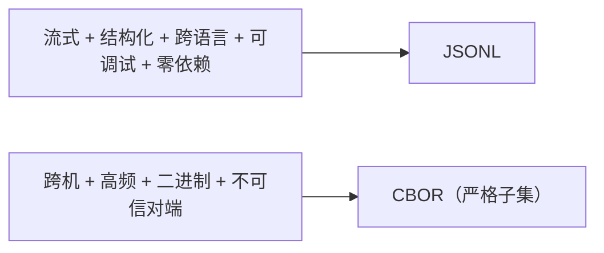

# 进程间通信协议：JSONL 与 CBOR

> 状态：初版
> 本文回答：为什么 pi 本地用 JSONL、远程用 CBOR，以及这套选择背后的通用工程原理。

本文是"方法论"而非"pi 专属事实"：它把 [rpc-sdk.md](rpc-sdk.md) 里 pi 的两套接口抽象成可迁移的规律，并用 Claude Code 佐证这不是 pi 独有的选择。

## 一句话定位

agent 的进程间通信，本质是**"流式结构化事件"的传输问题**。JSONL 和 CBOR 是同一个问题在"本地可读"和"远程高效"两个约束下的两个答案。

## 为什么 agent 的通信是"事件流"，不是"文档"

普通程序调 API 是"一次请求一次结果"。但 LLM 是 **token 级增量生成**，agent 收到的是**一条持续的事件序列**：

```
system → assistant(message_start) → assistant(text_delta)×N
       → assistant(tool_use) → user(tool_result) → assistant(...) → result
```

这条序列有三个 JSON 数组扛不住的性质：

1. **长度未知**——回答可能 5 行也可能 500 行，无法预先定数组长度；
2. **要边生成边消费**——一检测到 `tool_use` 就要立刻执行工具，绝不能等整段回答生成完；
3. **不能等结束**——streaming 的价值就在于"先出先看"，等闭合等于丢掉整个体验。

所以传输格式必须支持"一条一条往外吐"，这就是"流式"的硬约束。JSONL 和 CBOR 都是围绕这个约束设计的，区别只在"吐的是文本还是二进制"。

## JSONL：本地可读的流式文本

**JSON Lines / NDJSON**——一行一个 JSON 对象，对象之间用换行符 `\n` 分隔，没有外层括号：

```jsonl
{"type":"prompt","id":"1","message":"hi"}
{"type":"response","id":"1","command":"prompt","success":true}
{"type":"message_update","delta":"hello"}
```

核心机制一句话：**换行符就是消息边界**。写入端每条消息序列化后加个 `\n`，读取端按行读、每遇到 `\n` 就解析一行。这让 JSONL 天然满足"流式、可追加、无限长"。

在 pi 里 JSONL 有**两个用途，别混**：

| 用途 | 载体 | 内容 |
|---|---|---|
| RPC 传输 | stdin/stdout | `RpcCommand` / `RpcResponse` / 事件 |
| Session 存储 | 磁盘 `~/.pi/agent/sessions/*.jsonl` | session entry（user/assistant/toolResult/compaction…） |

一个在进程之间传消息，一个在磁盘上存历史；但都吃"按行独立、append-only、坏一行可跳过"的红利。

它同时满足五个"不可妥协"的需求，且成本最低：

1. **流式**——一行一事件，换行即分帧；
2. **结构化 + 可路由**——JSON 对象自带字段名，`{"type":"prompt"}` 天然是路由表；
3. **跨语言 + 零 schema**——任何语言都能 `split('\n')` + `JSON.parse`，不需要 `.proto`；
4. **人可读 = 可调试**——`tail -f` / `grep` / `jq` 直接排障，agent 是黑盒，可观测性是命根子；
5. **断点恢复 / 容错**——每行独立，记"处理到第几行"就能续传。

## CBOR：远程高效的二进制

**CBOR**（Concise Binary Object Representation，RFC 8949）——一句话是"**二进制的 JSON**"：干 JSON 的活，用二进制表示。

| | JSON | CBOR |
|---|---|---|
| 形态 | 文本（`{"a":1}`） | 二进制字节序列 |
| 体积 | 大（键名、引号、逗号都是字符） | 小（类型标记代替语法字符） |
| 数字 | 只有浮点，大整数丢精度 | 原生整数（不限 2^53）、浮点、字节串 |
| 解析 | 慢（逐字符） | 快（按类型字节解码） |

pi 的 `pi-protocol` 用它的两个理由，都和"远程 socket 传输"有关：

1. **分帧简单**——JSONL 靠换行符切分，遇到内容含换行或二进制就麻烦；CBOR 用 **4 字节长度前缀**精确切分，字节流被任意拆分/合并都不影响解析。
2. **能传二进制**——JSON 传不了原始字节（要 base64，膨胀 33%）；CBOR 原生支持字节串，传附件/工具产物不用编码。

但 CBOR 规范本身很宽松（支持 tag、无限长数组），这些灵活性是安全/兼容的坑。所以 pi 用的是**严格子集**：

- ✅ 只留：null、布尔、有限数字（整数限 JS safe range、非整数 float64）、UTF-8 字符串、字节串、定长数组/map；
- ❌ 拒绝：tag、无限长 item、非有限/超范围数、稀疏数组、畸形 UTF-8、尾随数据、过深嵌套、超大值；
- 默认上限：16 MiB/帧、100 万元素、64 层嵌套。

为什么砍这么狠：对端被当作**不可信**（协议 README 反复强调 "All transports are untrusted"），收紧格式 = 减少畸形输入打爆内存或触发解析器漏洞的攻击面。

## 对比与分工

| | JSONL | CBOR |
|---|---|---|
| 本质 | 文本，一行一个 JSON | 二进制，长度前缀 + CBOR item |
| 消息边界 | 换行符 `\n` | 4 字节长度前缀 |
| 人眼可读 | ✅ 能看、能 `jq` | ❌ |
| 二进制数据 | ❌ 要 base64 | ✅ 原生字节串 |
| 体积/解析 | 大 / 慢 | 小 / 快 |
| pi 里的场景 | 本地 RPC + session 文件 | 远程 socket 会话 |

一句话：**JSONL 管"把人/本地程序接进 pi"，CBOR 管"把 pi 当远程服务连"。** 这是通用的分工，不是 pi 独有。

## 为什么还要拆 client / server / protocol

远程通信天然有三个角色：**协议**（怎么说话）、**客户端**（谁要连）、**服务端**（谁被连）。pi 对应拆成 `pi-protocol` / `pi-client` / `pi-server`，等价于 gRPC 的 `.proto` / client stub / server 框架。

四条理由：

1. **依赖隔离**——client 零外部依赖、只依赖 protocol；server 才背 pi-ai。轻客户端不拖 server 的重依赖。
2. **transport-neutral**——client 核心无 Node 专属 import，Unix socket 放子路径，浏览器用 WebSocket 跑同一套逻辑。
3. **形态不同**——client 是开箱 SDK，server 是留钩子的框架（要自己实现 service）。
4. **协议单独成包**——两端共享同一份 schema，字段不一致在类型/编译层就被拦，不会运行时"静默失联"。

## 佐证：这不是 pi 独有的选择

Claude Code 在 headless / agent 模式下，官方要求的也是 NDJSON（= JSONL）。第三方整理的协议文档（[claude-cli-agent-protocol](https://raw.githubusercontent.com/NeverSight/skills_feed/refs/heads/main/data/skills-md/bohdan-shulha/skills/claude-cli-agent-protocol/SKILL.md)）记录了它的启动参数：

```bash
claude --output-format stream-json --input-format stream-json --permission-prompt-tool stdio
```

消息同样是带 `type` 字段的 NDJSON：

```json
{"type":"user","message":{"role":"user","content":[{"type":"text","text":"your prompt"}]}}
{"type":"assistant","message":{...}}
{"type":"control_request","request_id":"req_abc","request":{"subtype":"can_use_tool","tool_name":"Bash",...}}
{"type":"result",...}
```

> 注意边界：Claude Code **核心是闭源的**，这里确认的是它**对外暴露的 headless 接口**用 NDJSON。该接口设计是公开的，因为要供第三方 SDK 驱动。

对照 pi 的 `pi --mode rpc`，你会发现几乎同一个模子：stdio 上的 JSONL、消息带 `type`、请求/响应 + 事件流、工具审批走 `control_request/control_response`（对应 pi 的 `extension_ui_request`）。这不是抄袭，是**场景约束把所有人逼到了同一个答案**。

## 我的理解

选格式的底层逻辑是"约束收敛"：



当"可读性、流式性、零成本"同时成立时，JSONL 是代价最低的交点；一旦场景变成"远程、高频、要传二进制、不再需要人看"，就再加一层 CBOR。**格式不是越先进越好，而是匹配约束**——这也是为什么 pi 宁可两套并存，也不用一个"万能的"格式硬扛所有场景。

## 实验角度

1. **JSONL roundtrip**：手写一个 `split('\n')` + `JSON.parse` 的最小收发循环，体会"换行即分帧"。
2. **CBOR 分片/合并**：用 `pi-protocol` 的 `encodeClientMessage` / `createServerMessageDecoder`，故意把一帧拆成几段 push，验证"任意分片不影响解析"。
3. **体积对比**：同一份消息分别用 JSONL 和 CBOR 编码，量一下字节差，直观感受"文本 vs 二进制"的代价。
4. **对照 Claude Code**：起一个 `claude --output-format stream-json` 的 headless 进程，和 `pi --mode rpc` 并排看，确认两者协议骨架同构。

## 相关链接

- [rpc-sdk.md](rpc-sdk.md) — pi 的 SDK / JSONL RPC / CBOR 协议的具体接口。
- [session-storage.md](session-storage.md) — JSONL 作为 session 存储格式的那一面。
- [RFC 8949 — CBOR](https://www.rfc-editor.org/rfc/rfc8949.html)
- [JSON Lines](https://jsonlines.org/)
