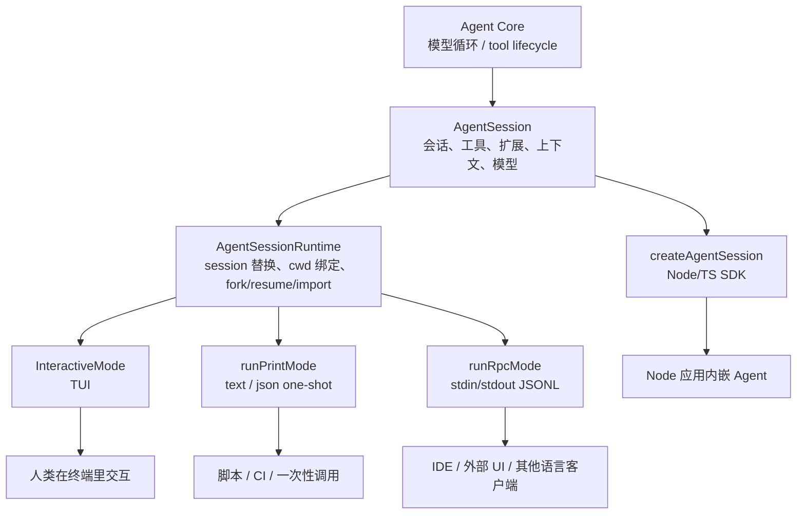
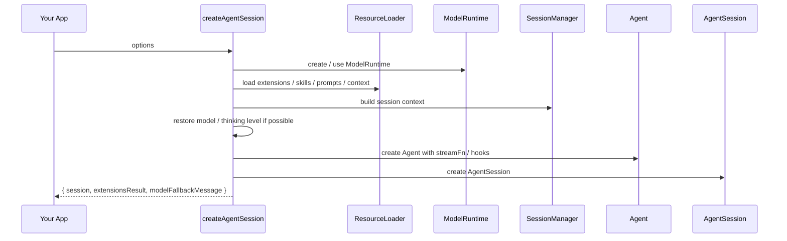
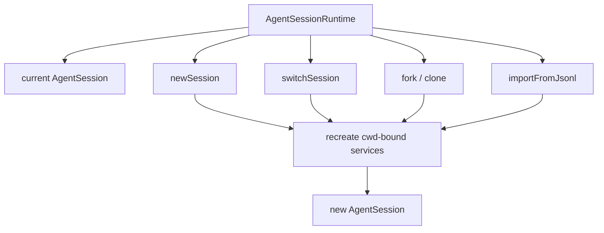
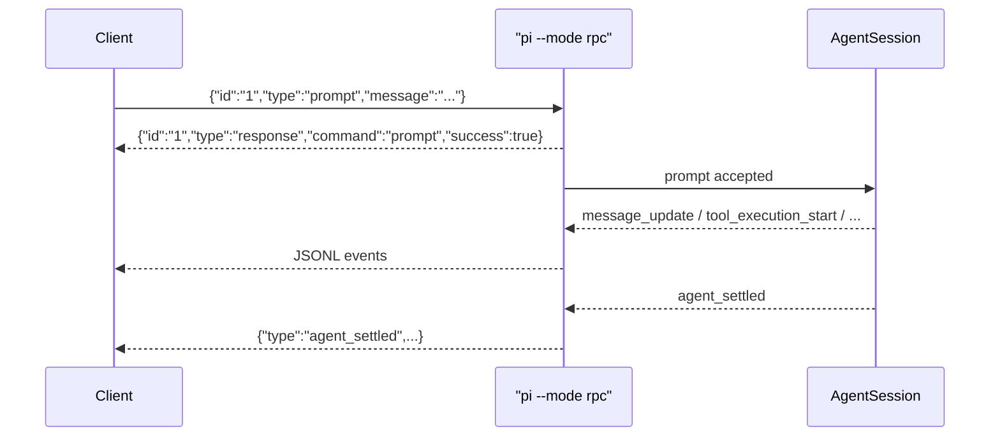
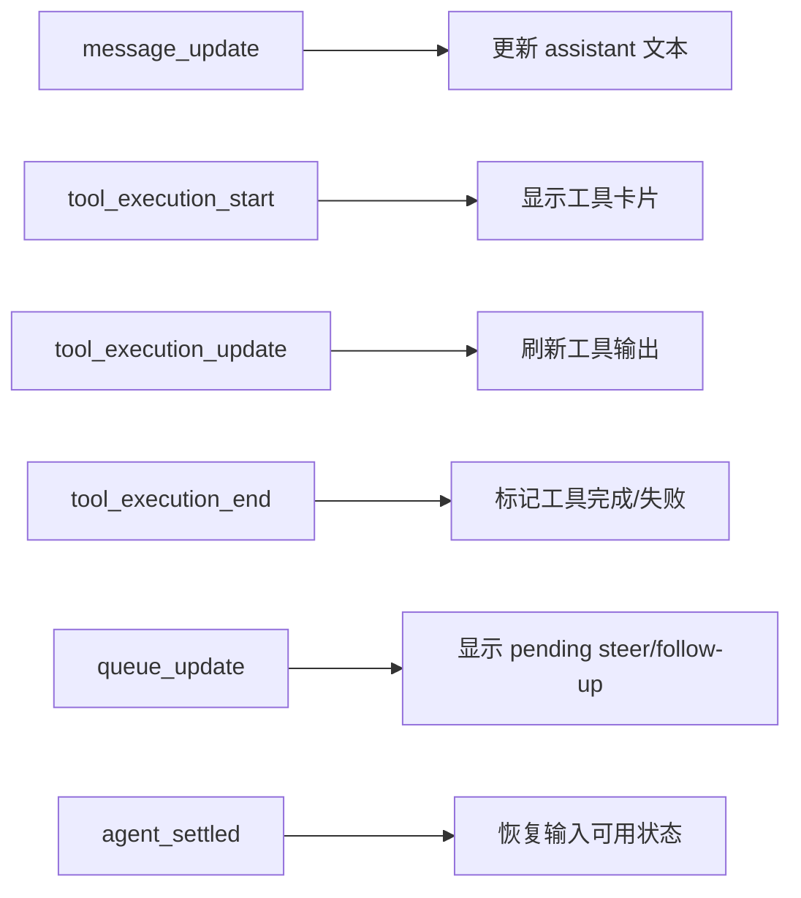
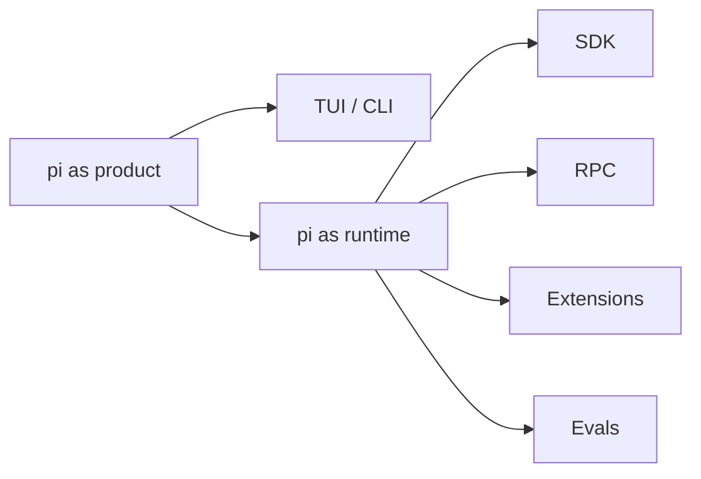

# pi RPC / SDK：把 Agent 从终端工具变成可嵌入 runtime

这一章看 pi 的外部集成层。

前面我们已经看到，pi 不是只有一个 TUI。它真正有价值的地方是：核心能力被封装成 `AgentSession` 和 `AgentSessionRuntime`，然后不同入口只是把这套能力暴露给不同使用场景。

一句话理解：

> TUI 是给人用的界面，SDK / RPC 是给程序用的接口。

这也是 pi 更像 agent harness 的地方：你可以直接用它的终端体验，也可以把它嵌进自己的产品、IDE、自动化系统或实验平台。

## 1. pi 有几种使用入口

可以先把入口层理解成这样：



这张图里最关键的是：TUI、print、RPC 并没有各自重写一套 Agent。它们都是套在同一个 `AgentSessionRuntime` 上。

这能解释为什么 pi 的 bug 面可能更小：同一套核心逻辑被多个入口复用，而不是每个入口都长出一套平行实现。

## 2. SDK 和 RPC 不是一回事

它们解决的是两个不同问题。

| 入口 | 适合谁 | 运行方式 | 优点 | 代价 |
| --- | --- | --- | --- | --- |
| TUI | 人类开发者 | 终端交互 | 体验完整，适合日常 coding | 不适合被别的程序精细控制 |
| text/print | shell 脚本 | 单次执行后退出 | 简单，适合一次性任务 | 不适合长会话控制 |
| JSON mode | shell / pipeline | 单次 prompt 的 JSONL 事件流 | 能观察结构化事件 | 不是完整命令协议 |
| RPC mode | IDE、外部 UI、非 Node 客户端 | 长期子进程 + stdin/stdout JSONL | 跨语言、进程隔离、可多命令控制 | 客户端要处理事件/响应协议 |
| SDK | Node/TypeScript 应用 | 同进程 import package | 类型安全、直接访问状态、易自定义工具/扩展 | 绑定 JS/TS 生态，同进程风险更高 |

我的理解是：

- 如果你只是日常使用，走 TUI。
- 如果你要在脚本里跑一次任务，走 print/text 或 JSON mode。
- 如果你要做自己的 IDE 插件、桌面壳、Web 后端、Python 客户端，优先看 RPC。
- 如果你要在 Node/TS 应用里深度改工具、模型、资源加载、session 策略，优先看 SDK。

## 3. SDK：同进程嵌入 pi

SDK 的核心入口是：

```typescript
createAgentSession()
```

它创建一个 `AgentSession`。这个 session 管：

- 当前模型；
- thinking level；
- system prompt；
- 可见工具；
- prompt / steer / followUp；
- event stream；
- session message history；
- compaction；
- extension runner；
- model runtime；
- settings；
- resource loader。

最小形态大概是：

```typescript
import { createAgentSession, ModelRuntime, SessionManager } from "@earendil-works/pi-coding-agent";

const modelRuntime = await ModelRuntime.create();
const { session } = await createAgentSession({
  sessionManager: SessionManager.inMemory(),
  modelRuntime,
});

session.subscribe((event) => {
  if (event.type === "message_update" && event.assistantMessageEvent.type === "text_delta") {
    process.stdout.write(event.assistantMessageEvent.delta);
  }
});

await session.prompt("What files are in the current directory?");
```

这段代码的意思不是“启动 TUI”，而是在你的程序里直接拥有一个 pi agent。

## 4. `createAgentSession()` 实际做了什么

从源码看，`createAgentSession()` 大概做这些事：



它的选项很多，但可以归成几类：

| 选项 | 用途 |
| --- | --- |
| `cwd` / `agentDir` | 决定项目资源和全局配置在哪里 |
| `modelRuntime` / `model` / `thinkingLevel` | 控制模型和推理级别 |
| `tools` / `excludeTools` / `noTools` | 控制哪些工具暴露给模型 |
| `customTools` | 直接注册自定义工具 |
| `resourceLoader` | 控制 extensions、skills、prompts、context files 如何加载 |
| `sessionManager` | 控制会话存在内存、JSONL 文件，或打开已有 session |
| `settingsManager` | 控制 settings 来源和覆盖 |

这就是 SDK 的核心价值：你可以保留 pi 的 Agent 能力，但替换很多产品层策略。

比如：

- 做一个只读 agent：`tools: ["read", "grep", "find", "ls"]`
- 做一个无文件系统 agent：`noTools: "all"` + 自定义业务工具
- 做一个企业内部 agent：自定义 `resourceLoader` + 内部搜索工具 + 内部 provider
- 做一个 eval harness：in-memory session + 固定模型 + 固定工具 + 订阅事件

## 5. `AgentSessionRuntime`：处理 session 替换

`AgentSession` 是单个会话。

但真实应用里经常要：

- 新建 session；
- 打开旧 session；
- fork；
- clone；
- import JSONL；
- cwd 变化后重建资源；
- 切换 session 后重新绑定扩展。

这些由 `AgentSessionRuntime` 管。

它的存在说明 pi 不是把“当前会话”当成一个永远不变的全局对象，而是承认 session 会被替换。



有一个小坑要记住：订阅是绑在具体 `AgentSession` 上的。runtime 换 session 后，外部应用要重新 subscribe；如果用 extension，也要重新 bind。

这很像前端里 route 变了以后组件要重新挂载，不是继续拿老实例硬用。

## 6. RPC：用 JSONL 驱动一个 headless pi

RPC mode 启动方式：

```bash
pi --mode rpc
```

协议很简单：

- stdin：客户端发送 JSON command，一行一个；
- stdout：pi 输出 response / event，一行一个；
- 每个 command 可以带 `id`；
- response 会带回同一个 `id`；
- agent 运行时的事件异步流出；
- extension UI 也通过同一条 JSONL 通道做 request/response。



这里有个关键点：`prompt` 的 response 只表示“请求被接受/排队/处理”，不代表 agent 已经完成。完成要看后续事件，比如 `agent_end` / `agent_settled`。

这和很多任务系统一样：HTTP 200 只是“任务入队成功”，不是“任务完成”。

## 7. RPC command 覆盖了哪些能力

RPC command 主要分这些组：

| 组 | 命令 |
| --- | --- |
| Prompting | `prompt`、`steer`、`follow_up`、`abort`、`new_session` |
| State | `get_state`、`get_messages` |
| Model | `set_model`、`cycle_model`、`get_available_models` |
| Thinking | `set_thinking_level`、`cycle_thinking_level`、`get_available_thinking_levels` |
| Queue | `set_steering_mode`、`set_follow_up_mode` |
| Compaction / Retry | `compact`、`set_auto_compaction`、`set_auto_retry`、`abort_retry` |
| Bash | `bash`、`abort_bash` |
| Session | `get_session_stats`、`export_html`、`switch_session`、`fork`、`clone`、`get_entries`、`get_tree`、`set_session_name` |
| Commands | `get_commands` |

这已经不只是“发一句话给模型”。它基本把 TUI 里一大部分会话控制能力变成了协议。

特别值得注意的是 `get_entries`：

- 它返回 session append-only entries；
- 可以传 `since` 作为 durable cursor；
- 包含 pre-compaction 历史和 abandoned branches；
- 同时返回当前 `leafId`。

这很适合外部 UI 做 session tree、timeline、增量同步。

## 8. RPC 的事件模型

RPC 会把 `AgentSessionEvent` 输出到 stdout。

常见事件包括：

- `agent_start`
- `agent_end`
- `agent_settled`
- `turn_start`
- `turn_end`
- `message_start`
- `message_update`
- `message_end`
- `tool_execution_start`
- `tool_execution_update`
- `tool_execution_end`
- `queue_update`
- `compaction_start`
- `compaction_end`
- `auto_retry_start`
- `auto_retry_end`

对外部 UI 来说，这就是状态机输入流。

你不用猜 pi 正在做什么，只要消费事件：



这就是做外部 GUI/IDE 集成的基础。

## 9. Extension UI 在 RPC 里怎么工作

扩展原本可以调用：

- `ctx.ui.select()`
- `ctx.ui.confirm()`
- `ctx.ui.input()`
- `ctx.ui.editor()`
- `ctx.ui.notify()`
- `ctx.ui.setStatus()`
- `ctx.ui.setWidget()`
- `ctx.ui.setTitle()`

在 TUI 模式里，这些会直接渲染终端 UI。

在 RPC 模式里，pi 会把它们翻译成：

```json
{"type":"extension_ui_request","id":"...","method":"confirm","title":"...","message":"..."}
```

客户端再回：

```json
{"type":"extension_ui_response","id":"...","confirmed":true}
```

dialog 类方法会等待客户端回复；notify/status/widget/title 这类是 fire-and-forget。

这设计很漂亮，因为扩展作者可以写一套逻辑：

```text
需要确认 -> ctx.ui.confirm()
```

至于确认 UI 是终端弹窗、桌面弹窗、VSCode quick pick，还是 Web modal，都交给运行模式处理。

## 10. JSON mode 和 RPC mode 的差别

这两个容易混。

JSON mode：

```bash
pi --mode json "List files"
```

它输出一次 agent 运行期间的事件流。适合 pipe 到 `jq`、日志系统、CI 脚本。

RPC mode：

```bash
pi --mode rpc
```

它是一个长期进程，客户端可以持续发命令：

- prompt；
- steer；
- follow-up；
- change model；
- compact；
- bash；
- switch session；
- fork；
- get tree。

所以可以这么记：

> JSON mode 是“结构化输出模式”；RPC mode 是“远程控制模式”。

## 11. 为什么这套设计对生态重要

如果 pi 只有 TUI，它就是一个终端产品。

有了 SDK / RPC，它就变成了一个可复用 runtime：

- IDE 可以接；
- 桌面 App 可以接；
- Web 服务可以接；
- CI/CD 可以接；
- eval harness 可以接；
- 子 Agent 扩展可以接；
- 企业内部平台可以接。

而且这些集成不需要 fork pi 的核心代码。

这和我们前面讲 extension system 是同一个哲学：核心保持小，能力通过明确边界扩出去。

## 12. 我们可以做的实验

这块非常适合放进 `experiments/`：

1. `experiments/sdk-minimal/`：用 `createAgentSession()` 跑一个 in-memory session。
2. `experiments/sdk-readonly/`：只开放 `read/grep/find/ls`，验证只读 agent。
3. `experiments/sdk-custom-tool/`：注册一个 `status` 工具，返回 git branch、cwd、时间。
4. `experiments/rpc-python-client/`：Python 启动 `pi --mode rpc`，发送 prompt，消费 `message_update`。
5. `experiments/rpc-session-tree/`：调用 `get_entries` / `get_tree`，画一个 session tree。
6. `experiments/rpc-extension-ui/`：跑 permission gate 扩展，用 RPC 客户端处理 confirm。

这些实验很有价值，因为它们不是单纯“学 API”，而是在验证 pi 的底座性：

- 能不能被程序嵌入；
- 能不能被外部 UI 控制；
- 能不能用事件复原状态；
- 能不能安全地限制工具；
- 能不能从 session tree 做回放和分支理解。

## 13. 我现在的理解

SDK / RPC 是 pi 从“工具”走向“平台”的接口。



TUI 让开发者直接用；SDK 让 Node 应用直接嵌；RPC 让任何语言、任何 UI 都能控制它。

所以如果我们后面想参与生态，不一定非要一上来改 agent loop。做 SDK examples、RPC client、外部 UI、CI/evals、session inspector，都可能是很好的切入点。

这条路线和你的 runbook 项目很契合：先理解 runtime 边界，再做小实验验证，最后带着证据回到上游提 issue / PR。
