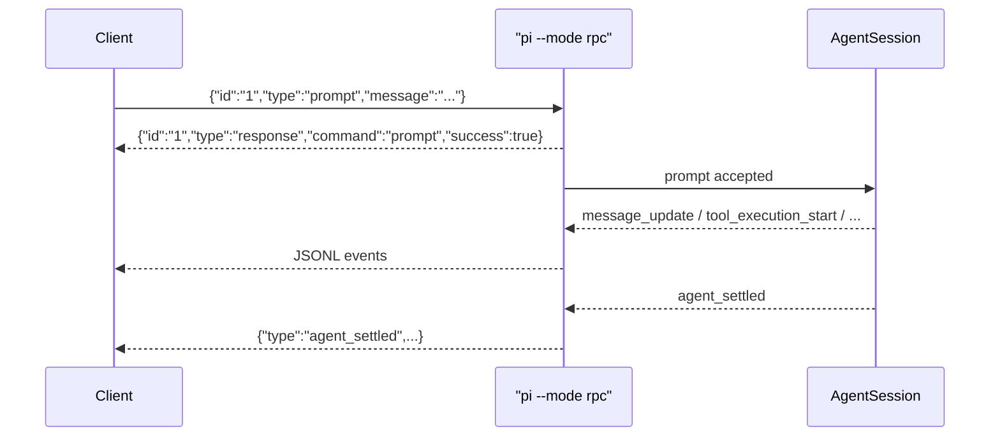
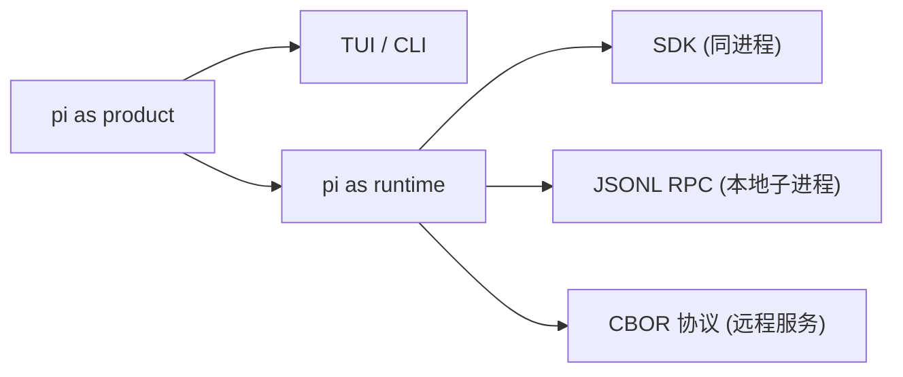

# pi RPC / SDK：从终端工具到可嵌入 runtime，再到远程服务

> 状态：已对齐 main（revision `9d2ec7ff`，2026-08-13）
> 本文回答：pi 如何被"程序"而不是"人"使用——SDK 同进程嵌入、本地 JSONL RPC、远程 CBOR 会话协议，三者各管一段。

pi 不是只有一个 TUI。它真正有价值的地方是：核心能力被封装成可复用的 runtime，然后不同入口把它暴露给不同使用场景。

一句话理解：

> TUI 是给人用的界面；SDK / RPC 是给程序用的接口。

## 两种"让程序控制 pi"的方式

先立一个总图，避免后面混淆。当前 main 上并存着**两套**程序接口，加上 SDK 共三个入口：

| | SDK | 本地 JSONL RPC | 远程 CBOR 协议 |
|---|---|---|---|
| 包 | `pi-coding-agent` | `pi-coding-agent` | `pi-protocol` + `pi-client` + `pi-server` |
| 形态 | Node/TS 同进程 import | 子进程 stdin/stdout | socket 上的字节流 |
| 载体 | 直接函数调用 | JSON 行（JSONL） | `[uint32-be CBOR 长度][CBOR]` |
| 用途 | 深度定制工具/模型/session | 本地 headless 嵌入（IDE/UI 驱动） | 跨进程/跨机远程 session |
| 可读性 | —— | ✅ 人可读、可 `jq` | ❌ 二进制 |
| 稳定性 | 稳定 | 稳定 | **experimental**（无兼容承诺） |

关键认知：**JSONL RPC 和 CBOR 协议不是新旧版本关系，是并存的两条线。** 一个偏"本地、可读、可调试"，一个偏"远程、紧凑、能传二进制"。

---

# Part 1 — 本地：SDK 与 JSONL RPC

## SDK：同进程嵌入 pi

SDK 的核心入口是 `createAgentSession()`（`coding-agent/src/index.ts` 里导出，另有 `createAgentSessionFromServices` / `createAgentSessionRuntime` 等变体）。它创建一个 `AgentSession`，管：

- 当前模型、thinking level、system prompt、可见工具；
- prompt / steer / followUp、事件流、session message history；
- compaction、extension runner、model runtime、settings、resource loader。

最小形态：

```typescript
import { createAgentSession, ModelRuntime, SessionManager } from "@earendil-works/pi-coding-agent";

const modelRuntime = await ModelRuntime.create();
const { session } = await createAgentSession({
  sessionManager: SessionManager.inMemory(),
  modelRuntime,
});

session.subscribe((event) => {
  if (event.type === "message_update" && event.assistantMessageEvent.type === "text_delta") {
    process.stdout.write(event.assistantMessageEvent.delta);
  }
});

await session.prompt("What files are in the current directory?");
```

这段代码的意思不是"启动 TUI"，而是在你的程序里直接拥有一个 pi agent。

### `createAgentSession()` 的选项分类

| 选项 | 用途 |
|---|---|
| `cwd` / `agentDir` | 决定项目资源和全局配置位置 |
| `modelRuntime` / `model` / `thinkingLevel` | 控制模型和推理级别 |
| `tools` / `excludeTools` / `noTools` | 控制哪些工具暴露给模型 |
| `customTools` | 直接注册自定义工具 |
| `resourceLoader` | 控制 extensions/skills/prompts/context files 加载 |
| `sessionManager` | 会话存在内存、JSONL 文件，或打开已有 session |
| `settingsManager` | 控制 settings 来源和覆盖 |

典型用法举例：

- 只读 agent：`tools: ["read", "grep", "find", "ls"]`
- 无文件系统 agent：`noTools: "all"` + 自定义业务工具
- eval harness：in-memory session + 固定模型 + 订阅事件

### AgentSessionRuntime：处理 session 替换

`AgentSession` 是单个会话；`AgentSessionRuntime` 管"新建 / 打开 / fork / clone / import / cwd 变化后重建资源"这些 session 级操作。它承认 session 会被替换，而不是把"当前会话"当成永远不变的全局对象。

一个坑：订阅绑在具体 `AgentSession` 上，runtime 换 session 后外部应用要重新 subscribe；extension 也要重新 bind。

## 本地 JSONL RPC（`pi --mode rpc`）

这是 runbook 早期记录的重点，经核对**仍然成立**。源码注释写得很直接：

> RPC mode: Headless operation with JSON stdin/stdout protocol.
> Commands are sent as JSON lines on stdin; responses and events are emitted as JSON lines on stdout.

协议规则：

- stdin：客户端发 JSON command，一行一个；
- stdout：pi 输出 response / event，一行一个；
- 每个 command 可带 `id`，response 带回同一个 `id`；
- agent 运行时的事件异步流出；
- extension UI 走同一条通道做 request/response。

时序：



关键点：`prompt` 的 response 只表示"请求被接受/排队"，不代表 agent 完成。完成要看后续事件（`agent_end` / `agent_settled`）。这跟"HTTP 200 只是任务入队，不是任务完成"一个道理。

### RPC command

当前 `rpc-types.ts` 里的完整 command 集（**加粗的是 runbook 早期遗漏、本次补上的**）：

| 组 | 命令 |
|---|---|
| Prompting | `prompt`、`steer`、`follow_up`、`abort`、`new_session` |
| State | `get_state` |
| Model | `set_model`、`cycle_model`、`get_available_models` |
| Thinking | `set_thinking_level`、`cycle_thinking_level`、`get_available_thinking_levels` |
| Queue | `set_steering_mode`、`set_follow_up_mode` |
| Compaction / Retry | `compact`、`set_auto_compaction`、`set_auto_retry`、`abort_retry` |
| Bash | `bash`、`abort_bash` |
| Session | `get_session_stats`、`export_html`、`switch_session`、`fork`、`clone`、**`get_fork_messages`**、`get_entries`、`get_tree`、**`get_last_assistant_text`**、`set_session_name` |
| Messages | `get_messages` |
| Commands | `get_commands` |

其中 `get_entries` 特别值得注意：它返回 append-only entries，支持 `since` 作 durable cursor，包含 pre-compaction 历史和 abandoned branches，同时返回当前 `leafId`——很适合外部 UI 做 session tree / timeline / 增量同步。

### RPC 事件模型

RPC 把 `AgentSessionEvent` 输出到 stdout。常见事件：

```
agent_start / agent_end / agent_settled
turn_start / turn_end
message_start / message_update / message_end
tool_execution_start / tool_execution_update / tool_execution_end
queue_update / compaction_start / compaction_end
auto_retry_start / auto_retry_end
```

对外部 UI 来说，这就是状态机输入流，消费事件即可复原状态，不用猜 pi 在干什么。

### Extension UI 在 RPC 里怎么工作

扩展调用 `ctx.ui.select/confirm/input/editor/notify/setStatus/setWidget/setTitle`。TUI 模式里直接渲染终端；RPC 模式里翻译成：

```json
{"type":"extension_ui_request","id":"...","method":"confirm","title":"...","message":"..."}
```

客户端回：

```json
{"type":"extension_ui_response","id":"...","confirmed":true}
```

dialog 类方法等待客户端回复；notify/status/widget/title 是 fire-and-forget。扩展作者只写"需要确认 -> `ctx.ui.confirm()`"，确认 UI 是终端弹窗还是 VSCode quick pick，交给运行模式处理。

### JSON mode 和 RPC mode 的差别

- **JSON mode**（`pi --mode json "List files"`）：输出**一次** agent 运行期间的事件流，适合 pipe 到 `jq` / CI。是"结构化输出模式"。
- **RPC mode**（`pi --mode rpc`）：**长期进程**，客户端持续发命令。是"远程控制模式"。

---

# Part 2 — 远程：CBOR 会话协议

这一块是 runbook 早期完全没覆盖的，当前 main 上独立成三个包。

## 为什么需要远程协议

本地 JSONL RPC 的前提是"子进程、stdio、同一个机器"。但还有一类需求它覆盖不了：

- 把 agent 跑在远程机器 / 容器 / micro-VM 里，本地 UI 连过去；
- 一个 agent 服务被多个前端（桌面、Web、移动）共享；
- 通过 socket 而非子进程 stdio 通信；
- 需要传二进制（图片、附件），且对带宽敏感。

pi 的选择是：**另起一套二进制协议**，而不是把 JSONL 硬套到 socket 上。

## 三个包的分工

| 包 | 角色 | 类比（gRPC） |
|---|---|---|
| `pi-protocol` | 线格式 + 消息 schema + 分帧 | `.proto` + protobuf |
| `pi-client` | 调用方 SDK，`PiClient` | 生成的 client stub |
| `pi-server` | 服务端骨架，`PiServer` | server 实现框架 |

拆三份的理由：

1. **依赖隔离**——`pi-client` 零外部依赖、只依赖 protocol；`pi-server` 才背 `pi-ai`。轻客户端不必拖 server 的重依赖。
2. **transport-neutral**——client 核心无 Node 专属 import，Unix socket 放子路径 `pi-client/unix`，浏览器用 WebSocket 跑同一套逻辑。
3. **形态不同**——client 是开箱 SDK（`new PiClient()` 即用），server 是留钩子的框架（要自己实现 `PiServerService`）。
4. **协议单独成包**——两端共享同一份 schema，字段不一致在类型/编译层就被拦住，不会运行时"静默失联"。

## 线格式与消息信封

线格式（`framing.ts`）：

```
[4 字节 big-endian 长度][一个 definite-length CBOR item]
```

- `PROTOCOL_VERSION = 1`。
- 第一个客户端消息是 `hello`，携带 `PROTOCOL_VERSION`。
- 后续用 **correlated request/response envelopes** 和 **server event envelopes**。
- transport 在协议字节交换**之前**完成认证。

CBOR 用的是严格 RFC 8949 子集：只留 null/布尔/有限数字/UTF-8 字符串/字节串/定长数组/map；拒绝 tag、无限长、非有限数、稀疏数组、畸形 UTF-8、尾随数据、过深嵌套、超大值。默认上限 16 MiB/帧、100 万元素、64 层嵌套。

为什么砍这么狠：对端被当作**不可信**（README 反复强调 "All transports are untrusted"），收紧格式 = 减少畸形输入打爆内存或触发解析器漏洞的攻击面。

## 状态模型：snapshot 是权威，event 是瞬态

这是 CBOR 协议和 JSONL RPC 一个很不一样的地方：

- **`SessionSnapshot` / server snapshot 是权威状态**（authoritative），客户端靠它重建真实状态；
- **progress event 是瞬态 UI 提示**，不能被归约（reduce）进权威状态；
- `SessionMetadata` 是"不 acquire session 就能拿到的 durable 元数据"（只有 `id` / `createdAt` 必填，`updatedAt` / `parentSessionId` / `sessionName` / `cwd` 视 backend 支持）；
- runtime 状态（phase、model、thinking level、attachment、lock）只出现在 acquire 之后的 `SessionSnapshot` 里。

`PiClient` 里对应 `subscribe()`（订阅权威 snapshot）和 `onEvent()`（订阅协议事件）两个不同接口。Session 的 phase 枚举是 `idle / turn / compaction / branch_summary / retry`。

## pi-client：开箱即用的会话租约

```typescript
const client = new PiClient({ transportFactory });  // ByteTransport 接口
await client.connect();
const session = await client.createSession({ cwd: "/workspace" });
const unsubscribe = session.subscribe((snapshot) => render(snapshot));
await session.prompt("Inspect this project");
```

要点：

- **`SessionLease`（会话租约）**：`{ mode: "exclusive" }` 给生命周期/变更协调者，`{ mode: "shared" }` 给多个低级消费者共享。exclusive 与 shared 互斥。
- 错误有专门类型：`PiDisconnectedError`（断连）、`PiSessionDetachedError`（租约释放中/已失效）、`PiSessionOwnershipError`（占用冲突）、`PiServerError`（服务端结构化错误）。
- 不自动重连，需显式 `reconnect()`。
- Node/Bun 用独立子路径 `pi-client/unix` 拿 Unix socket transport。

## pi-server：留钩子的框架

`pi-server` **不是开箱即用的服务**。README 明说它 "does not provide a standalone CLI or coding-agent service"。应用要自己实现 `PiServerService`：

```typescript
const service: PiServerService = {
  async listSessions() { return storage.listSessions(); },
  async listModels() { return modelRegistry.listModels(); },
  async createSession(options) { return storage.createAndOpen(options); },
  async openSession(sessionId) { return storage.open(sessionId); },
};
```

`PiServer` 通过 `PiServerListener` 组合 transport 监听器，每个 listener 在把 connection 交给 PiServer 之前完成认证/授权（Unix 靠文件权限，WebSocket 靠升级时验凭据）。

它还带一个 **`pi-ai` protocol bridge**：把 `pi-ai` 领域对象转成 `pi-protocol` 的 wire DTO（`toProtocolModelMetadata` / `toProtocolAssistantMessage` / `toProtocolUserMessage` / `toProtocolToolResultMessage`），两边 schema 独立、边界清晰。

## coding-agent 的双重身份

`pi-coding-agent` 同时站在两端：

- `client/remote-session.ts`——`RemoteSession` 用 `PiClient` 连远程 server，操作有 `open/create/submit/abort/setModel/setThinking/reconnect`；
- `server/create-harness.ts`——`createCodingAgentHarness` 把 coding-agent 的 harness 暴露成 server 端；
- `rpc-entry.ts`——`pi-rpc` 二进制的入口（`main(["--mode","rpc",...])`）。

也就是说：coding-agent 既是 JSONL 本地端，也能当 CBOR 远程的 client 端和 server 端。

## 与本地 JSONL RPC 的边界

| | JSONL RPC | CBOR 协议 |
|---|---|---|
| 场景 | 本地 headless 嵌入 | 跨进程/跨机远程 session |
| 传输 | 子进程 stdio | Unix socket / WebSocket |
| 分帧 | 换行符 | 4 字节长度前缀 |
| 二进制 | 要 base64 | 原生字节串 |
| 状态 | 事件流 | authoritative snapshot + progress event |
| 人可读 | ✅ | ❌ |

一句话：**JSONL 管"把人/本地程序接进 pi"，CBOR 管"把 pi 当远程服务连"。**

---

## 实验

按"先本地后远程"的顺序：

1. `experiments/sdk-minimal/`：`createAgentSession()` 跑 in-memory session。
2. `experiments/sdk-readonly/`：只开 `read/grep/find/ls`，验证只读 agent。
3. `experiments/rpc-jsonl-client/`：Python 启动 `pi --mode rpc`，发 prompt、消费 `message_update`。
4. `experiments/rpc-session-tree/`：调 `get_entries` / `get_tree`，画 session tree。
5. `experiments/rpc-extension-ui/`：跑 permission gate 扩展，用 RPC 客户端处理 confirm。
6. `experiments/cbor-roundtrip/`：用 `encodeClientMessage` / `createServerMessageDecoder` 做分片/合并 roundtrip（不联网）。
7. `experiments/remote-unix/`：`createUnixServer` + `PiClient` 走本地 Unix socket 跑通一次 createSession → prompt → snapshot。

## 我现在的理解

SDK / RPC 是 pi 从"工具"走向"平台"的接口。当前它已经长成三条腿：



TUI 让开发者直接用；SDK 让 Node 应用同进程嵌入；JSONL RPC 让本地 IDE/UI 通过子进程驱动；CBOR 协议让 pi 变成一个能被跨机连接的远程 session 服务。四者共享同一套 agent 核心，只是暴露形态不同。

## 待深挖

1. **CBOR 的 `ServerEvent` 完整枚举**——本篇只确认了 snapshot/progress 的区分和 phase 枚举，server event 的具体类型清单未穷举。
2. **`agent-core` 的 transport abstraction**——package description 提到的词，`harness/` 和 `proxy.ts` 的具体职责未读，它可能是 CBOR 协议在 core 层的落点。
3. **`pi-rpc` 二进制 vs `pi --mode rpc`**——两者是否同一件事的两种入口，还是前者已开始承载 CBOR 远程，未完全确认。
4. **`createAgentSession` 与 core 层 `Agent` / `AgentHarness` 的关系**——coding-agent 的 facade 与 core 的底层抽象如何分层，需要一篇专门对照。
