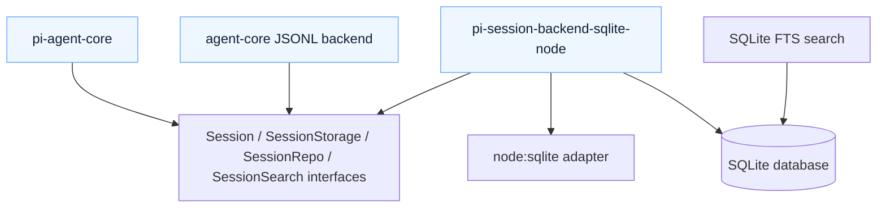
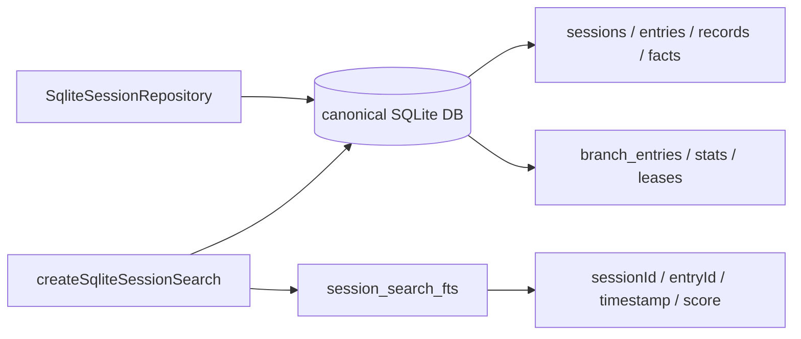

# pi Session Backend：会话存储为什么开始模块化

> 状态：已对齐 main（revision `9d2ec7ff`，2026-08-13）
> 本文回答：`pi-session-backend-sqlite-node` 做什么，为什么它从 core 里拆成独立包，以及它和 JSONL session / SessionStorage 抽象是什么关系。

一句话：

> Session backend 是把 append-only session tree 落到不同持久化介质上的适配层；SQLite backend 是当前最结构化的实现。

这页不是重新讲 session tree。session tree 的核心思想见 [Session / Storage](session-storage.md)。这里专门看“存储后端为什么要独立”。

## 它在架构里的位置

当前 main 上，SQLite backend 已经是独立 package：

```text
packages/session-backends/sqlite-node
```

它的 npm 包名是：

```text
@earendil-works/pi-session-backend-sqlite-node
```

依赖方向是：



注意这个方向：不是 core 依赖 SQLite，而是 SQLite backend 依赖 core 的 session interface。

这就是我们之前说的 SPI/JDBC 味道：核心定义接口，具体 backend 自己接进来。

## core 层定义了什么

`pi-agent-core` 里能看到三组关键接口：

| 接口 | 职责 |
|---|---|
| `SessionStorage` | 单个 session 的底层读写：append entry/record、lanes、branch reads、facts、stats |
| `SessionRepo` | session 仓库：create/open/list/delete/fork |
| `SessionSearch` | session 搜索：按 text 返回 sessionId / entryId，可带 entryTypes、limit、AbortSignal |

这些接口让上层只依赖“会话能读写、能列举、能搜索”，而不关心背后是 JSONL、内存、SQLite，还是未来别的数据库。

## SQLite backend 提供什么

`pi-session-backend-sqlite-node` 的 README 说它提供：

- `node:sqlite` adapter；
- SQLite session repository；
- migrations；
- materialized views / derived state；
- optional FTS search。

源码结构也基本沿着这几件事拆：

| 模块 | 作用 |
|---|---|
| `src/index.ts` | 把 Node 的 `DatabaseSync` 包成统一的 `SqliteDatabase`，并 re-export SQLite backend |
| `sqlite/repo.ts` | `SqliteSessionRepository`，实现 create/open/list/delete/fork |
| `sqlite/search-backend.ts` | `createSqliteSessionSearch()`，基于 SQLite FTS 做搜索 |
| `sqlite/migrations.ts` | migration runner |
| `sqlite/migrations/001_initial.sql` | 初始化表结构 |
| `sqlite/storage/*` | sessions、entries、records、facts、lanes、branch cache、writer lease 等表的读写 |

这不是“把 JSONL 换成一个 SQL 文件”那么简单。它是把 session 的事实日志、派生状态、搜索索引、写锁，都显式建模。

## 数据库里有哪些状态

当前 migration 建了这些核心表：

| 表 | 类型 | 用途 |
|---|---|---|
| `sessions` | canonical | session 元信息：id、created_at、cwd、parent、metadata |
| `entries` | canonical | append-only entry tree：session_id、seq、id、parent_id、type、timestamp、payload |
| `records` | canonical / log | lane-scoped operation record |
| `session_sequences` | canonical helper | 每个 session 的自增 seq |
| `lanes` | current state | lane 到 leaf 的指针，以及 open operation |
| `lane_moves` | log | lane 移动记录 |
| `facts` | fact log | session name、label 等 latest-wins fact |
| `session_stats` | derived state | message count、tokens、cost 等统计 |
| `branch_entries` | derived cache | branch path 缓存，用于便宜地扫 branch |
| `branch_tips` | derived cache | branch id 与 tip id |
| `writer_leases` | concurrency guard | session 写入租约，带 owner、fence、expiry |

最值得注意的是 migration 里的注释：

> Parent links in entries remain canonical; this cache exists only to make branch scans cheap.

也就是说，`entries.parent_id` 才是事实源；`branch_entries` 是为了读得快而维护的派生缓存。这个区分很重要：cache 可以 repair，canonical log 不能乱。

## Repository：写入与租约

`SqliteSessionRepository` 实现的是 `SessionRepo`：

- `create()`
- `open()`
- `list()`
- `delete()`
- `fork()`

它还有几个工程细节：

1. **懒打开一个共享 database connection**
   README 明确写了 repository lazily owns one shared database connection。仓库不必在构造时就打开文件。

2. **串行化 repository 操作**
   `SerialOperationQueue` 把 repository 级操作排队，降低同一 repository 内部的竞态。

3. **active storages 复用**
   同一个 session 如果已经有 active storage，再打开会复用这个 storage，而不是重复 claim。

4. **writer lease**
   `writer_leases` 表有 `owner_id`、`fence`、`expires_at_ms`。默认 lease ttl 30 秒，heartbeat 10 秒。过期后别的 writer 可以 takeover；fence 用来防止旧 owner 过期后继续写。

这说明 SQLite backend 面向的不是“只在一个进程里随便 append”的场景，而是开始认真处理长期运行、恢复、并发写入边界。

## Search：为什么从 Repository 里拆出来

README 里有一句很关键：

> Search is an independent service over the same canonical database: repositories do not expose `search()`.

也就是说：

- repository 管 canonical write/read；
- search 是独立服务；
- 两者共享同一个 SQLite database；
- 但 repository API 不把搜索混进去。

这是一刀很漂亮的边界。搜索是可选能力，不应该污染基础持久化接口。



## FTS 是懒创建的

`search-backend.ts` 里可以看到：

- 空搜索直接 return；
- 第一次非空搜索时打开 database；
- 先跑 migrations；
- 再 `ensureSearchSchema()`；
- 如果 `session_search_fts` 不存在但 `entries` 已存在，就做一次 rebuild；
- 后续通过 trigger 保持 FTS 与 `entries.payload` 同步。

FTS 表结构使用 SQLite FTS5：

```sql
CREATE VIRTUAL TABLE IF NOT EXISTS session_search_fts USING fts5(
  payload,
  content = 'entries',
  content_rowid = 'rowid',
  tokenize = 'trigram remove_diacritics 1'
);
```

并建了三类 trigger：

| Trigger | 时机 | 作用 |
|---|---|---|
| `session_search_fts_ai` | `AFTER INSERT ON entries` | 新 entry 进入搜索索引 |
| `session_search_fts_ad` | `AFTER DELETE ON entries` | 删除 entry 时从索引删除 |
| `session_search_fts_au` | `AFTER UPDATE OF payload ON entries` | payload 更新时先删旧，再写新 |

这解释了 README 里说的“optional FTS search”：不搜就不建 FTS；开始搜以后才承担索引成本。

## JSONL 与 SQLite 的差异

| 维度 | JSONL backend | SQLite backend |
|---|---|---|
| 主要优点 | 透明、简单、人可读、容易导入导出 | 结构化查询、索引、统计、搜索、并发写边界 |
| 存储形态 | 一行一个 JSON object | canonical tables + derived caches + optional FTS |
| 搜索方式 | 可扫描 entry 文本 | FTS5 trigram index |
| 分支读取 | 从 tree/path 计算 | `branch_entries` 派生缓存加速 |
| 并发写 | 更适合单进程本地 CLI/TUI | writer lease + WAL + busy_timeout |
| 依赖 | core 内置文件存储能力 | 独立包，依赖 `node:sqlite` adapter |

这不是“谁替代谁”。更像两种 profile：

- JSONL：个人本地、透明、容易 debug；
- SQLite：更结构化、更适合规模化查询和长期 session catalog。

## 为什么拆成独立包

当前源码给出的答案很直接：

1. **运行时依赖隔离**
   SQLite backend 需要 `node:sqlite`。如果放进 core，所有使用 core 的人都会被 Node SQLite 运行时假设影响。

2. **backend 生态可以扩展**
   `packages/session-backends/*` 这个目录结构本身就在表达：未来可以有更多 backend。

3. **core 保持抽象稳定**
   core 只关心 `SessionStorage` / `SessionRepo` / `SessionSearch`。backend 的表结构、migration、FTS、租约策略可以独立演进。

4. **搜索能力可选**
   `SessionSearch` 是单独接口，SQLite FTS 是单独 service。持久化和搜索不强绑。

这和 Pi 其他拆分原则一致：变化频率不同、运行环境不同、依赖重量不同的东西要拆开。

## Source observations

| 观察 | 来源 |
|---|---|
| SQLite backend README 明确列出 node:sqlite adapter、repository、migrations、materialized views、optional FTS search | `packages/session-backends/sqlite-node/README.md` |
| package 入口把 Node `DatabaseSync` 包成统一 `SqliteDatabase`，并 re-export backend | `packages/session-backends/sqlite-node/src/index.ts` |
| `SessionStorage` / `SessionRepo` / `SessionSearch` 是 core 层接口 | `packages/agent/src/harness/session/types.ts`、`packages/agent/src/search/index.ts` |
| migration 表结构包含 canonical entries、records、facts，以及 branch cache、stats、writer leases | `packages/session-backends/sqlite-node/src/sqlite/migrations/001_initial.sql` |
| `SqliteSessionRepository` 实现 create/open/list/delete/fork，并维护 operation queue、active storages、writer leases | `packages/session-backends/sqlite-node/src/sqlite/repo.ts` |
| search 是独立 service，repository 不暴露 `search()` | `packages/session-backends/sqlite-node/README.md`、`packages/session-backends/sqlite-node/src/sqlite/search-backend.ts` |
| FTS table/trigger 懒创建，首次创建时从 canonical entries rebuild，之后靠 trigger 同步 | `packages/session-backends/sqlite-node/src/sqlite/search-backend.ts` |

## 当前理解

Session backend 这层说明 Pi 的 session 设计已经从“CLI 本地文件”走向“可替换 runtime persistence”。

它的关键不是 SQLite 本身，而是这几条边界：

1. **事实源与派生状态分离**
   `entries` 是 canonical log；`branch_entries`、`session_stats`、FTS 是为了读得快。

2. **持久化与搜索分离**
   repository 管 session 生命周期和写入；search 独立挂在同一个 database 上。

3. **core 与 runtime-specific dependency 分离**
   core 不背 `node:sqlite`；SQLite backend 自己背。

4. **写入 ownership 显式化**
   writer lease 把“谁有权写这个 session”变成数据库状态，而不是隐含在进程里。

如果要做 agent 应用，这层很值得研究：它告诉你一个 agent 产品怎么从“能聊天”变成“能保存、恢复、搜索、迁移、审计”的系统。

## 可以做的小实验

1. **读 migration 建模**
   对照 `001_initial.sql`，把每个表标成 canonical / derived / concurrency / search。

2. **比较 JSONL 与 SQLite 的同一抽象**
   用同一组 `SessionStorage` 操作：append message、set name、set label、fork，比较两种 backend 如何落盘。

3. **FTS 懒初始化**
   创建 SQLite database 后不搜索，确认没有 FTS 表；第一次非空 search 后再确认 FTS 表和 trigger 出现。

4. **branch cache repair**
   找 `repairBranchCache()` 的调用/测试，理解 canonical parent links 如何重建 `branch_entries`。

5. **writer lease 场景**
   模拟两个 repository 同时 open 同一 session，观察 active writer 和 expired lease 的行为。

6. **搜索接口替换**
   用 core 的 `createScanningSessionSearch()` 和 SQLite FTS search 做同一个查询，比较结果结构与性能边界。
