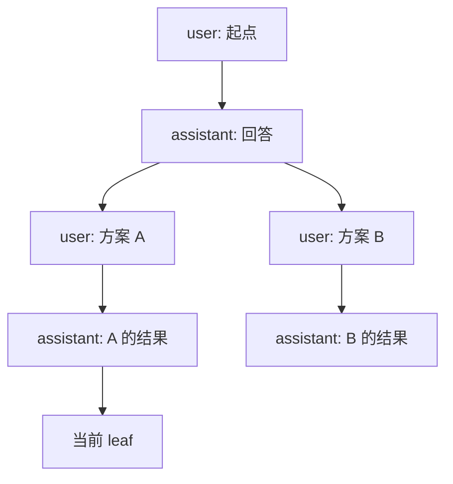
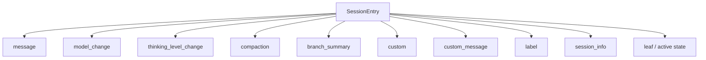
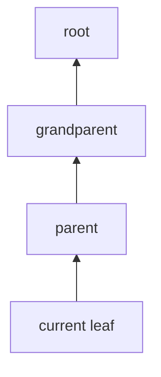
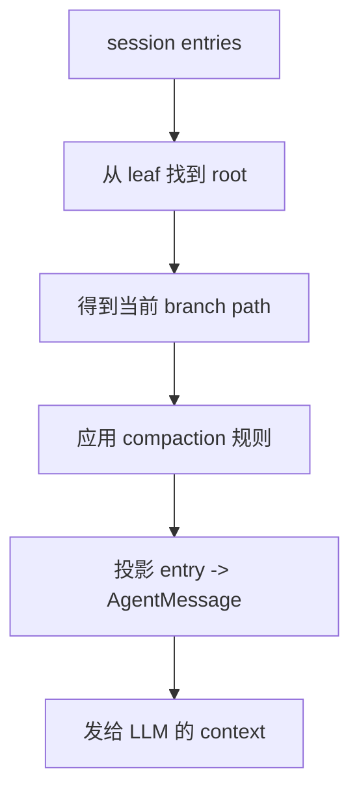
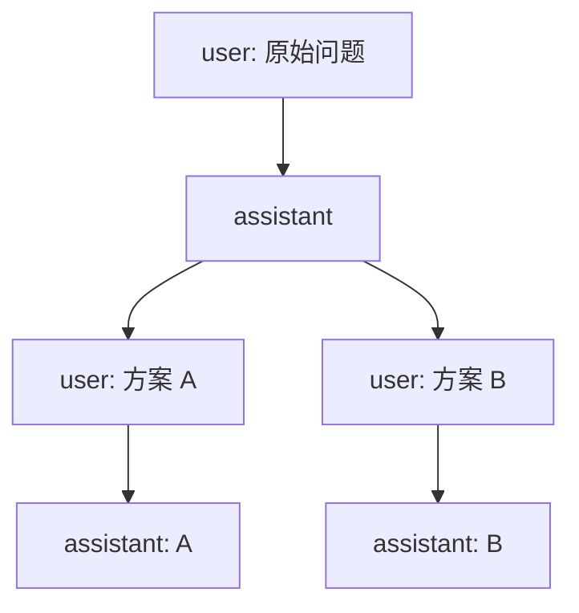
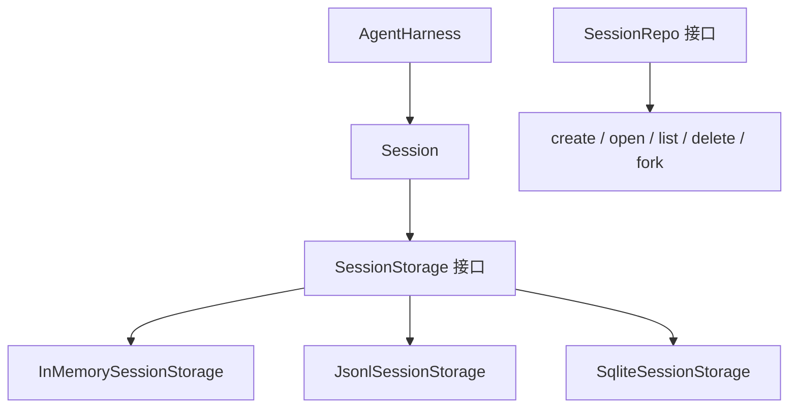
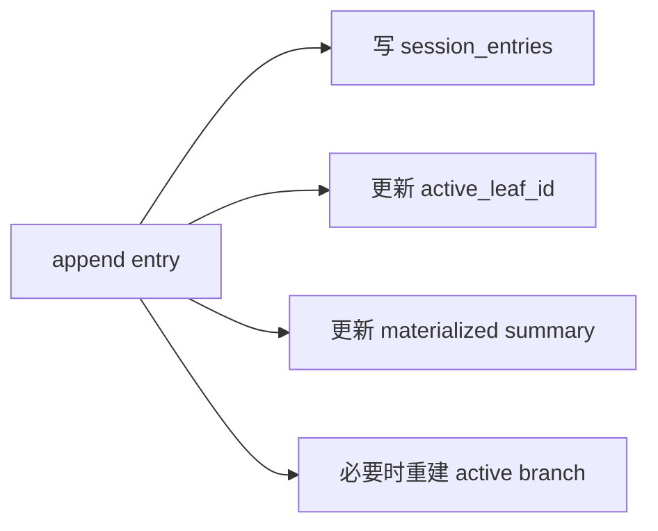
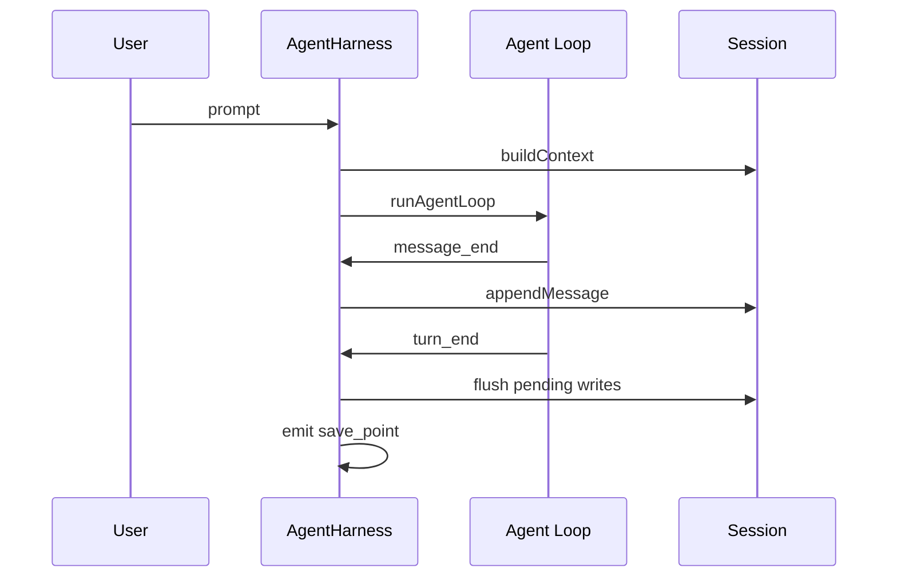

# pi Session / Storage：让 Agent 变成可持续工作的系统

这一章看 pi 的会话与存储设计。

很多 coding agent 看上去是在“跟模型聊天”，但真正难的是：怎么把一次次聊天、工具调用、模型切换、分支尝试、上下文压缩、扩展状态，都保存成一个能继续、能回放、能迁移、能被 UI 理解的结构。

pi 在这里的核心选择是：

> Session 不是简单聊天记录，而是 append-only 的会话树。

这也是 pi 能支持 `/resume`、`/tree`、`/fork`、`/clone`、`/compact`、extension state 的基础。

## 1. 为什么不是普通 chat history

最直觉的做法，是把消息存在一个数组里：

```text
user -> assistant -> tool -> assistant -> user -> assistant
```

这样能继续聊天，但有几个问题：

- 不能优雅地从中间某一步分叉；
- 不能保留“我试过方案 A，也试过方案 B”；
- 不能在上下文压缩后仍然知道保留了哪些尾部消息；
- 不能把模型切换、thinking level、session name、label 这类元事件放进同一套历史里；
- 扩展想保存状态时容易污染 LLM context。

pi 选择把 session 做成 entry tree：



每个 entry 都有：

- `id`
- `parentId`
- `timestamp`
- `type`

当前会话位置由 leaf 指向。你从旧消息继续，不是删除历史，而是把 leaf 移过去，然后下一条消息成为新的 child。

所以 pi 的 session 更像 Git commit graph，而不是普通聊天数组。

## 2. JSONL 文件格式

pi 默认把会话存在：

```text
~/.pi/agent/sessions/--<encoded-cwd>--/<timestamp>_<uuid>.jsonl
```

JSONL 的意思是：每一行都是一个 JSON 对象。

第一行是 session header：

```json
{"type":"session","version":3,"id":"...","timestamp":"...","cwd":"/path/to/project"}
```

后面每一行是 session entry：

```json
{"type":"message","id":"a1b2c3d4","parentId":null,"timestamp":"...","message":{"role":"user","content":"hello"}}
{"type":"message","id":"b2c3d4e5","parentId":"a1b2c3d4","timestamp":"...","message":{"role":"assistant","content":[...]}}
```

这个格式有几个工程优点：

- append-only，写入简单；
- 人能直接打开看；
- 容易导入导出；
- 一行坏了，很多地方可以跳过坏行继续恢复；
- 很适合本地 CLI/TUI 工具；
- 不需要数据库也能工作。

但它也有代价：

- 大 session 搜索和统计会变慢；
- 列表页需要扫描很多文件；
- 多进程并发写不是它的强项；
- 复杂查询不如数据库自然。

所以后面出现 SQLite backend 就很合理：JSONL 是默认个人使用体验，SQLite 是更结构化、更可扩展的 backend。

## 3. Entry 类型

Session 里不只有 message。



几个关键类型：

| Entry | 作用 | 是否进 LLM context |
|---|---|---|
| `message` | 用户、助手、tool result 等真实对话消息 | 是 |
| `model_change` | 记录中途切换模型 | 否，但影响恢复状态 |
| `thinking_level_change` | 记录 thinking level | 否，但影响恢复状态 |
| `compaction` | 记录压缩摘要和保留尾部 | 是，以 summary 形式进入 |
| `branch_summary` | 记录离开分支时的摘要 | 是 |
| `custom` | 扩展保存自己的状态 | 默认否 |
| `custom_message` | 扩展注入上下文 | 是 |
| `label` | 给某个 entry 打标签 | 否 |
| `session_info` | 会话名等元信息 | 否 |

这个设计很舒服的一点是：所有历史事件都走同一个 append-only entry 模型，但不是所有 entry 都会进入 LLM context。

也就是说：

- session file 是完整事实记录；
- LLM context 是从 session 里投影出来的一条工作视图。

这两个概念被分开了。

## 4. Context 是怎么从 tree 里构造出来的

当 pi 要发请求给模型时，它不会把整个 session 文件塞进去。

它会先从当前 leaf 往 root 回溯，得到当前 branch：



然后再转成模型真正看到的 messages。

简化流程：



这里有两个重要细节。

第一，模型/思考等级是从 path 里推导出来的。

如果 branch 上出现过 `model_change` 或 `thinking_level_change`，恢复 session 时就能知道当时用的是什么模型和 thinking level。

第二，compaction 会改变 context 的起点。

如果 path 上存在 compaction entry，pi 会用最新 compaction 作为 checkpoint：

- compaction summary 代替更早的长历史；
- 后面的 retained tail / kept entries 继续保留；
- 老 session 兼容 `firstKeptEntryId`；
- 新 harness 更倾向于用 `retainedTail` 做自包含 checkpoint。

这就解释了为什么 compaction 不是简单“删旧消息”，而是“在树上放一个摘要 checkpoint”。

## 5. Branching：为什么 `/tree` 能原地分叉

普通聊天工具如果你回到旧消息继续，通常要新开一个 conversation。

pi 的 `/tree` 可以在同一个 session 文件里分叉，因为 entry 本来就是树。



`branch(entryId)` 本质上只是：

1. 检查目标 entry 是否存在；
2. 把 leaf 指向那个 entry；
3. 下一次 append 时，新 entry 的 `parentId` 就会指向这个目标 entry。

旧历史不会改，也不会删。

`branchWithSummary()` 会多做一步：在新分支上追加一个 `branch_summary` entry，用来保存离开的那条路径的关键信息。

这很像开发时：

- `/tree` = 在当前 Git graph 上 checkout 到某个旧点继续；
- `/fork` = 把某条路径抽成新的 session 文件；
- `/clone` = 复制当前 branch 到新 session。

## 6. SessionManager 的产品层策略

`coding-agent` 里有一个面向 CLI/TUI 的 `SessionManager`。

它负责：

- 创建新 session；
- 打开指定 session；
- 继续最近 session；
- 从其他项目 fork session；
- 列出当前项目或全部项目 session；
- 追加各种 entry；
- 维护 `leafId`、label cache、session name；
- 把 entry 写入 JSONL 文件。

它有一个很实际的策略：新 session 不一定立刻落盘。

源码里有 `flushed` 和 `hasAssistant` 逻辑。粗略理解：

- 只有用户输入、还没有 assistant 回复时，可能先不真正写完整文件；
- 等出现 assistant 消息后，再把 header 和已有 entries 一次性写入；
- 之后继续 append。

这样做可能是为了避免产生大量“只有用户开头、没有真实会话”的空 session 文件。

但它也带来一些边界复杂度，所以测试里会看到不少 session 文件、无效 session、duplicate header、startup session name 之类的用例。

这是一个典型工程取舍：

> 为了更好的用户体验和更少垃圾文件，引入了一点持久化状态机复杂度。

## 7. agent-core 的新抽象：Session / SessionStorage / SessionRepo

更底层的 `agent-core` 里，有一套更干净的异步抽象：



这层的品味很像框架代码：

- `Session` 只关心 append、getBranch、buildContext；
- `SessionStorage` 负责具体读写；
- `SessionRepo` 负责创建、打开、列举、删除、fork；
- 上层 `AgentHarness` 依赖接口，不依赖某一种文件格式。

这就是我们之前说的 SPI/JDBC 味道：核心定义协议，外部可以替换 backend。

目前可见 backend 有：

- in-memory：测试、eval、临时会话；
- JSONL：本地 CLI/TUI 默认体验；
- SQLite：结构化存储 backend。

## 8. SQLite backend 为什么存在

SQLite backend 不只是“换个存储格式”。

它有这些表：

| 表 | 用途 |
|---|---|
| `sessions` | session 元信息、cwd、parent、active leaf |
| `session_entries` | 所有 entry，带 `entry_seq` |
| `session_sequences` | 每个 session 的 entry 序号 |
| `branch_entries` | materialized branch path |
| `session_materialized` | session 统计与摘要状态 |
| `entry_materialized` | 部分 entry 的派生索引，比如 label |

这里最关键的是 materialized state。

JSONL 每次要统计 session name、message count、cost、labels，通常要扫文件。SQLite backend 会在 append entry 时同步更新派生状态：



这让列表、统计、分支路径读取更适合规模化。

所以可以这样理解：

- JSONL 是“透明、简单、适合个人本地”的存储；
- SQLite 是“可查询、可索引、适合更复杂 runtime”的存储；
- 两者背后共享同一个 session/storage 抽象。

## 9. 和 Extension System 的连接

Session 设计给扩展系统留了两个很重要的口：

### `custom`

`custom` entry 用来存扩展状态。

它不进入 LLM context。

适合保存：

- 扩展自己的计数器；
- 已发现的外部资源；
- 用户选择过的配置；
- 某个 workflow 的进度；
- 上次同步的 cursor。

### `custom_message`

`custom_message` 会进入 LLM context。

适合扩展主动注入背景信息，比如：

- 当前 ticket 摘要；
- 外部系统查询结果；
- 项目约束；
- 用户确认过的长期偏好；
- 某个工具生成的上下文。

这个区分非常重要：

> 扩展状态不等于模型上下文。pi 允许你分别处理“我要持久化什么”和“我要让模型看到什么”。

这就是框架设计里很漂亮的一刀。

## 10. 和 AgentHarness 的连接

`AgentHarness` 是更靠 core 的执行层，它会在 agent 事件发生时写 session。

典型路径是：



有些写入会在运行中暂存到 `pendingSessionWrites`，等 turn 结束或 agent 结束再 flush。

这样做是为了避免运行中的状态变更把 session 写乱，同时保留事件驱动的灵活性。

比如：

- 模型切换；
- thinking level 切换；
- active tools 切换；
- custom entry；
- label；
- session name；
- leaf navigation。

都可以统一成为 session write。

## 11. 这个设计的核心思想

我会把 Session / Storage 的思想总结成四句话：

第一，session 是事实日志，不是单纯 prompt 历史。

它记录的是整个 agent 工作过程，包括消息、工具结果、分支、压缩、模型选择、扩展状态。

第二，session 是树，不是数组。

这让 pi 能在同一个会话里保留多条探索路径。

第三，context 是从 session 投影出来的。

session 可以保存很多东西，但模型只看到经过筛选、压缩、转换后的 messages。

第四，storage 是可替换 backend。

JSONL 适合本地透明使用，SQLite 适合更结构化的查询和规模化。

## 12. 我们怎么学习和实验

这块很适合做几个小实验：

1. 运行一段简单会话，打开 JSONL 文件看 entry；
2. 使用 `/name`，观察 `session_info` entry；
3. 使用 `/tree` 从旧消息分叉，观察 `parentId`；
4. 给 entry 打 label，观察 `label` entry；
5. 做一次 `/compact`，观察 `compaction` entry；
6. 写一个 extension 用 `appendEntry` 写 `custom`；
7. 再写一个 extension 写 `custom_message`，比较它是否进入 LLM context；
8. 如果 SQLite backend 能接到本地 runtime，再比较同一套 session 抽象怎么落到数据库。

这个方向对贡献也很友好。

潜在切入点：

- session-format 文档和实际类型是否完全同步；
- JSONL 与 agent-core 新 SessionStorage 抽象之间的迁移说明；
- Windows 路径编码、session dir、session picker 行为；
- malformed JSONL 的恢复策略；
- branch / label / compaction 组合场景的测试；
- SQLite backend 的 README 补充；
- session export/share 的边界说明。

如果说 Extension System 是“生态怎么接进来”，那么 Session / Storage 就是“这些生态行为怎么被保存和回放”。

