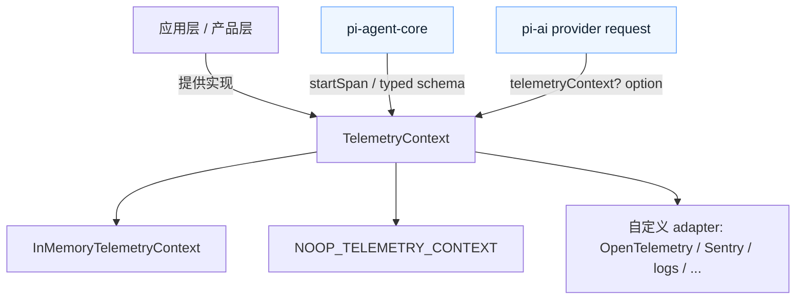
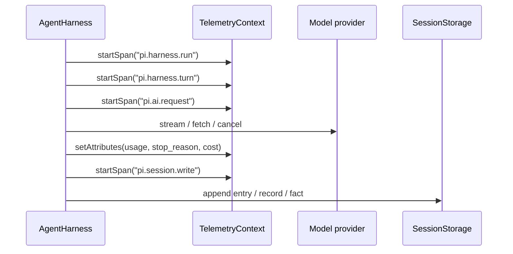

# pi Telemetry：把可观测性做成 runtime 契约

> 状态：已对齐 main（revision `9d2ec7ff`，2026-08-13）
> 本文回答：`pi-telemetry` 到底做什么，为什么它不是 exporter，以及它怎样把 LLM 请求、agent harness、tool、session write 放进同一套可观测性语言里。

一句话：

> `pi-telemetry` 定义“如何描述一次运行”，不决定“把数据发到哪里”。

这和很多项目直接接 OpenTelemetry / Sentry / logging SDK 的做法不太一样。Pi 先抽出一层 vendor-neutral contract，让 core package 只依赖一套小接口；至于最后写到内存、stdout、OpenTelemetry、Sentry，还是别的系统，是应用层 adapter 的责任。

## 为什么这个边界重要

Agent runtime 里有很多需要观察但不应该彼此耦合的动作：

- 一次 provider request；
- 一次 harness run；
- 一轮 assistant turn；
- 一次 tool execution；
- 一次 session mutation；
- 一次 retry / compaction / navigation。

如果每层都直接接某个 telemetry backend，core 很快会被平台 SDK、全局上下文、exporter flush、采样策略拖住。Pi 的选择是把 telemetry 下沉成一个非常小的 runtime contract：



这里的重点不是“Pi 自带一套监控系统”，而是：

- core 能产生结构化 span；
- 上层能选择是否记录、如何记录；
- adapter 可以换；
- 测试可以验证 adapter 的行为；
- telemetry 失败不能影响业务执行。

## 核心 API：callback-based span

源码里的最小接口非常小：

```ts
export interface TelemetryContext {
  startSpan<T>(options: SpanOptions, callback: (span: TelemetrySpan) => T | Promise<T>): Promise<T>;
}

export interface TelemetrySpan extends TelemetryContext {
  addEvent(name: string, attributes?: SpanAttributes): void;
  setAttributes(attributes: SpanAttributes): void;
  setStatus(status: SpanStatus): void;
}
```

几个设计味道很明显：

1. **span 没有公开 `end()`**
   `startSpan()` 拥有生命周期，callback 返回或 reject 之后 span 才 settle。这能避免“业务已经结束但 span 忘记结束”的悬挂状态。

2. **`TelemetrySpan` 自己也是 `TelemetryContext`**
   子 span 直接从父 span 上启动，所以 parent/child 关系通过显式参数传播。

3. **记录方法是 passive 的**
   `addEvent()`、`setAttributes()`、`setStatus()` 不应该抛出业务错误。telemetry 是诊断数据，不是业务状态。

4. **返回值必须保持透明**
   adapter 要保留 callback 的返回值和 reject 值。换句话说，加 telemetry 不应该改变原函数的语义。

## 不是 exporter，也不是全局上下文

`pi-telemetry` 的 README 明确列出它不提供：

| 不做什么 | 为什么重要 |
|---|---|
| 不提供 exporter | 不绑定 OpenTelemetry、Sentry、日志平台或任何后端 |
| 不提供 global current span | core 不依赖隐藏全局状态或 `AsyncLocalStorage` |
| 不依赖 telemetry backend | runtime package 可以保持轻量、可测试 |
| 不决定采样 / flush / buffer | 这些是 adapter 或应用层策略 |

这就是它和“埋点 SDK”的差异：它先定义观察语言，不抢占观察系统。

## Adapter contract：可替换的关键

README 里对 adapter 的要求非常具体。一个合格 adapter 至少要做到：

- 同步、且只调用一次 callback；
- 保留 callback 的 return / rejection；
- callback promise settle 前保持 native span 打开；
- 正常完成默认 `ok`，throw/rejection 默认 `error`，除非显式设置 status；
- 多次 `setStatus()` 以后者为准；
- 多次 `setAttributes()` 合并，后写覆盖先写，`undefined` 忽略；
- 记录方法同步、被动、不抛出；
- span settle 之后的记录调用忽略；
- backend 失败时吞掉 telemetry 错误，但业务 callback 仍然只执行一次。

这组约束看起来琐碎，但很关键。它把“telemetry adapter 的自由度”限制在不会污染 runtime 行为的范围里。

## No-op 与 In-memory

Pi 提供两个参考实现：

| 实现 | 用途 | 特点 |
|---|---|---|
| `NOOP_TELEMETRY_CONTEXT` | 默认值 / 不记录 | 共享 frozen inert span；同步调用 callback；不保留名字、属性、事件、状态 |
| `InMemoryTelemetryContext` | 测试 / 本地诊断 | 进程内保存 span snapshot；确定性 ID、parentId、event 顺序、final status、settlement state；不记录 timestamp |

`NOOP` 的存在说明 telemetry 是可选的。`InMemory` 的存在说明它也是可测试的：可以在单元测试里断言 span tree，而不需要真的连一个监控系统。

## Typed schema：把观测语言收窄

低层 `TelemetryContext` 接受开放的 span name 和 attribute bag，但 Pi 还提供 schema 工具：

- `defineTelemetrySchema()`
- `createTypedSpanStarter()`
- `TelemetryParentDefinition`
- `TelemetryAttributeMetadata`
- `ExactTelemetryAttributes`

这让 domain package 能声明“这个 span 允许哪些属性、哪些属性必填、父 span 应该是谁、哪些字段高基数或敏感”。

一个 schema span 大概包含：

| 字段 | 含义 |
|---|---|
| `description` | span 表示的操作 |
| `parents` | 允许的父 span：任意、root/external、或指定 span |
| `startAttributes` | 开始时必须/可选的属性 |
| `endAttributes` | 完成时补充的属性 |
| `events` | span 中允许记录的事件 |
| `status` | 默认状态与错误语义 |

这层的作用不是运行时校验，而是 TypeScript 侧的约束。源码注释也写得很直接：schema values 只用于类型推导，不做 runtime validation。

## Pi 当前定义了哪些 span

`packages/agent/src/harness/telemetry.ts` 里有两组 agent-owned schema，并由脚本生成 `packages/agent/docs/telemetry-schema.md`。

| Schema | 代表 span | 观察什么 |
|---|---|---|
| AI request schema | `pi.ai.request` | provider、model、API、stream/deferred、HTTP status、usage、cost、response stop reason |
| Harness schema | `pi.harness.run` | 一次被接受的 run invocation |
| Harness schema | `pi.harness.compaction` | 一次 manual compaction invocation |
| Harness schema | `pi.harness.navigation` | 一次 navigation invocation |
| Harness schema | `pi.harness.checkpoint` | 一次 run checkpoint |
| Harness schema | `pi.harness.turn` | 一轮 assistant response + tool batch |
| Harness schema | `pi.harness.step` | 一次 durable retry attempt |
| Harness schema | `pi.harness.tool` | 一次 raw phase-2 tool execution |
| Harness schema | `pi.harness.hook` | 一次 hook handler invocation |
| Harness schema | `pi.harness.sleep` | 一次 retry delay |
| Harness schema | `pi.harness.event_handler` | 一次 passive event listener invocation |
| Harness schema | `pi.session.write` | 一次 committed session mutation |

这说明 telemetry 已经不是“产品层锦上添花”，而是 agent runtime 的结构化自述。

## 和 `pi-ai` / `pi-agent-core` 的关系

源码里能看到两个方向：

1. `pi-ai` 的 `ProviderRequestOptions` 接收 `telemetryContext?: TelemetryContext`。
   provider 请求可以被纳入调用方的 span tree，而不是自己偷偷开一个全局 trace。

2. `pi-agent-core` 定义 AI request + harness 两组 schema，并提供 `startAiSpan()` / `startHarnessSpan()`。
   agent loop、tool、session write 这些 runtime 动作可以共享同一套 typed span vocabulary。

简化理解：



模型调用、工具执行、持久化写入，不再是散落日志，而是可以构成一棵 trace tree。

## Source observations

| 观察 | 来源 |
|---|---|
| package README 定位为 vendor-neutral telemetry contracts，不含 exporter/global current-span/backend dependency | `packages/telemetry/README.md` |
| `TelemetryContext.startSpan()` 是 callback-based，`TelemetrySpan` 继承 `TelemetryContext` | `packages/telemetry/src/index.ts` |
| no-op context 使用共享 frozen inert span，不保留 telemetry 数据 | `packages/telemetry/src/noop.ts` |
| in-memory adapter 记录确定性 id、parentId、attributes、events、status、settlement state，不记录 timestamp | `packages/telemetry/src/memory.ts` |
| adapter conformance suite 覆盖 callback 单次调用、返回值透明、状态/属性/事件语义、parentage、backend failure suppression | `packages/telemetry/README.md` |
| `pi-ai` request options 暴露 `telemetryContext?` | `packages/ai/src/types.ts` |
| agent harness 定义 `AI_TELEMETRY_SCHEMA`、`HARNESS_TELEMETRY_SCHEMA`，并生成 schema docs | `packages/agent/src/harness/telemetry.ts`、`packages/agent/docs/telemetry-schema.md` |

## 当前理解

`pi-telemetry` 的核心价值不是“能看 dashboard”，而是让 agent runtime 有一套稳定的自我描述方式。

我会把它理解成三层：

1. **Contract 层**：`TelemetryContext` / `TelemetrySpan` 定义怎么包住一次操作。
2. **Vocabulary 层**：typed schema 定义 Pi 认为哪些操作值得观察，以及它们的属性长什么样。
3. **Adapter 层**：应用选择把这些 span 送到内存、日志、OpenTelemetry、Sentry，或完全丢弃。

这对二开很有用：你可以在不 fork core 的情况下，把 Pi 的运行过程接到自己的观测系统里。

## 可以做的小实验

1. **No-op 透明性**
   用 `NOOP_TELEMETRY_CONTEXT.startSpan()` 包一个会 throw 的函数，确认 reject 值不被改写。

2. **In-memory span tree**
   用 `InMemoryTelemetryContext` 创建 parent/child span，确认 `parentId`、event 顺序、settlement state。

3. **Typed schema 编译约束**
   用 `createTypedSpanStarter()` 启动 `pi.ai.request`，故意漏掉 required attribute，看 TypeScript 是否报错。

4. **Adapter conformance**
   写一个最小自定义 adapter，跑 `@earendil-works/pi-telemetry/testing`，确认它没有污染业务 callback。

5. **Agent runtime trace**
   把 `AgentHarness` 的 telemetry context 接到 `InMemoryTelemetryContext`，跑一次简单 prompt，看 `pi.harness.run → pi.harness.turn → pi.ai.request → pi.session.write` 是否形成树。
