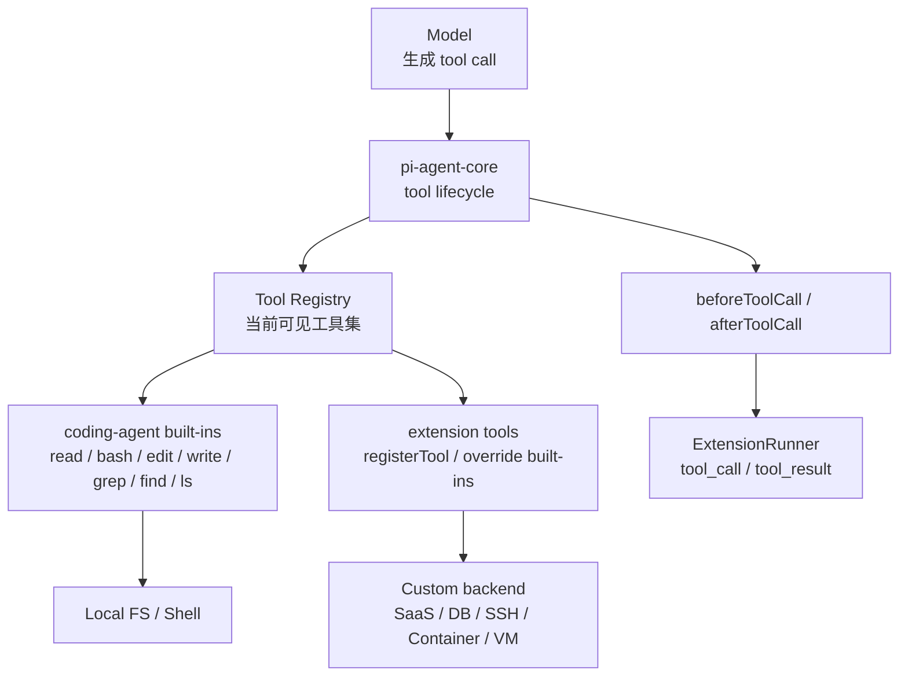
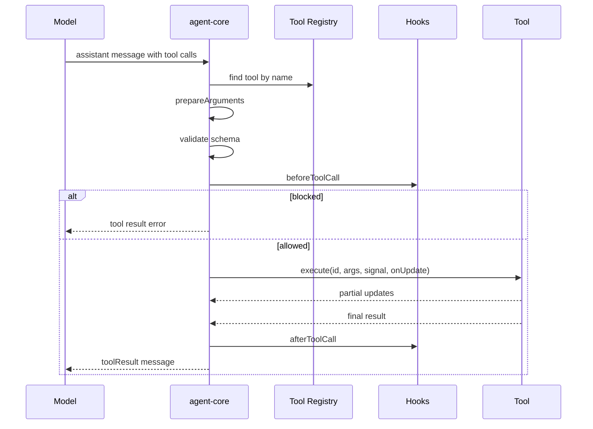
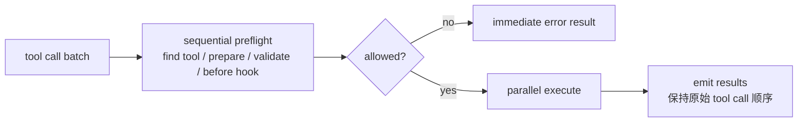
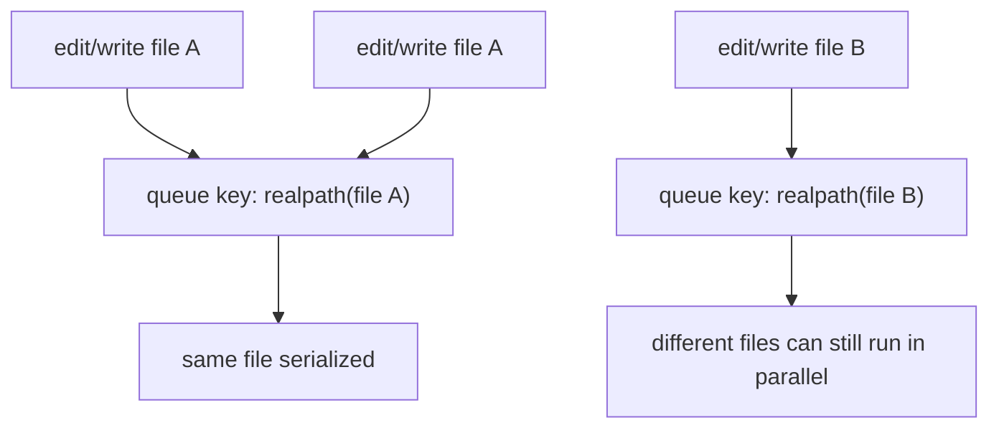
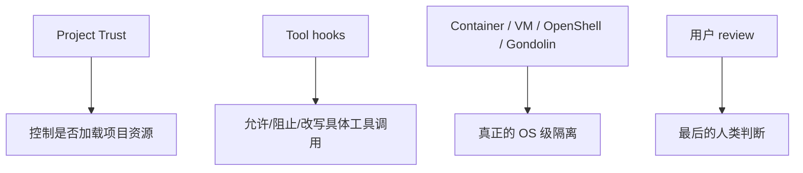
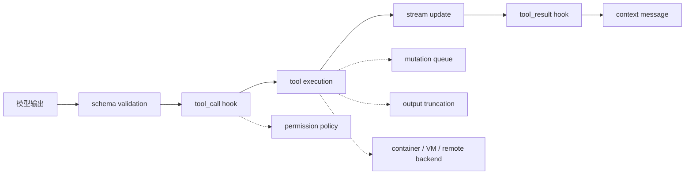

# pi Tool Execution / Safety：工具调用是 Agent 的执行边界

这一章看 pi 的工具执行系统。

如果说 `agent-core` 负责“模型什么时候该继续思考、什么时候该执行工具”，那 Tool Execution 就是模型真正接触外部世界的边界。读文件、改文件、跑命令、接扩展工具，所有风险和能力都集中在这里。

一句话理解：

> pi 的工具系统不是一把万能锤，而是一条可验证、可拦截、可观察、可替换的执行管线。

这也是它像“Agent 底座”的原因之一：核心不把每个场景都写死，而是把工具生命周期抽象出来，让产品层、扩展层、安全策略和运行环境各自接入。

## 1. 为什么工具系统值得单独看

普通聊天模型最多是在生成文本；coding agent 一旦有工具，就变成了可以改变世界的程序。

它至少会碰到这些问题：

- 模型生成的工具参数是否合法？
- 工具调用是否应该被允许？
- 多个工具能不能并发执行？
- 如果两个 edit 同时改同一个文件，会不会互相覆盖？
- 命令输出巨大时，怎么避免把上下文塞爆？
- 工具结果能不能被扩展层审计、修改或隐藏？
- 安全边界到底在 pi 内部，还是应该交给容器 / VM / OS？

pi 的处理方式很“系统工程”：不是在一个工具函数里塞满判断，而是把它拆成几层。



这张图的重点是：`agent-core` 不知道“编程工具”具体是什么，它只知道一套通用工具协议。`coding-agent` 才负责把这套协议落到真实开发环境里。

## 2. agent-core 管的是生命周期，不是具体工具

`packages/agent/src/agent-loop.ts` 里的核心逻辑大概是这样：



这里有几个很重要的设计点。

第一，参数先被 `prepareArguments` 修正，再做 schema validation。比如 `edit` 会兼容一些模型把 `edits` 错发成 JSON 字符串的情况。

第二，`beforeToolCall` 可以阻止工具执行。阻止后不会真的跑工具，而是生成一个 error tool result 交还给模型。

第三，`afterToolCall` 可以改写结果。比如扩展可以在工具结果里做脱敏、加提示、追加 usage，甚至标记本轮应该停止。

第四，如果模型回复因为长度限制被截断，pi 不会执行里面的 tool call。原因很朴素：工具参数可能是不完整 JSON，不能靠猜。

这点挺值得学。很多 Agent bug 都来自“模型输出一半，执行层还硬着头皮 salvage”。pi 在这里选择了保守。

## 3. 并发不是随便并发

`agent-core` 支持两种工具执行模式：

- `parallel`
- `sequential`

默认是 parallel。但只要这一批 tool call 里有任何一个工具声明自己必须 `sequential`，整批就会顺序执行。

并行模式也不是完全放飞。它会先按顺序做 preflight：



这个设计解决两个问题：

- 执行可以快：真正耗时的工具可以并发跑；
- 结果仍可理解：最终 tool result 按模型原始 tool call 顺序回到上下文。

对 coding agent 很重要，因为模型可能一次发出多个读文件 / 搜索请求。读操作并发能提速，但改文件这类操作需要更谨慎。

## 4. coding-agent 提供的是编程场景工具组

`packages/coding-agent/src/core/tools/index.ts` 里内置了这些工具：

| 工具 | 类型 | 作用 |
| --- | --- | --- |
| `read` | 读取 | 读取文本文件或图片；文本按行数/字节截断；支持 `offset` / `limit` |
| `grep` | 搜索 | 搜索文件内容，尊重 `.gitignore`，限制返回数量和输出大小 |
| `find` | 搜索 | 按 glob 找文件，尊重 `.gitignore` |
| `ls` | 浏览 | 列目录，包含 dotfiles，按数量/字节截断 |
| `bash` | 执行 | 在当前工作目录执行 shell 命令，支持 timeout、输出流、截断和完整输出临时文件 |
| `edit` | 修改 | 对单个文件做精确文本替换，要求 `oldText` 唯一且不重叠 |
| `write` | 修改 | 新建或完整覆盖文件，自动创建父目录 |

默认 coding tools 是：

```text
read / bash / edit / write
```

只读工具组是：

```text
read / grep / find / ls
```

这说明 pi 并不是只靠 `bash` 解决一切。它把常见动作拆成结构化工具，让模型更容易做对，也让 UI 和安全策略更容易理解。

## 5. `read`：读文件不是 `cat`

`read` 的特点是：

- 支持文本和图片；
- 图片会作为 attachment 发给支持 vision 的模型；
- 如果当前模型不支持图片，会给出提示，不硬塞；
- 文本默认按行数和字节双重截断；
- 大文件可以用 `offset` / `limit` 继续读；
- 如果某一行本身就超过字节上限，会提示用 `bash` 做更细粒度读取。

这里的思想是：工具结果要对模型友好。

如果直接把大文件完整塞进上下文，模型看似“知道更多”，实际会拖慢、污染上下文，还可能把关键内容挤出去。pi 更偏向给模型一个可继续探索的窗口。

## 6. `bash`：命令执行是可观察的流

`bash` 不是简单的 `exec(command)`。

它做了这些事情：

- 在当前 cwd 执行；
- 可配置 `shellPath`；
- 可给每条命令加 `commandPrefix`；
- 支持 timeout；
- stdout/stderr 合并进入输出累积器；
- 执行中会流式发 update 给 TUI；
- 输出太大时只保留尾部摘要；
- 完整输出会保存到临时文件，并把路径写进结果；
- abort 或 timeout 时会 kill process tree；
- 可以通过 `spawnHook` 改写 command / cwd / env。

它还会注入一组 `PI_*` 环境变量：

```text
PI_SESSION_ID
PI_SESSION_FILE
PI_PROVIDER
PI_MODEL
PI_REASONING_LEVEL
```

注入前会先删除外部传入的同名变量，再按当前 session 重设。这个细节很小，但很讲究：避免 shell 环境里已有的 `PI_*` 假冒当前会话信息。

`spawnHook` 很关键。它让 bash 的执行 backend 可以被替换，例如：

- 本地 shell；
- SSH；
- Docker；
- micro-VM；
- 远程 sandbox。

所以 `bash` 不是一个封死的本地命令工具，而是一个可重定向的执行入口。

## 7. `edit` / `write`：文件修改要可预测

`write` 很直接：

- path 相对 cwd 解析，也支持绝对路径；
- 自动创建父目录；
- 文件不存在则创建，存在则覆盖；
- 适合新文件或完整重写。

`edit` 更细：

- 用 exact text replacement；
- 每个 `oldText` 必须在原始文件里唯一匹配；
- 多个 edit 是针对原始文件匹配，不是一个改完再匹配下一个；
- 不允许重叠或嵌套修改；
- 会保留 BOM；
- 会检测原始换行风格，并在写回时恢复；
- 返回 display diff、unified patch 和 first changed line。

这个设计明显是在约束模型：不要让模型“凭感觉 patch”，而是让它证明自己知道要替换哪一段。

## 8. 同文件修改队列：小而关键的并发防护

`edit` 和 `write` 都会走 `withFileMutationQueue`。

它的作用是：



这不是完整事务系统，但它刚好解决 coding agent 最常见的一类竞态：

> 两个工具调用同时改同一个文件，后写入的覆盖前一个。

pi 的做法是：同一个文件串行，不同文件仍然可以并发。这是一个很“less is more”的工程点，成本很低，但收益很实在。

## 9. 安全边界：pi 很坦白，它默认不是 sandbox

这一点必须单独强调。

pi 的官方安全文档说得很直白：pi 默认用启动它的用户权限运行。内置工具可以读文件、写文件、改文件、跑 shell；扩展也是 TypeScript 模块，拥有同样的进程权限。

`Project Trust` 也不是 sandbox。它解决的是“项目能不能自动加载本地 `.pi` 配置、扩展、技能、资源”这个问题；它不阻止模型在你开始工作后通过工具读写当前用户能访问的东西。

所以 pi 的安全模型更像这样：



这其实是一个成熟选择：不要把进程内的权限判断包装成“强安全边界”。如果要跑不可信项目、无人值守任务或高风险改动，应该用容器、VM、micro-VM 或策略化 sandbox。

## 10. 扩展层怎样介入工具安全

`AgentSession` 会把 `agent-core` 的 hook 映射到扩展事件：

- `beforeToolCall` -> `tool_call`
- `afterToolCall` -> `tool_result`

这意味着扩展可以做很多横切逻辑：

- dangerous command confirmation；
- protected path guard；
- dirty repo guard；
- tool result redaction；
- audit log；
- routing bash/edit/write/read 到 sandbox；
- override built-in tools。

pi 自带示例里就有一个 `permission-gate.ts`：检测 `rm -rf`、`sudo`、`chmod/chown 777` 这类命令；如果有 UI 就询问用户，没有 UI 就默认 block。

这里体现了 pi 的生态路线：

> core 不内置所有 policy，但给 policy 足够清晰的接入点。

## 11. 对我们做 runbook / fork 的意义

这块适合做几个实验：

1. 写一个只读安全扩展：记录每次 tool call 和 tool result。
2. 写一个 protected-path 扩展：阻止读写 `.env`、`~/.ssh`、`node_modules`。
3. 写一个 bash permission gate：危险命令需要确认，非交互模式默认拒绝。
4. 写一个 tool result redactor：把结果里的 API key-like 文本替换成 `[REDACTED]`。
5. 写一个 fake remote bash backend：用 `spawnHook` 或 custom operations 模拟远程执行。
6. 对 `edit` 的唯一匹配、重叠匹配、换行恢复写小测试。

如果我们之后真的要参与 pi 上游，这些 issue/PR 会比“加一个随机 feature”更有价值，因为它们贴着项目的核心设计：

- 工具生命周期；
- 扩展安全策略；
- 可观察性；
- sandbox routing；
- Agent 行为回归。

## 12. 我现在的理解

pi 的 Tool Execution / Safety 不是一个单点模块，而是一组边界：



这套设计的味道是：底座保持小，边界保持清晰，强约束放在真正能生效的地方。

它不假装自己能在进程内解决所有安全问题，但它把“谁可以拦截、谁可以替换、谁负责隔离”拆得很清楚。这就是我们前面一直说的，pi 更像一个可以被二开的 agent harness，而不只是一个 CLI 产品。
