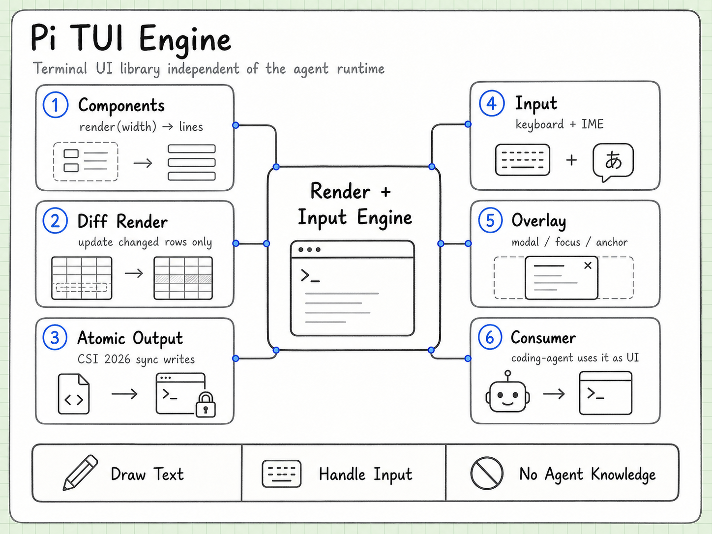

# TUI 引擎

> 状态：第一轮理解完成

pi-tui 是从零写的终端 UI 库，跟 agent 无关。依赖只有两个 npm 包（get-east-asian-width, marked）。



上图先把 `pi-tui` 理解成独立终端 UI 引擎：组件负责把状态渲染成文本行，diff renderer 只更新变化部分，input/overlay 管交互，`pi-coding-agent` 只是它的一个消费者。

## 做什么

两件事：

1. 把字画到终端上（渲染）
2. 处理键盘输入（包括中文 IME 支持）

## 差分渲染（核心特性）

三策略渲染系统：

1. 首次渲染：输出所有行，不清 scrollback
2. 宽度变化或视口上方有变更：清屏全量重绘
3. 正常更新：移到第一个变化的行，从那里开始重绘

所有更新包在 CSI 2026 synchronized output 里（`\x1b[?2026h` ... `\x1b[?2026l`），做原子写入，无闪烁。

效果：streaming 输出时只更新真正变化的行，写往终端的字节数最少，视觉上更跟手。

## 组件系统

```typescript
interface Component {
  render(width: number): string[];     // 返回每行字符串，不能超宽
  handleInput?(data: string): void;    // 有焦点时收到键盘输入
  invalidate?(): void;                 // 清除缓存，下次 render 重新生成
}
```

内置组件：Text, TruncatedText, Input, Editor, Markdown, Loader, SelectList, SettingsList, Spacer, Image, Box, Container。

### 缓存

组件应该缓存 render 输出，只在 invalidate 后重新生成。这是性能关键。

### Overlay 系统

不替换底层内容的模态层，支持 anchor 定位、百分比定位、margin、focus 管理。

## 跟 agent 的关系

没有关系。pi-tui 不知道 LLM 是什么，不知道 agent 是什么。pi-coding-agent 把 tui 当成一个显示和输入设备来用。

你可以拿 pi-tui 写任何终端应用——配置面板、聊天软件、终端游戏都行。

## 为什么自己写而不用现成框架

- Bubble Tea（Go）：Elm 架构 model-view-update，每次状态变更重算整个 view
- pi-tui：差分渲染，只更新变化的行

在 streaming 输出高频到达时，pi-tui 写往终端的字节数更少。
