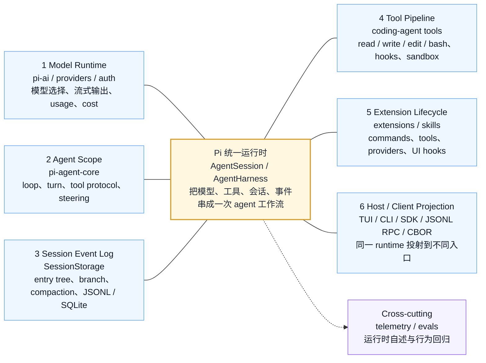
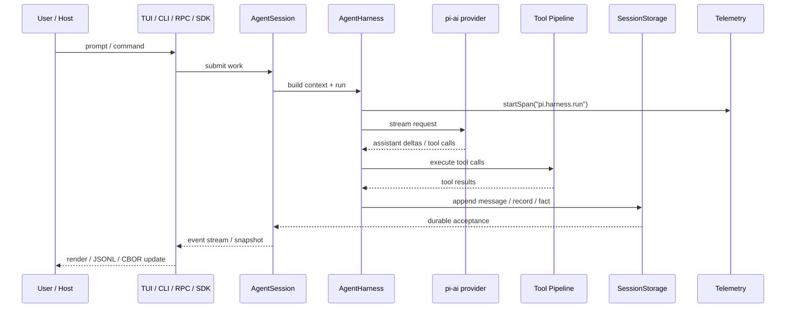

# Pi Visual Map：一张图看懂运行时边界

> 状态：初版（基于 main revision `9d2ec7ff`）
> 本文回答：如果只用一张图理解 Pi，它的中心运行时是什么，周围有哪些能力边界，和“完整产品型 coding agent / 插件化 harness”分别有什么差异。

这页是视觉入口，不替代 [架构总览](architecture.md)。如果说 `architecture.md` 是源码地图，这页就是“先把脑子里的大图搭起来”。

上图是阅读入口。下面的 Mermaid 版本保留为可维护文本版，方便后续随着源码变化继续调整。

## 中心图：Pi 统一运行时

Pi 可以先理解成一个“可改造的终端 agent 工作台”。中心不是 TUI，也不是某个模型 provider，而是 `AgentSession / AgentHarness` 这条运行时主线：它把模型请求、工具执行、会话状态、事件流和外部入口串起来。

读这张图时，先抓三句话：

1. **Pi 的中心是 runtime，不是 UI。**

   TUI / CLI / RPC / SDK 都只是 runtime 的不同投射方式。

2. **Pi 的能力是按边界拆开的。**

   模型、agent loop、session、tool、extension、host/client 都能分别理解、分别替换。

3. **Telemetry / evals 是横切层。**

   它们不直接“做任务”，而是帮助 runtime 可观察、可回归、可维护。

## 六个边界分别看什么

| 编号 | 边界 | 主要源码包 | 解决的问题 | 相关文档 |
|---:|---|---|---|---|
| 1 | Model Runtime | `pi-ai` | 统一 provider、model、streaming、auth、usage/cost | [AI Package](ai-package.md)、[Model Runtime / Auth](model-runtime-auth.md) |
| 2 | Agent Scope | `pi-agent-core` | agent loop、事件流、tool call 协议、steering、harness | [Agent Core](agent-core.md)、[架构总览](architecture.md) |
| 3 | Session Event Log | `pi-agent-core` session、`session-backends/sqlite-node` | 会话树、分支、压缩、恢复、搜索、存储 backend | [Session / Storage](session-storage.md)、[Session Backend](session-backend.md) |
| 4 | Tool Pipeline | `pi-coding-agent/core/tools` | 文件读写、bash、edit、hooks、truncation、mutation queue、安全边界 | [Tool Execution / Safety](tool-execution-safety.md) |
| 5 | Extension Lifecycle | `pi-coding-agent` extensions | commands、tools、providers、UI hooks、skills、生命周期 | [Extension System](extensions.md) |
| 6 | Host / Client Projection | `pi-tui`、`pi-client`、`pi-server`、`pi-protocol`、`coding-agent/modes` | TUI、CLI、SDK、JSONL RPC、CBOR remote session | [RPC / SDK](rpc-sdk.md)、[Inter-process protocols](protocol-transport.md)、[TUI Engine](tui-engine.md) |
| — | Cross-cutting | `pi-telemetry`、`pi-evals` | span schema、adapter contract、行为回归 | [Telemetry](telemetry.md)、[Evals](evals.md) |

## 和其他 agent 形态怎么对照

下面这张表不是产品评测，而是帮助定位“Pi 处在什么生态位”。

| 核心维度 | 产品型 coding agent | Pi | 插件化 harness / agent 搭建平台 |
|---|---|---|---|
| 产品形态 | 开箱即用的完整工具 | 极简、可改造的终端 agent 工作台 | 以插件和 preset 组合 agent 系统 |
| 默认能力 | 官方组织好模型、工具、会话和交互 | 默认提供 `read` / `write` / `edit` / `bash` 等 coding tools | 由 profile、preset、插件组合能力 |
| 主要使用者 | 想直接完成开发任务的用户 | 想定制个人终端工作流、研究 agent runtime 的开发者 | 想实验或搭建 agent 系统的开发者 |
| 扩展方向 | 在统一产品里增加能力 | 从小核心向外扩展，能替换 runtime 边界 | 替换和重组组成部分 |
| 学习重点 | 怎么高效使用产品 | 怎么拆分 agent runtime、session、tool、protocol | 怎么设计插件协议、preset、scope 和生命周期 |

Pi 的位置有点微妙：它不是“只有库没有产品”，因为 `pi-coding-agent` 已经能作为 CLI/TUI 使用；但它也不是把所有东西封死的完整产品，因为 `agent-core`、`ai`、`protocol`、`client/server`、`session-backends` 都在表达“可以被拿出去重新组合”。

## 数据流图：一次 prompt 怎么穿过 Pi

这张图把几个常见误解拆开：

- **模型不是中心。** 模型只是 runtime 里的一段调用。
- **工具不是直接暴露给用户。** 工具经过 agent loop、hooks、安全边界和 session write。
- **session 不是聊天数组。** 它是 append-only event log / tree，再投影成模型上下文。
- **UI 不是核心。** TUI、JSONL、CBOR 都是在同一套 runtime 之外做投射。

## 什么时候看哪张图

| 你现在困惑的是 | 先看 |
|---|---|
| “Pi 到底是什么层级？” | 本页中心图 |
| “每个 package 负责什么？” | [架构总览](architecture.md) |
| “为什么 session 这么复杂？” | [Session / Storage](session-storage.md) |
| “SQLite backend 为什么单独拆？” | [Session Backend](session-backend.md) |
| “外部 UI / IDE 怎么接 Pi？” | [RPC / SDK](rpc-sdk.md)、[Inter-process protocols](protocol-transport.md) |
| “怎么观察 agent runtime？” | [Telemetry](telemetry.md) |

## 当前理解

Pi 最适合用“runtime 边界”来理解，而不是用“一个终端应用”来理解。

更具体一点：

- `pi-coding-agent` 是能直接用的产品层；
- `pi-agent-core` 是 agent runtime；
- `pi-ai` 是模型适配层；
- `pi-tui` 是终端渲染层；
- `pi-protocol / pi-client / pi-server` 是远程会话边界；
- `session-backends` 是持久化边界；
- `telemetry / evals` 是维护 runtime 的横切能力。

掌握这张图之后，再读源码就不容易迷路：看到一个文件时，先问它在六个边界里的哪一格，而不是一上来就追所有函数调用。
